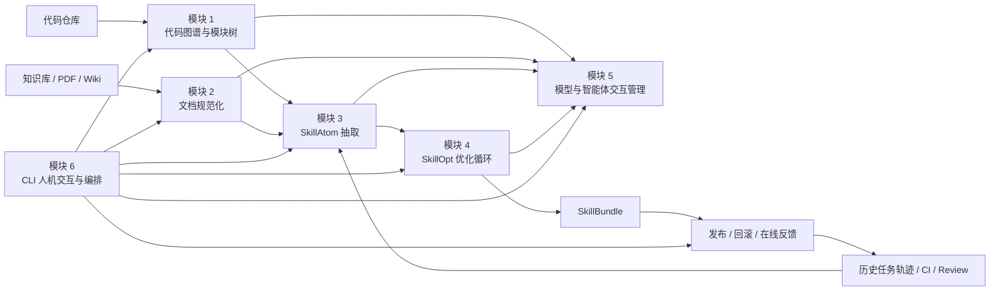

# 从知识库和代码提取并优化 Agent Skill 的总体设计文档

> 本文是项目级总体设计文档，定义从知识库、PDF/Wiki、代码仓库与历史执行轨迹中提取、生成、评测并持续优化 Agent Skill 的整体架构。分模块输入、输出、存储内容与执行细节见本目录下的模块设计文档。

## 1. 背景与目标

Agent Skill 不是知识库摘要，也不是一次性提示词。它是面向特定仓库、业务域或工作流的可复用能力包，用来告诉 Agent 在什么条件下执行什么流程、调用什么工具、遵守什么约束，以及如何验证结果。

本系统的目标是建立一条可审计、可评测、可持续优化的 Skill 生产流水线：

1. 从代码仓库生成代码图谱、模块树与叶子上下文，提取代码中的真实行为约束。
2. 从知识库、PDF、Wiki 等材料生成规范化文档块，保留来源锚点、版本与结构信息。
3. 将代码侧和文档侧证据统一抽取为结构化 `SkillAtom`。
4. 基于 `SkillAtom` 生成候选 Skill，并通过 SkillOpt 式循环进行离线优化。
5. 通过可插拔模型/智能体交互层统一管理 LLM、工具型 Agent 与外部评测 Agent。
6. 通过 CLI 提供人机交互、审批、运行编排、状态查看和发布入口。

最终产物是一组可部署、可回滚、可复现的 Agent Skill 包：

```text
skills/<skill_name>/
├── SKILL.md
├── references/
│   ├── domain-map.md
│   ├── api-contracts.md
│   └── failure-modes.md
└── scripts/
    └── deterministic_checker.py
```

其中 `SKILL.md` 只保留 Agent 高频使用的核心流程、工具策略和判断准则；长事实、详细 API、表格和历史案例进入 `references/`；稳定且可确定执行的检查、格式转换、验证逻辑进入 `scripts/`。

## 2. 设计范围

### 2.1 范围内

| 范围 | 说明 |
|---|---|
| 代码结构理解 | 从仓库快照中抽取文件、符号、调用关系、依赖关系、入口点和模块树 |
| 文档规范化 | 将 Markdown、PDF、Wiki 导出内容转为统一 `DocumentChunk` 与索引 |
| SkillAtom 抽取 | 从代码图谱和规范化文档中抽取可执行、可验证、可追踪的技能原子 |
| Skill 生成与优化 | 生成候选 `SKILL.md`、引用资料和脚本，并用 SkillOpt 循环改进 |
| 模型交互管理 | 统一裸模型、结构化模型调用、其他智能体调用和观测追踪 |
| CLI 编排 | 以命令行方式执行初始化、抽取、优化、审批、评测、发布和恢复 |

### 2.2 范围外

| 非目标 | 说明 |
|---|---|
| 在线 RAG 问答系统 | 本系统生产 Skill，不替代运行时检索问答 |
| 通用代码文档站 | 代码图谱和模块树服务于 Skill 抽取，不以生成完整代码百科为首要目标 |
| 自动无审核发布 | 涉及权限、事实冲突、低置信度规则和发布动作时需要显式审批 |
| 只靠模型自由改写 | Skill 修改必须保留来源、评分、评测结果和拒绝记录 |

## 3. 总体架构



整体架构按“来源接入 -> 证据规范化 -> 技能原子抽取 -> Skill 优化 -> 发布回流”组织。模块 1 和模块 2 是证据生产层；模块 3 是证据到 Skill 语义的转换层；模块 4 是优化与评测层；模块 5 是模型能力适配层；模块 6 是用户入口和编排层。图中模块 1-4 指向模块 5 表示“调用统一交互接口”，不是模块 5 反向依赖业务模块。

**分层依赖规则**：模块 5 是基础设施层，处于最底层。模块 1-4 只允许依赖模块 5 的接口定义（`InteractionBackend` 抽象类、`InteractionRequest`/`InteractionResponse` 等标准类型），不得直接依赖任何具体 backend 实现。模块 4 调用 target Agent 或 optimizer 模型时，通过依赖注入接收已配置好的 backend 实例，避免在模块 4 内部 import 模块 5 的具体类。CLI（模块 6）负责在启动时将配置好的 backend 实例注入各模块。

## 4. 模块划分

| 模块 | 设计文档 | 核心职责 | 主要产物 |
|---|---|---|---|
| 1. 代码仓库到代码图谱与模块树 | [01-code-repo-to-code-graph-module-tree.md](01-code-repo-to-code-graph-module-tree.md) | 解析仓库快照，抽取符号、依赖、调用链、入口点和模块层级 | `graph.json`、`module_tree.json`、`leaf_contexts/` |
| 2. 知识库/PDF/Wiki 到文档规范化 | [02-knowledge-pdf-wiki-normalization.md](02-knowledge-pdf-wiki-normalization.md) | 统一解析多格式文档，恢复结构、切分 chunk、保留来源锚点 | `document_index.json`、`chunks.jsonl`、`tables.jsonl` |
| 3. SkillAtom 抽取 | [03-skillatom-extraction.md](03-skillatom-extraction.md) | 将代码证据和文档证据转成可执行、可验证的技能原子 | `raw_atoms.jsonl`、`merged_atoms.jsonl`、`benchmark_seeds.jsonl` |
| 4. SkillOpt 优化循环 | [04-skillopt-loop.md](04-skillopt-loop.md) | 基于 rollout、反思、聚合、选择、更新、评测循环优化 Skill | `best_skill.md`、`skill_bundle.json`、`history.json`、`final_eval/` |
| 5. 模型与智能体交互管理 | [05-model-agent-interaction-manager.md](05-model-agent-interaction-manager.md) | 提供可插拔模型、外部 Agent、路由、预算、追踪和结构化输出能力 | `traces/`、`token_usage.jsonl`、`cost_usage.jsonl` |
| 6. CLI 人机交互与模块编排 | [06-cli-human-interaction-orchestrator.md](06-cli-human-interaction-orchestrator.md) | 提供命令行入口、运行计划、审批、状态、恢复、发布和报告 | `run_manifest.json`、`run_state.json`、`events.jsonl` |

模块之间通过文件化中间产物和稳定 schema 解耦。除 CLI 外，其它模块应优先设计为可被库调用，也可被单独命令执行。

## 5. 端到端数据流

### 5.1 输入层

系统接收四类输入：

| 输入 | 来源示例 | 使用方式 |
|---|---|---|
| 代码仓库 | Git 仓库、本地目录、指定 commit | 构建代码图谱、模块树、入口点、调用链、测试与配置约定 |
| 知识文档 | Markdown、PDF、Wiki 导出、内部 SOP | 规范化为带来源锚点的 `DocumentChunk` |
| 历史轨迹 | Agent 任务、CI 日志、人工 review、工单 | 抽取失败模式、验证要求和高价值改进点 |
| 运行配置 | 项目配置、模型配置、预算、审批策略 | 控制抽取范围、模型路由、评测策略和发布门禁 |

### 5.2 中间层

核心中间对象包括：

| 对象 | 生产模块 | 消费模块 | 用途 |
|---|---|---|---|
| `SourceManifest` | 模块 1、2、6 | 全部模块 | 记录输入快照、版本、hash、解析器版本 |
| `CodeGraph` | 模块 1 | 模块 3、4 | 表达符号、调用、依赖、入口点和影响范围 |
| `ModuleTree` | 模块 1 | 模块 3、CLI | 支持大仓库分治、模块级抽取和审查 |
| `DocumentChunk` | 模块 2 | 模块 3 | 表达可引用、可追踪的规范化文档片段 |
| `SkillAtom` | 模块 3 | 模块 4 | 表达最小可复用技能规则、约束和验证断言 |
| `BenchmarkItem` | 模块 3、4 | 模块 4 | 评测 Skill 是否提高目标 Agent 表现 |
| `SkillBundle` | 模块 4 | CLI、发布流程 | 可部署 Skill 包及其评测、版本、来源记录 |
| `RunState` | 模块 6 | CLI、恢复流程 | 记录当前运行阶段、失败点、审批状态和产物路径 |

### 5.3 输出层

系统输出三类产物：

1. **发布产物**：`skills/<skill_name>/SKILL.md`、`references/`、`scripts/`、版本元数据。
2. **审计产物**：来源清单、Atom 来源链、优化历史、评测结果、被拒绝修改记录。
3. **运行产物**：CLI 事件、模型调用 trace、审批记录、失败恢复状态。

## 6. 核心数据对象

### 6.1 `SourceManifest`

记录一次运行的输入快照和解析环境，确保结果可复现。

```json
{
  "schema_version": "1.0",
  "manifest_id": "skill-src-2026-06-03",
  "repos": [{"path": "repo/payment", "commit": "abc123"}],
  "documents": [{"path": "docs/paybook.md", "sha256": "..."}],
  "pdfs": [{"path": "docs/CodeWiki_paper.pdf", "sha256": "..."}],
  "extractor_versions": {"codegraph": "local", "document_normalizer": "0.1.0"},
  "created_at": "2026-06-03T00:00:00Z"
}
```

### 6.2 `SkillAtom`

`SkillAtom` 是 Skill 的最小候选单位，必须同时包含规则、适用条件、来源和验证方式。

```json
{
  "schema_version": "1.0",
  "atom_id": "api-error-handling.retry-timeout",
  "kind": "procedure",
  "claim": "调用支付 API 超时时先查询幂等键状态，再按指数退避重试，最多 3 次。",
  "applicability": "支付链路外部 API 调用超时",
  "source_refs": ["doc://paybook.md#timeout", "code://payment/client.py::retry"],
  "checks": ["回答中必须提到幂等键", "不得建议直接重复扣款"],
  "confidence": 0.86
}
```

### 6.3 `SkillBundle`

`SkillBundle` 是候选或已发布 Skill 的完整描述。

```json
{
  "schema_version": "1.0",
  "skill_id": "payment-agent-skill",
  "version": "0.3.0",
  "entry_file": "SKILL.md",
  "token_budget": 1800,
  "included_atoms": ["api-error-handling.retry-timeout"],
  "references": ["references/api-contracts.md"],
  "scripts": ["scripts/check_payment_patch.py"],
  "eval_report": "final_eval/report.json"
}
```

### 6.4 `InteractionRequest` 与 `InteractionResponse`

模型交互统一通过模块 5 的 `InteractionRequest` 进入，避免各模块直接绑定某个供应商、模型名称或外部智能体协议。`ModelResponse` 与 `AgentResponse` 是 `InteractionResponse` 的两种具体返回形态。

```json
{
  "schema_version": "1.0",
  "request_id": "req-20260603-0001",
  "role": "atom_extractor",
  "task": "extract_skill_atoms",
  "input_refs": ["runs/payment-skill-20260603-001/sources/docs/payment-runbook/v2026-05-28/chunks.jsonl"],
  "response_format": {"type": "json_schema", "schema_name": "SkillAtomList"},
  "budget": {"max_tokens": 4000, "max_cost_usd": 1.5}
}
```

## 7. 运行生命周期

一次完整运行由 CLI 发起，并由 `RunState` 驱动恢复和审计。

```mermaid
sequenceDiagram
  participant User as 用户
  participant CLI as 模块 6 CLI
  participant Code as 模块 1 代码图谱
  participant Doc as 模块 2 文档规范化
  participant Atom as 模块 3 Atom 抽取
  participant Model as 模块 5 模型/Agent 管理
  participant Opt as 模块 4 SkillOpt

  User->>CLI: run config.yaml
  CLI->>Code: build graph/module tree
  CLI->>Doc: normalize docs
  Code-->>CLI: CodeGraph + ModuleTree
  Doc-->>CLI: DocumentChunk index
  CLI->>Atom: extract atoms
  Atom->>Model: structured extraction calls
  Model-->>Atom: SkillAtom candidates
  Atom-->>CLI: atoms + conflicts + bench seeds
  CLI->>User: approve high-risk atoms/conflicts
  User-->>CLI: approval decision
  CLI->>Opt: optimize SkillBundle
  Opt->>Model: rollout/reflect/update/evaluate
  Model-->>Opt: model or agent results
  Opt-->>CLI: best SkillBundle + eval report
  CLI->>User: publish or inspect
```

生命周期分为 7 个阶段：

1. **初始化**：读取配置，创建运行目录，生成 `run_manifest.json`。
2. **证据构建**：并行执行代码图谱构建和文档规范化。
3. **Atom 抽取**：融合代码、文档和历史轨迹，生成 `SkillAtom`、冲突记录和评测种子。
4. **人工审批**：对高风险、低置信度、冲突或权限敏感内容进行确认。
5. **Skill 优化**：执行 SkillOpt 循环，生成候选 Skill 并记录每轮改动。
6. **质量门禁**：在 selection/held-out benchmark 上验证收益和退化风险。
7. **发布回流**：发布通过门禁的版本，并将在线反馈写回轨迹池。

## 8. SkillOpt 优化策略

优化循环采用离线可审计策略，而不是让模型直接覆盖 Skill 文档。核心阶段为：

| 阶段 | 目标 | 主要记录 |
|---|---|---|
| Rollout | 使用当前 Skill 在 benchmark 上执行任务 | 输入、输出、工具调用、得分、失败原因 |
| Reflect | 对失败和低分样本生成改进建议 | 问题归因、候选编辑、关联 Atom |
| Aggregate | 合并相似建议，去重并排序 | 聚类结果、支持证据、风险标签 |
| Select | 选择进入候选更新的编辑 | 被采纳和被拒绝的理由 |
| Update | 生成候选 `SKILL.md`、`references/`、`scripts/` | diff、版本号、来源链 |
| Evaluate / Gate | 在验证集和保留集上评估候选版本 | 分数、退化项、发布结论 |

每次更新必须满足：

1. 能追溯到一个或多个 `SkillAtom`、rollout 失败样本或人工审批记录。
2. 有明确适用条件，不能将局部经验泛化为全局规则。
3. 不超过配置的 `SKILL.md` token 预算。
4. 在关键 benchmark 上不产生不可接受退化。
5. 被拒绝的修改进入 rejected-edit buffer，防止后续循环反复提出同类无效编辑。

## 9. 质量门禁

### 9.1 内容质量

| 门禁 | 要求 |
|---|---|
| 来源完整性 | 核心规则必须有文档、代码或轨迹来源；无来源内容不得进入发布版 |
| 可执行性 | `SKILL.md` 中的规则应表达为条件、动作或验证要求 |
| 去重与压缩 | 重复、单例事实、训练样本痕迹应被移除或下沉到引用材料 |
| 冲突处理 | 未解决冲突不得写入核心 Skill，只能进入冲突引用或审批队列 |
| 上下文预算 | `SKILL.md` 保持轻量；长资料进入 `references/` |

### 9.2 评测质量

| 门禁 | 要求 |
|---|---|
| 基线对比 | 候选 Skill 必须与无 Skill 或旧版 Skill 对比 |
| 保留集 | 发布前必须通过未参与优化的 held-out 任务 |
| 退化检查 | 关键任务和安全约束不能明显退化 |
| 可复现 | 评测配置、输入、模型路由、随机种子和产物路径必须记录 |
| 人工抽检 | 高风险领域需要人工抽检样本和发布确认 |

## 10. 工程目录建议

```text
code-to-skill/
├── docs/
│   ├── requirements.md
│   └── design/
│       ├── 00-overall-design.md
│       ├── 01-code-repo-to-code-graph-module-tree.md
│       ├── 02-knowledge-pdf-wiki-normalization.md
│       ├── 03-skillatom-extraction.md
│       ├── 04-skillopt-loop.md
│       ├── 05-model-agent-interaction-manager.md
│       └── 06-cli-human-interaction-orchestrator.md
├── external/
│   ├── CodeWiki/
│   ├── codegraph/
│   └── SkillOpt/
├── runs/
│   └── <run_id>/
│       ├── run_manifest.json
│       ├── run_state.json
│       ├── sources/
│       │   ├── code/
│       │   └── docs/
│       ├── atoms/
│       ├── benchmarks/
│       ├── optimization/
│       ├── model_interactions/
│       └── reports/
├── skills/
│   └── <skill_name>/
├── configs/
│   └── <project>.yaml
└── src/
    ├── code_graph/
    ├── document_normalizer/
    ├── atom_extractor/
    ├── skillopt_loop/
    ├── model_gateway/
    └── cli/
```

`external/` 只承载参考实现和论文相关代码，不作为生产运行时的直接依赖边界。生产实现应在 `src/` 中封装，按接口吸收参考实现中的算法和设计。

## 11. 参考实现关系

| 参考来源 | 可借鉴内容 | 本系统中的位置 |
|---|---|---|
| `external/CodeWiki` | 代码依赖图、模块聚类、面向模块的文档生成流程 | 模块 1 的模块树构建与上下文分包 |
| `external/codegraph` | 符号搜索、调用关系、影响分析、上下文检索接口 | 模块 1 的图谱查询与模块 3 的代码证据对齐 |
| `external/SkillOpt` | rollout、reflect、aggregate、select、update、evaluate 循环 | 模块 4 的优化主循环和发布门禁 |
| `docs/skillopt_2605.23904.pdf` | 将 Skill 视为可优化外部状态的训练思路 | 模块 4 的整体算法设计 |
| `docs/CodeWiki_paper.pdf` | 大仓库分层理解、上下文控制和模块级文档生成 | 模块 1 与模块 3 的大仓库分治策略 |

参考实现只提供结构与算法启发。实际落地时应通过本系统 schema、CLI、模型交互层和质量门禁重新封装，避免把研究代码中的路径假设、模型调用方式或临时评测逻辑直接暴露给生产流程。

## 12. 技术选型

本节定义系统的语言、依赖栈与离线部署策略。

### 12.1 主语言与版本

- **语言**：Python
- **最低版本**：3.10（匹配 SkillOpt 上游的最低要求，同时 3.10 的 `match-case` 和更完善的类型系统对结构化数据管线友好）
- **包管理**：[uv](https://github.com/astral-sh/uv) 或 pip + `requirements.txt`。推荐 uv，安装速度更快、lock 文件可复现，且支持离线安装（`--offline`）。

### 12.2 依赖分层与选型原则

按模块边界将依赖分为 5 层，每层只引入生态中最主流的包。**选型原则**：

1. **优先标准库**：能用 `pathlib`、`json`、`hashlib`、`argparse`、`logging` 等功能就不引入第三方包。
2. **选择生态最主流的包**：同类包中选 GitHub Stars 最高、维护最活跃、Python 版本支持最广的。
3. **零 C 扩展依赖或提供 wheel**：避免需要本地编译的包（如旧版 `lxml` 需要 C 编译器），优先选择有预编译 wheel（包括 ARM64 macOS）的包。必需 C 扩展的包（如 OCR 引擎）作为可选依赖。
4. **离线友好**：所有依赖必须能通过 `pip download` 或 `uv sync --offline` 落地到本地目录，在无网环境通过 `--find-links` 或 `--no-index` 安装。

### 12.3 核心依赖清单

#### 第 1 层：基础工具（全模块共用）

| 包 | 用途 | 为何选它 |
|---|---|---|
| `pyyaml` | 解析 `project.yaml` 和各模块 YAML 配置 | YAML 生态事实标准，无 C 依赖 |
| `pydantic>=2.0` | 所有模块的 schema 校验（`graph.json`、`SkillAtom`、`RunState` 等） | 纯 Python、类型安全、JSON Schema 导出、生态最主流 |
| `tiktoken` | token 估算（模块 1 叶子上下文预算） | OpenAI 出品，cl100k_base 编码，纯 Python + 数据文件 |

#### 第 2 层：代码分析（模块 1）

| 包 | 用途 | 为何选它 |
|---|---|---|
| `tree-sitter` + 语言 grammar（python/java/typescript/go/rust） | 多语言 AST 解析，生成 `graph.json` 节点和边 | 增量解析、多语言统一 API、纯 C 但预编译 wheel 齐全 |
| `paths` → **标准库 `pathlib`** | 文件遍历、glob 匹配、路径管理 | 标准库，零依赖 |

**不使用**：`jedi`（仅 Python）、`ast-grep`（较新，生态不够成熟）。tree-sitter 是编译器前端领域最广泛使用的增量解析器，Neovim、Helix 编辑器均内置。

#### 第 3 层：文档规范化（模块 2）

| 包 | 用途 | 为何选它 |
|---|---|---|
| `markdown-it-py` 或 `mistune` | Markdown → 结构化 blocks | `markdown-it-py` 是 VS Code Markdown 预览的渲染器，`mistune` 是 Jupyter 系的解析器，二者均为纯 Python |
| `pdfplumber` | PDF 文本抽取 + 表格提取 | 纯 Python，比 `pdfminer.six` API 更友好，表格提取能力强 |
| `python-docx` | DOCX 解析 | 事实标准，纯 Python |
| `beautifulsoup4` + `lxml`（可选 wheel） | HTML / Wiki 导出解析 | `lxml` 有预编译 wheel，安装无需 C 编译器；若离线环境无 wheel 可用，退化为 `html.parser`（标准库） |

**可选依赖**（仅在需要时安装）：

| 包 | 用途 | 备注 |
|---|---|---|
| `pytesseract` + 系统 Tesseract 二进制 | PDF 扫描件 OCR | 需要系统安装 Tesseract（`brew install tesseract` / `apt install tesseract-ocr`）。离线环境下 Tesseract 需预先安装。 |
| `pillow` | OCR 预处理（图像缩放、二值化） | 有预编译 wheel，纯 Python 模式也可工作 |

#### 第 4 层：模型与 Agent 交互（模块 5）

| 包 | 用途 | 为何选它 |
|---|---|---|
| `openai` | OpenAI-compatible API 调用（百炼、vLLM、Ollama 等） | 生态事实标准，支持 `base_url` 指向任意兼容服务 |
| `httpx` | 异步 HTTP 客户端，Agent backend 调用第三方服务 | 比 `requests` 更现代，支持 HTTP/2、async，生态主流 |
| `tenacity` | 重试策略（指数退避、fallback） | 比 `retry` 更灵活，装饰器 + 上下文管理器 |

#### 第 5 层：CLI 与人机交互（模块 6）

| 包 | 用途 | 为何选它 |
|---|---|---|
| `rich` | 终端美化输出（进度条、表格、syntax highlight、Markdown 渲染） | 生态最主流的终端美化库，纯 Python |
| `click` | CLI 命令定义与参数解析 | Flask 生态标准，比 `argparse` 更简洁；也可用标准库 `argparse` 而零依赖 |

**不使用**：`textual`（TUI 框架，功能过重，MVP 不需要 TUI 仪表盘）、`typer`（依赖 `click`，增加一层抽象但好处有限）。

#### 汇总

```
# requirements.txt（有网环境通过 pip install -r requirements.txt 安装）
pyyaml>=6.0
pydantic>=2.0
tiktoken>=0.5
tree-sitter>=0.21
pdfplumber>=0.10
python-docx>=1.0
beautifulsoup4>=4.12
markdown-it-py>=3.0
openai>=1.0
httpx>=0.27
tenacity>=8.0
rich>=13.0
click>=8.0

# 可选依赖
# pytesseract>=0.3
# pillow>=10.0
# lxml>=5.0
```

### 12.4 离线部署策略

目标：在一台无互联网访问的服务器上，仅通过 U 盘/共享目录拷贝即可完成环境搭建。

**方案 A：pip download + requirements.txt（推荐 MVP）**

```bash
# 在有网机器上
mkdir vendor
pip download -r requirements.txt -d vendor/

# 将 vendor/ 目录拷贝到离线机器
# 在离线机器上
pip install --no-index --find-links=vendor/ -r requirements.txt
```

**方案 B：uv 离线 lock + sync**

```bash
# 在有网机器上
uv lock                          # 生成 uv.lock
uv sync --frozen                 # 安装到 .venv
uv export --no-hashes > requirements.frozen.txt

# 将 .venv/lib/python3.10/site-packages/ 打包为 wheels.tar.gz

# 在离线机器上
uv sync --frozen --offline       # 从 uv.lock 直接还原
```

**方案 C：嵌入式 Python + vendor（最彻底的离线方案）**

适用于目标机器不允许 pip 安装任何包的极端环境。将 CPython 解释器 + site-packages + 本系统源码打包为一个自包含目录。uv 的 `--python` 参数指向嵌入式 Python 即可。

### 12.5 包管理文件约定

```
code-to-skill/
├── pyproject.toml          # 项目元数据 + 依赖声明
├── requirements.txt        # pip 兼容格式（由 pyproject.toml 导出）
├── requirements-opt.txt    # 可选依赖
├── vendor/                 # 离线依赖缓存（.gitignore）
└── scripts/
    └── install_offline.sh  # 一键离线安装脚本
```

## 13. MVP 路线

### Phase 0：资料准备

- **固定目标仓库**：[Apache Fineract](https://github.com/apache/fineract)（Java，金融核心系统）。
  - 选定原因：纯金融业务——贷款发放、还款计划、利息计算、储蓄产品、会计分录、过账规则——业务复杂度高、领域术语密集，是检验 Skill 抽取和优化的理想靶场。
  - 锁定 commit：`rel/1.10.0`（2025 年稳定分支），确保可复现。
  - 分析范围（`include`）聚焦核心业务模块，排除基础设施和测试：
    ```yaml
    include:
      - "fineract-provider/src/main/java/org/apache/fineract/accounting/**"
      - "fineract-provider/src/main/java/org/apache/fineract/portfolio/**"
      - "fineract-core/src/main/java/org/apache/fineract/accounting/**"
      - "fineract-core/src/main/java/org/apache/fineract/portfolio/**"
    exclude:
      - "**/test/**"
      - "**/integration-tests/**"
      - "**/node_modules/**"
      - "**/target/**"
    ```
  - tree-sitter Java grammar 覆盖良好，模块 1 的 AST 解析无额外适配成本。
- 固定一个知识库目录（Fineract 官方文档的 Markdown 导出）和一组 PDF（Apache Fineract 用户手册）。
- 建立 `project.yaml`、运行目录规范和模型路由配置。
- 准备最小 benchmark：10 到 20 个真实任务（从 Fineract 的 GitHub Issues 和 PR review 中抽取金融业务相关的 bug fix、feature request、code review 场景）。

### Phase 1：离线证据构建

- 实现模块 1 的仓库快照、符号抽取、依赖图和模块树。
- 实现模块 2 的 Markdown/PDF 规范化和 chunk 索引。
- 输出可人工审查的 `CodeGraph`、`ModuleTree` 和 `DocumentChunk`。

### Phase 2：SkillAtom 与初版 Skill

- 实现模块 3 的候选规则抽取、证据对齐、冲突检测和置信度评分。
- 生成初版 `SkillBundle`，先人工审查再进入优化。

### Phase 3：优化与门禁

- 接入模块 5 的模型/Agent 路由。
- 实现模块 4 的单轮 SkillOpt 循环和 held-out gate。
- 通过 CLI 执行 `run`、`inspect`、`approve`、`eval`、`publish`。

### Phase 4：回流与规模化

- 接入真实 Agent 任务轨迹、CI 日志和人工 review。
- 支持多仓库、多 Skill、多模型后端和增量更新。
- 建立 rejected-edit buffer 与发布回滚策略。

## 14. 产物版本兼容性策略

系统各模块产出的中间文件（`graph.json`、`chunks.jsonl`、`merged_atoms.jsonl` 等）在迭代中 schema 会演进。为避免模块间隐性不兼容，所有中间产物必须遵守以下规则：

### 13.1 强制 `schema_version` 字段

每个模块产出的结构化产物必须声明 `schema_version`（语义化版本 `MAJOR.MINOR`）。消费模块在读取时必须校验：

- **JSON 文件**：顶层包含 `schema_version`。
- **JSONL 文件**：每一行记录包含 `schema_version`；如果文件由同一 schema 的大量记录组成，也可以在同目录 manifest 中声明 `record_schema_version`，但记录级字段仍是推荐方式。
- **Markdown Skill 产物**：不强制在正文写 `schema_version`，由同目录 `skill_bundle.json` 记录 Skill 包版本、来源和评测结果。

- **MAJOR 不变**：向后兼容，可正常读取。
- **MAJOR 升级**：消费模块必须拒绝读取，报告不兼容错误，并建议重新运行生产模块。

示例：

```json
{
  "schema_version": "1.0",
  "nodes": [...],
  "edges": [...]
}
```

### 13.2 各模块产物当前目标版本

| 产物 | 生产模块 | 版本位置 | 说明 |
|---|---|---|---|
| `graph.json` | 模块 1 | 顶层 `schema_version=1.0` | 代码图谱节点与边 |
| `module_tree.json` | 模块 1 | 顶层 `schema_version=1.0` | 模块分层结构 |
| `leaf_contexts/*.json` | 模块 1 | 顶层 `schema_version=1.0` | 叶子模块上下文包 |
| `chunks.jsonl` | 模块 2 | 每行 `schema_version=1.0` | 规范化文档块 |
| `tables.jsonl` | 模块 2 | 每行 `schema_version=1.0` | 结构化表格 |
| `document_index.json` | 模块 2 | 顶层 `schema_version=1.0` | 文档结构索引 |
| `merged_atoms.jsonl` | 模块 3 | 每行 `schema_version=1.0` | 已合并 SkillAtom |
| `benchmark_seeds.jsonl` | 模块 3 | 每行 `schema_version=1.0` | 评测种子 |
| `skill_bundle.json` | 模块 4 | 顶层 `schema_version=1.0` | 最终 Skill 包元数据 |
| `history.json` | 模块 4 | 顶层 `schema_version=1.0` | 训练历史 |
| `run_state.json` | 模块 6 | 顶层 `schema_version=1.0` | 运行状态 |

### 13.3 版本升级流程

1. 生产模块升级 schema 时，递增 `MAJOR` 或 `MINOR`。
2. 在模块设计文档中记录 changelog。
3. 消费模块同步更新读取逻辑以支持新版本。
4. 旧版本产物不会被自动迁移——需通过 CLI 的 `--from-step` 重跑生产模块。

## 15. 主要风险与应对

| 风险 | 表现 | 应对 |
|---|---|---|
| Skill 变成文档堆积 | `SKILL.md` 过长、事实太多、流程不清 | 用 token 预算、Atom 类型和可执行性门禁控制 |
| 模型幻觉进入 Skill | 无来源规则被写入发布版 | 强制 source refs、置信度评分、人工审批和 held-out 评测 |
| 代码与文档冲突 | 文档 SOP 和实际代码行为不一致 | 冲突进入 `conflicts.jsonl`，不得自动写入核心 Skill |
| 优化过拟合 | benchmark 分数提升但真实任务退化 | 使用 selection split、held-out set、退化检查和拒绝记录 |
| 模型供应商绑定 | 各模块直接调用固定模型 | 统一走模块 5 的 provider/router/capability 抽象 |
| 运行不可恢复 | 长任务失败后无法定位阶段 | CLI 维护 `run_state.json`、事件日志和幂等输出目录 |

## 16. 成功标准

系统达到可用状态时，应满足以下标准：

1. 给定一个仓库和一组文档，能够生成可审查的代码图谱、文档索引和 `SkillAtom`。
2. 每条进入核心 Skill 的规则都有来源、适用条件和验证方式。
3. 候选 Skill 能在 benchmark 上相对基线产生可解释提升。
4. 发布过程能记录版本、diff、评测报告和回滚路径。
5. 替换模型或改为调用外部智能体时，不需要修改模块 1 到模块 4 的业务逻辑。
6. CLI 能支持从初始化到发布的完整人机协作流程。
