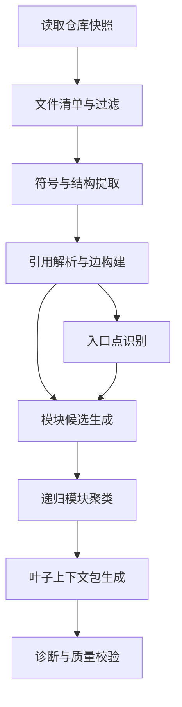

# 模块 1：从代码仓库到代码图谱与模块树

> 版本: 2.0  
> 状态: **已实现**（2026-06-07 代码对照完成）  
> 实现路径: `src/code_to_skill/code_graph/`、`src/code_to_skill/codegraph_mcp/`  
> 参考实现: `external/codegraph`（TypeScript MCP 服务，算法对齐参考）  
> 差距分析: [codegraph-gap-analysis.md](../references/codegraph-gap-analysis.md)

## 1. 模块目标

本模块把一个或多个代码仓库转换为可被后续 SkillAtom 抽取模块消费的结构化代码证据，包括：

- 代码快照清单：仓库路径、commit、语言、构建系统、排除规则。
- 代码图谱：文件、模块、类、函数、方法、入口、配置、测试等节点与依赖边。
- 模块树：按架构/功能边界递归分解后的树形结构。
- 入口点与关键路径：REST/RPC/CLI/Job/SPI/消息订阅等用户或系统进入路径。
- 叶子模块上下文包：每个叶子模块可直接用于规则抽取的源码、图谱关系和摘要。

本模块借鉴 CodeWiki 的“先构图、再分层分解、叶子先处理、父层后汇总”流程，以及 CodeGraph 的“本地索引、符号搜索、调用图、影响分析、上下文构建”能力。

## 2. 输入要求

### 2.1 必填输入

| 输入 | 类型 | 要求 |
|---|---|---|
| `repo_root` | path | 本地可读代码仓库根目录 |
| `repo_id` | string | 稳定仓库标识，例如 `payment-service` |
| `snapshot_ref` | string | commit SHA、tag 或归档版本号 |
| `include_patterns` | string[] | 需要分析的源码路径或 glob |
| `exclude_patterns` | string[] | 必须排除的目录和文件，例如 `.git`、`node_modules`、`dist`、测试快照、大文件产物 |
| `output_root` | path | 本模块产物写入目录，通常为 `runs/<run_id>/sources/code/` |

### 2.2 可选输入

| 输入 | 用途 |
|---|---|
| `language_hints` | 指定语言集合，减少误解析 |
| `build_metadata` | Maven/Gradle/npm/pip 等构建信息 |
| `domain_focus` | 聚类时优先关注的业务域或目录 |
| `entrypoint_rules` | 补充入口识别规则，例如 Spring 注解、FastAPI decorator、Quartz job |
| `max_leaf_tokens` | 叶子模块上下文上限，默认按目标模型窗口折算 |
| `max_module_depth` | 模块树最大递归深度，默认 3 |

### 2.3 输入约束

- 必须固定代码快照，禁止在分析过程中使用会漂移的工作区状态作为唯一来源。
- 大仓库必须启用 include/exclude，否则图谱会被测试、构建产物和依赖目录污染。
- 不能把密钥、证书、用户数据文件写入后续上下文包；发现后只保留脱敏风险标记。
- 如果仓库依赖生成代码，需要记录生成代码检测结果，并默认降低生成代码在模块聚类中的权重。

## 3. 输出与存储内容

推荐目录：

```text
runs/<run_id>/sources/code/<repo_id>/<snapshot_ref>/
├── manifest.json
├── file_inventory.json
├── graph.json
├── entrypoints.json
├── module_tree.json
├── leaf_contexts/
│   └── <leaf_id>.json
├── summaries/
│   ├── repository.md
│   └── <module_id>.md
└── diagnostics/
    ├── parse_errors.json
    ├── unresolved_edges.json
    └── oversized_files.json
```

### 3.1 `manifest.json`

记录可复现信息。

```json
{
  "schema_version": "1.0",
  "repo_id": "payment-service",
  "repo_root": "/abs/path/payment-service",
  "snapshot_ref": "abc123",
  "analyzed_at": "2026-06-03T00:00:00Z",
  "include_patterns": ["src/**"],
  "exclude_patterns": ["**/node_modules/**", "**/dist/**"],
  "tools": {
    "codegraph": "external/codegraph",
    "codewiki": "external/CodeWiki"
  }
}
```

### 3.2 `graph.json`

统一代码图谱。

```json
{
  "schema_version": "1.0",
  "nodes": [
    {
      "id": "src/refund/client.py::retry_refund",
      "kind": "function",
      "name": "retry_refund",
      "file_path": "src/refund/client.py",
      "start_line": 42,
      "end_line": 88,
      "language": "python",
      "source_hash": "sha256:..."
    }
  ],
  "edges": [
    {
      "source": "src/refund/client.py::retry_refund",
      "target": "src/common/idempotency.py::check_key",
      "kind": "calls",
      "confidence": 0.92,
      "provenance": "static"
    }
  ]
}
```

节点类型至少支持：

- `file`
- `module`
- `class`
- `interface`
- `function`
- `method`
- `route`
- `job`
- `config`
- `test`
- `script`

边类型至少支持：

- `contains`
- `calls`
- `imports`
- `extends`
- `implements`
- `references`
- `reads_config`
- `writes_state`
- `tested_by`
- `entry_to`

### 3.3 `module_tree.json`

模块树只保存结构和组件 ID，不直接塞入全部源码。

```json
{
  "schema_version": "1.0",
  "root_modules": {
    "payment_api": {
      "path": "src/payment",
      "reason": "API handlers and payment service orchestration",
      "components": [
        "src/payment/controller.py::PaymentController",
        "src/payment/service.py::PaymentService"
      ],
      "children": {
        "refund_flow": {
          "path": "src/refund",
          "components": ["src/refund/client.py::retry_refund"],
          "children": {}
        }
      }
    }
  }
}
```

### 3.4 `leaf_contexts/<leaf_id>.json`

后续 SkillAtom 抽取只读取叶子上下文包。

```json
{
  "schema_version": "1.0",
  "leaf_id": "refund_flow",
  "module_path": ["payment_api", "refund_flow"],
  "component_ids": ["src/refund/client.py::retry_refund"],
  "entrypoints": ["POST /api/refunds"],
  "important_edges": [],
  "source_snippets": [],
  "tests": [],
  "risk_notes": [],
  "cross_ref_ids": [],
  "parent_leaf": null,
  "split_reason": null,
  "requires_source_read": false,
  "token_estimate": 5400
}
```

## 4. 执行过程

### 4.1 流程图



### 4.2 步骤 1：仓库快照与文件清单

1. 校验 `repo_root` 存在且可读。
2. 读取 commit SHA 或归档版本，写入 `manifest.json`。
3. 根据 include/exclude 生成 `file_inventory.json`。
4. 标注文件类型：源码、测试、配置、文档、生成代码、构建产物。
5. 对超大文件和二进制文件只记录元数据，不进入源码上下文。

### 4.3 步骤 2：符号与结构提取

优先使用 CodeGraph 或语言专用解析器提取：

- 文件级节点。
- 类、接口、结构体、函数、方法、组件节点。
- 源码位置、签名、docstring、参数、返回值。
- 包含关系 `contains`。
- 未解析引用列表。

如果某语言暂不支持，使用降级策略：

- 基于文件目录生成粗粒度模块节点。
- 用正则只识别入口点和明显函数/类定义。
- 标记 `confidence < 0.5`，禁止自动生成强约束型 SkillAtom。

### 4.4 步骤 3：引用解析与图谱构建

1. 基于 import、包路径、同文件符号、框架约定解析引用。
2. 生成 calls/imports/extends/implements/references 等边。
3. 对动态分发、框架路由、依赖注入、事件回调使用启发式边，并写明 `provenance=heuristic`。
4. 将无法解析的引用写入 `diagnostics/unresolved_edges.json`。
5. 对核心入口到下游服务、仓储、外部 API 的链路做抽样核验。

### 4.5 步骤 4：入口点识别

入口点识别采用静态规则 + 图谱规则：

| 入口类型 | 识别方式 |
|---|---|
| REST/RPC | 框架注解、路由表、handler 注册 |
| CLI | `main`、command registry、console script |
| Job | scheduler 注解、Quartz/Cron 配置、worker 注册 |
| Message | topic/queue consumer、event handler |
| SPI/Public API | exported function、public interface、service provider |
| Test entry | 重要集成测试、端到端测试 |

输出到 `entrypoints.json`，每个入口包含 handler 节点、路径、协议、下游首跳和可信度。

### 4.6 步骤 5：模块树生成

模块树生成采用**分层聚类**策略，避免大仓库（数万组件）直接送入 LLM 导致成本失控：

**第一层：确定性粗分组**

按构建模块（Maven/Gradle module、npm package、Cargo crate）、顶层目录和包名前缀做硬分组。保证每组组件数不超过 `max_components_per_group`（默认 200）。此层不涉及 LLM。

**第二层：LLM 细粒度聚类**

只对第一层超限或需要跨组合并的候选组送入 LLM。LLM 输入为组件 ID、路径、简短类型标签，不包含源码。单次 LLM 调用的输入组件数受 `max_components_per_llm_call`（默认 50）限制。

**第三层：确定性拆分与校验**

LLM 输出后，用确定性规则校验：无空模块、无重复归属、无循环引用。按 `max_leaf_tokens` 做最终拆分。

聚类原则：

- 优先功能内聚，其次目录相邻。
- 入口路径、服务层、数据层尽量保留在同一业务流子树下。
- 单叶子上下文超过 `max_leaf_tokens` 时继续拆分。
- 模块名使用稳定 ASCII snake_case，避免后续文件名不可控。

新增配置项：

| 配置 | 默认值 | 说明 |
|---|---|---|
| `max_components_per_group` | 200 | 粗分组后单组最大组件数 |
| `max_components_per_llm_call` | 50 | 单次 LLM 聚类调用输入最大组件数 |
| `llm_clustering_enabled` | true | 是否启用 LLM 聚类；关闭则仅用确定性分组 |

当组件总数超过 `max_components_per_llm_call * 10`（约 500）时，系统应输出警告并建议按子目录分批次运行。

### 4.7 步骤 6：叶子上下文包生成

对每个叶子模块收集：

- 组件 ID 和源码片段。
- 入口到该叶子的调用链。
- 上游 callers、下游 callees、影响半径。
- 相关配置和测试。
- 代码约定、风险点、注释和待处理标记。
- 与其它模块的交叉引用，而不是复制其它模块全文。

叶子上下文包必须可独立用于 SkillAtom 抽取，但不应包含整个仓库源码。

**Token 预算控制方案**：

1. **估算器选择**：使用 `tiktoken`（`cl100k_base` 编码）作为通用 token 估算器。这是 OpenAI 系模型的标准编码，对中文/英文混合场景偏差可接受。在配置中允许指定其他 tokenizer（如 `qwen` 系列专用）。

2. **拆分策略**（按优先级）：
   - 第一优先：按文件边界拆分，保持单文件完整。
   - 第二优先：按函数/类边界拆分，标注 `parent_leaf`。
   - 第三优先：按调用链分段拆分（如入口→服务层→数据层各一段）。
   - 不得已时按行数硬截断，并在截断处标注 `continuation_leaf_id`。

3. **跨 leaf 引用**：拆分后，被拆分的 leaf 标注 `parent_leaf` 和 `split_reason`。模块 3 在抽取 SkillAtom 时，遇到 `parent_leaf` 非空的 leaf 应主动读取相邻 leaf 的上下文。leaf 之间的引用关系通过 `cross_ref_ids` 字段传递。

4. **超预算检测**：在生成阶段实时累计 token，达到 `max_leaf_tokens * 0.9` 时触发拆分。拆分后各 leaf 的 `token_estimate` 应重新计算并写入。

5. **配置项**：

| 配置 | 默认值 | 说明 |
|---|---|---|
| `max_leaf_tokens` | 8000 | 单叶子上下文 token 上限 |
| `tokenizer` | `cl100k_base` | token 估算器编码 |
| `split_strategy` | `file_then_function` | 拆分策略优先级 |

### 4.8 步骤 7：LLM 聚类 prompt 模板

第二层 LLM 聚类使用以下 prompt 模板：

```markdown
## Task
Group the following code components into a module hierarchy.
Each component has an ID, file path, and type label.

## Components
{component_list}

## Rules
1. Group by functional cohesion: components that work on the same business flow stay together.
2. Entry points (REST handlers, CLI commands, job triggers) form top-level groups.
3. Service layer, data layer, and utility components stay within the same business subtree.
4. Maximum tree depth: {max_module_depth}.
5. Module names must use ASCII snake_case.

## Output Format
Return a valid JSON object with:
- "schema_version": "1.0"
- "root_modules": object whose keys are module names and values contain:
  - "components": list of component IDs assigned to this module
  - "children": nested modules (same structure)
  - "reason": one-sentence justification

```json
{
  "schema_version": "1.0",
  "root_modules": {
    "payment_api": {
      "components": ["src/payment/controller.py::PaymentController"],
      "children": {
        "refund_flow": {
          "components": ["src/refund/client.py::retry_refund"],
          "children": {},
          "reason": "handles refund lifecycle including retry and idempotency"
        }
      },
      "reason": "API handlers and payment service orchestration"
    }
  }
}
```
```

降级策略：若 LLM 调用失败或输出非法 JSON，回退到确定性预分组结果，并记录 `clustering_fallback=true` 到 manifest。

## 5. 质量校验

| 校验项 | 通过标准 |
|---|---|
| 文件覆盖 | 目标 include 范围内源码覆盖率 >= 95%，排除项可解释 |
| 图谱有效性 | 核心入口至少能连到一个业务节点或配置节点 |
| 模块树有效性 | 每个叶子有组件；无空模块；无重复组件归属，除非显式共享 |
| 上下文预算 | 单个叶子上下文不超过配置预算 |
| 稳定性 | 同一输入快照重复运行产物 ID 稳定 |
| 诊断完整性 | 解析失败、未解析边、超大文件均有记录 |

## 6. 失败处理

| 失败 | 处理 |
|---|---|
| 仓库不可读 | 中止并输出 manifest 错误 |
| 解析器不支持语言 | 降级为目录级模块树并降低可信度 |
| 聚类输出格式错误 | 重试；仍失败则用确定性预分组 |
| 叶子上下文超预算 | 按调用链、入口、文件边界继续拆分 |
| 入口识别为空 | 以 public API、main、测试入口作为候选 |
| 未解析边过多 | 输出诊断，禁止自动生成高风险调用链规则 |

## 7. 下游接口

SkillAtom 抽取模块只依赖以下文件：

- `manifest.json`
- `graph.json`
- `entrypoints.json`
- `module_tree.json`
- `leaf_contexts/*.json`
- `diagnostics/*.json`

不得直接扫描原始仓库，除非某个 leaf context 标记为 `requires_source_read=true` 且提供了精确文件路径和行号。

---

## 8. 与 external/codegraph 对齐

本节记录 M1 相对 external/codegraph 的架构对比、分阶段交付与验收状态（原独立复刻计划已合并入本文档）。

### 8.1 架构对比

| 维度 | external/codegraph | 本项目 M1 |
|------|-------------------|----------|
| 定位 | Agent 实时代码智能服务（MCP） | 离线批处理 → SkillAtom / SkillOpt 证据 |
| 存储 | SQLite + FTS5 + unresolved_refs | SQLite + `graph.json` |
| 解析 | tree-sitter WASM，28 语言 | tree-sitter 可选 + 正则，14 语言 grammar |
| 解析精度 | AST 级 + 框架插件（20+） | tree-sitter Query + Spring/MyBatis 补充 |
| 引用解析 | import + FQN + 框架 + callback 合成 | import + 方法体 calls + callback 合成 |
| 遍历/搜索 | GraphTraverser + QueryBuilder + FTS | `GraphQueryEngine` + FTS ✅ |
| 上下文 | ContextBuilder（1200+ 行启发式） | `ContextBuilder` + `build_deep()` ✅ |
| 增量 | mtime/hash sync + 文件监听 | hash 检测 + `watcher.py` ✅ |
| MCP | 10 工具 + daemon | `codegraph_mcp` 10 工具 + `codegraph-daemon` ✅ |
| 独有能力 | — | 模块树、入口点、多仓库、benchmark 链路 |

### 8.2 差距关闭状态

| 优先级 | 原差距 | 状态 | 关键代码 |
|:---:|--------|:---:|----------|
| P0 | 图索引查询、FTS、上下文构建、增量索引、calls 边 | ✅ | `graph_queries.py`, `db.py`, `context_builder.py`, `resolver.py` |
| P1 | tree-sitter、qualified_name、unresolved_refs、query 语法、manifest | ✅ | `parser.py`, `ts_backend.py`, `query_parser.py` |
| P2 | MCP 工具、框架解析、文件监听、生成代码检测 | ✅ | `codegraph_mcp/`, `framework.py`, `watcher.py`, `generated_detection.py` |
| P3 | 20+ 框架、28 语言、完整 callback parity | ⬜ 长期 | 非 M1 阻塞项，预估 50k+ LOC |

### 8.3 执行阶段（Phase 1–12）

| Phase | 主题 | 交付要点 | 状态 |
|:---:|------|----------|:---:|
| 1 | 图驱动代码工具 + DB 查询层 | `GraphQueryEngine`、`ContextBuilder`、SkillOpt `code_tools` 图索引 | ✅ |
| 2 | 解析与 schema 对齐 | tree-sitter 可选、`qualified_name`、FTS、`manifest.json` | ✅ |
| 3 | MCP 暴露 | 6 工具 → 扩展至 10 工具 | ✅ |
| 4 | 框架与运维 | Spring/MyBatis 边、`EvidenceBuilder`、`watcher.py` | ✅ |
| 5 | 派发合成与多仓库 | `callback_synthesis.py`、`GraphRegistry` 多 graph.db | ✅ |
| 6 | 框架插件与运行时 | `mybatis_xml.py`、`js_callbacks.py`、`codegraph-daemon` | ✅ |
| 7 | SkillOpt Rollout 可靠性 | `rollout_max_tool_rounds` 分离、`rollout_helpers.py` | ✅ |
| 8 | M4 断点续训 | `resume_state.py`、`--resume` | ✅ |
| 9 | E2E 质量兜底 | `scenario_rules.py`、`--resume-run-id` | ✅ |
| 10 | tree-sitter Query 深度解析 | `ts_queries.py`、`explore_symbol`、`code_evidence.py` | ✅ |
| 11 | MCP/工具 parity + rollout 代码注入 | `list_graph_files`、`find_callers/callees`、`build_rollout_item_context` | ✅ |
| 12 | 深度上下文 + 会计链接 | `build_deep()`、`accounting_linker.py`、`react_renders.py` | ✅ |

Phase 1 数据流：

```text
graph.db ──► GraphQueryEngine ──► ContextBuilder
                │                      │
                └──────► CodeToolsHandler（search_symbol / get_code_context / trace_symbol）
                │
run pipeline ──► 增量 parse + FTS 索引
resolver ──► 方法 calls 边 + callback 合成
```

### 8.4 验收标准

| # | 标准 | 状态 | 验证 |
|---|------|:---:|------|
| 1 | `use_cache=True` 二次运行只解析变更文件 | ✅ | `test_m1_code_graph.py` |
| 2 | `GraphQueryEngine.search("JournalEntry")` 返回符号 | ✅ | `test_graph_queries.py` |
| 3 | `ContextBuilder.build(...)` 返回片段 + 符号 | ✅ | `test_graph_queries.py` |
| 4 | SkillOpt `search_symbol` 走 graph.db | ✅ | `test_code_tools.py` |
| 5 | trace callers/callees | ✅ | `test_code_tools.py` |
| 6 | MCP 10 工具 | ✅ | `test_codegraph_mcp.py` |
| 7 | Spring/MyBatis / callback / generated 边 | ✅ | `test_phase4_framework.py` ~ `test_phase6.py` |
| 8 | watcher + daemon | ✅ | `test_watcher.py` |
| 9 | rollout 降级凭证 + 代码注入 | ✅ | `test_rollout_helpers.py` |
| 10 | `build_deep()` + accounting_linker | ✅ | `test_phase12.py` |

深度检查（2026-06-06）：codegraph + skillopt 相关 **73 passed**。

### 8.5 与 SkillOpt（M4）的关系

| M1 能力 | M4 消费方式 | 流水线整合 |
|---------|------------|------------|
| `graph.db` | `code_tools.graph_db_path` / `GraphRegistry` | ✅ `artifact_contract.json` 记录 present |
| `entrypoints.json` | `GraphSidecarContext` → entrypoint 驱动 `trace_symbol` | ✅ P1-1；不再仅用 `api` 路径启发式 |
| `role_index.json` | `role_index.py` 建图时写入；M4 按 `graph_role_hints` 限定检索 | ✅ P1-2 sidecar |
| `search_symbol` / `get_code_context` | reflect / rollout 工具链 | ✅ fallback 计入 metrics |
| `trace_symbol` | 验证 `context_refs` 调用链 | ✅ |
| `build_rollout_item_context` | `context_mode=inline` 时注入源码 | ✅ 分段 token 预算 |
| `evidence_index.json`（M3） | M4 reflect 按 `context_ref`/symbol/atom_id 精确命中 | ✅ P1-4 |
| `accounting_linker` | reflect 无 context_refs 时预取图谱块 | ✅ |
| `LeafContext` | M3 atom 抽取 | ✅ `run extract-atoms --from <run_dir>` |

**待后续**：P1-3 将 `metadata.role` 写入 `graph.db` nodes 表，使 `GraphRegistry` 可直接 SQL 按 role 查询（当前依赖 `role_index.json` sidecar）。

图查询与文件读取**并存**：符号级优先，文件级兜底。详见 [04-skillopt-loop.md §4.4](./04-skillopt-loop.md)。
