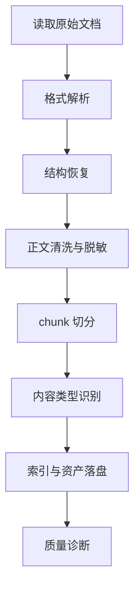

# 模块 2：知识库/PDF/Wiki 到文档规范化

## 1. 模块目标

本模块把 Markdown、PDF、Wiki、飞书/Confluence 导出、README、FAQ、SOP 等非结构化或半结构化资料转换为统一的 `DocumentChunk`、`DocumentAsset` 和 `DocumentIndex`。后续 SkillAtom 抽取模块不直接读取原始文档，而是读取本模块输出的规范化文档证据。

规范化的目标是：

- 保留来源、版本、页码、标题层级、段落位置，支持审计。
- 把长文档拆成可检索、可引用、可评分的 chunk。
- 把表格、代码块、图片说明、附件链接显式结构化。
- 识别 SOP、FAQ、错误码、接口约定、禁止行为、输出模板等可转成 Skill 的内容。
- 对敏感信息、过期内容、冲突内容做标记，而不是直接丢进 Skill。

## 2. 输入要求

### 2.1 必填输入

| 输入 | 类型 | 要求 |
|---|---|---|
| `source_uri` | string | 原始文档路径或 Wiki 导出标识 |
| `source_type` | enum | `markdown` / `pdf` / `wiki_export` / `html` / `docx` / `text` |
| `source_version` | string | 文档版本、导出时间或 hash |
| `source_owner` | string | 来源系统或责任团队 |
| `output_root` | path | 规范化产物目录 |

### 2.2 可选输入

| 输入 | 用途 |
|---|---|
| `authority_level` | 文档权威等级，解决冲突时使用 |
| `valid_from` / `valid_to` | 生效时间范围 |
| `language` | `zh`、`en` 等 |
| `ocr_enabled` | 扫描 PDF 或图片是否启用 OCR |
| `redaction_policy` | 脱敏规则 |
| `domain_tags` | 领域标签，例如 payment、monitoring |

### 2.3 输入约束

- PDF 必须保留页码；没有页码锚点的抽取结果只能作为低可信参考。
- Wiki 导出必须保留原始页面 ID、URL 或稳定路径。
- 文档中的密钥、账号、个人信息、临时 token 必须脱敏。
- 无法确定版本的文档不得作为高权威来源。

## 3. 输出与存储内容

推荐目录：

```text
sources/docs/<source_id>/<source_version>/
├── manifest.json
├── document_index.json
├── chunks.jsonl
├── tables.jsonl
├── assets.jsonl
├── extracted_text.md
└── diagnostics/
    ├── redactions.json
    ├── parse_warnings.json
    └── conflicts.json
```

### 3.1 `manifest.json`

```json
{
  "source_id": "payment-runbook",
  "source_uri": "kb/payment/runbook.md",
  "source_type": "markdown",
  "source_version": "2026-05-28",
  "sha256": "...",
  "authority_level": "team_runbook",
  "language": "zh",
  "normalized_at": "2026-06-03T00:00:00Z"
}
```

### 3.2 `document_index.json`

记录文档结构树。

```json
{
  "title": "支付系统故障处理手册",
  "sections": [
    {
      "section_id": "sec-timeout",
      "heading": "外部 API 超时处理",
      "level": 2,
      "parent_id": "sec-root",
      "chunk_ids": ["chunk-001", "chunk-002"],
      "page_range": [4, 5]
    }
  ]
}
```

### 3.3 `chunks.jsonl`

每行一个规范化 chunk。

```json
{
  "schema_version": "1.0",
  "chunk_id": "payment-runbook:v2026-05-28:chunk-001",
  "source_id": "payment-runbook",
  "section_id": "sec-timeout",
  "heading_path": ["故障处理", "外部 API 超时处理"],
  "content_type": "procedure",
  "text": "调用支付 API 超时时，先检查幂等键状态...",
  "page": 4,
  "char_start": 1024,
  "char_end": 1320,
  "authority_level": "team_runbook",
  "validity": "active",
  "sensitivity": "none",
  "tags": ["payment", "timeout", "retry"]
}
```

### 3.4 `tables.jsonl`

表格单独保存，避免在 chunk 中丢结构。

```json
{
  "table_id": "payment-runbook:table-error-codes",
  "caption": "错误码处理表",
  "columns": ["错误码", "含义", "处理方式"],
  "rows": [
    ["E100", "外部 API 超时", "检查幂等键后重试"]
  ],
  "source_ref": "page 6 / section sec-error-code"
}
```

### 3.5 `assets.jsonl`

记录图片、截图、附件、图表。

```json
{
  "asset_id": "payment-runbook:asset-003",
  "asset_type": "image",
  "source_ref": "page 8",
  "alt_text": "退款状态机流程图",
  "ocr_text": "",
  "file_path": "assets/refund-state-machine.png"
}
```

## 4. 执行过程

### 4.1 流程图



### 4.2 步骤 1：读取与格式解析

按 `source_type` 选择解析器：

| 类型 | 解析方式 |
|---|---|
| Markdown | 解析 heading、列表、表格、代码块 |
| PDF | 使用 PDF 文本抽取；扫描件走 OCR；保留页码 |
| Wiki/HTML | 解析 DOM heading、表格、链接、附件 |
| DOCX | 解析段落样式、表格、图片 |
| Text | 按标题规则和段落分隔降级解析 |

解析器输出统一的中间结构：

```json
{
  "blocks": [
    {"type": "heading", "level": 2, "text": "超时处理", "page": 4},
    {"type": "paragraph", "text": "...", "page": 4},
    {"type": "table", "table_id": "...", "page": 6}
  ]
}
```

### 4.2.1 OCR 处理细节

当 PDF 文本抽取结果为空或文本量异常低（< 50 字符/页）时，判定为扫描件，启用 OCR：

| 配置 | 默认值 | 说明 |
|---|---|---|
| `ocr_engine` | `tesseract` | OCR 引擎，可选 `tesseract` / `paddleocr` / `azure_form_recognizer` |
| `ocr_languages` | `chi_sim+eng` | Tesseract 语言包 |
| `ocr_confidence_threshold` | 0.6 | OCR 置信度低于此值的文本标记为 `low_quality` |
| `ocr_dpi` | 300 | OCR 预处理分辨率 |
| `ocr_timeout_seconds` | 300 | 单页 OCR 超时 |

OCR 结果处理：

1. 每页 OCR 后生成 `ocr_confidence` 评分（0-1）。
2. `ocr_confidence < 0.6` 的 chunk 标记 `quality=low`，在 `content_type` 中追加 `ocr_degraded`。
3. 低质量 OCR chunk 不进入高置信 SkillAtom 抽取，仅作为辅助参考。
4. OCR 识别出的表格尝试恢复行列结构；恢复失败时保留原始文本块。
5. 扫描件中的图片生成 `asset` 记录，不做 OCR（避免无意义乱码）。

### 4.2.2 多平台 Wiki 适配策略

不同 Wiki 平台的导出格式差异大，需要按平台选择适配器：

| 平台 | 输入格式 | 适配器 | 特殊处理 |
|---|---|---|---|
| **飞书 (Feishu/Lark)** | HTML 导出 或 Open API JSON | `feishu_adapter` | 飞书特有 block 类型（`callout`、`grid`、`bitable` 引用）；图片需通过 API 下载 |
| **Confluence** | HTML Storage Format 或 XML 导出 | `confluence_adapter` | 自定义宏（`ac:structured-macro`）；`<ri:attachment>` 引用；空间内页面链接 |
| **Notion** | Markdown/CSV 导出 | `notion_adapter` | 数据库视图转为 table；toggle block 展平 |
| **GitHub Wiki** | Markdown + 附件目录 | `github_wiki_adapter` | 相对链接 `[[page]]` 解析；附件路径映射 |
| **通用 HTML** | 标准 HTML | `generic_html_adapter` | 仅解析 `<h1>-<h6>`、`<table>`、`<pre><code>`、`<ul>/<ol>` |

适配器实现统一接口 `WikiAdapter`，输出 §4.2 定义的中间 `blocks` 结构。平台检测通过：
1. 用户显式指定 `source_subtype`。
2. HTML 文件的 meta 标签或特征 class 名自动检测。
3. 默认降级为 `generic_html_adapter`。

### 4.3 步骤 2：结构恢复

1. 根据 heading 构建 section tree。
2. 对 PDF 中断行、页眉页脚、脚注、目录页做清理。
3. 将列表项合并为有序步骤或检查项。
4. 将跨页表格合并为单个 table。
5. 保留原始页码、段落偏移和 heading path。

### 4.4 步骤 3：正文清洗与脱敏

清洗：

- 删除重复页眉页脚。
- 统一全角/半角、空白、换行。
- 保留代码块、命令、配置键和错误码原样。
- 将图片引用替换为 `asset_id`。

脱敏：

- API key、token、密码、证书片段。
- 个人手机号、邮箱、身份证号。
- 内部临时登录链接。
- 生产数据库连接串。

脱敏后的文本必须保留可理解占位符，例如 `<REDACTED_API_KEY>`。

### 4.5 步骤 4：chunk 切分

chunk 切分以语义完整为优先级：

1. SOP 步骤不能拆散。
2. FAQ 的问答必须保持同一 chunk。
3. 错误码表可以按行组切分，但表头必须保留。
4. 接口契约按 endpoint 或方法切分。
5. 单 chunk 超预算时，按小节和列表边界拆分。

推荐字段：

| 字段 | 说明 |
|---|---|
| `content_type` | `concept` / `procedure` / `faq` / `error_code` / `api_contract` / `policy` / `template` / `example` |
| `semantic_unit` | `section` / `qa_pair` / `table_rows` / `step_list` |
| `token_estimate` | 估算 token |
| `source_ref` | 页码或 Wiki anchor |

### 4.6 步骤 5：内容类型识别

使用规则优先，LLM 只做补充：

| 类型 | 识别线索 |
|---|---|
| SOP | “步骤”“流程”“先/再/最后”“必须” |
| FAQ | 问答格式、Q/A、常见问题 |
| 错误码 | 错误码列、状态码列、异常名 |
| API 契约 | endpoint、request、response、字段表 |
| 禁止行为 | “不得”“禁止”“不要”“严禁” |
| 输出模板 | 固定标题、JSON schema、报告格式 |
| 故障模式 | “如果失败”“常见原因”“排查” |

### 4.7 步骤 6：冲突与过期检测

本模块只标记**同一知识源体系内部**的矛盾，不检测跨来源（代码 vs 文档）冲突。跨来源一致性是模块 3 的职责。

冲突类型：

- 同一错误码对应不同处理方式。
- Wiki 与 README 对接口字段描述不一致。
- 同一文档内 SOP 步骤前后矛盾。
- 文档已过期但仍被引用（通过 `valid_to` 判断）。

输出到 `diagnostics/conflicts.json`：

```json
{
  "conflict_id": "conflict-error-E100",
  "claim": "E100 超时处理方式",
  "sources": ["runbook:v1", "faq:v3"],
  "status": "needs_resolution",
  "recommended_action": "defer_to_higher_authority_or_code"
}
```

## 5. 质量校验

| 校验项 | 通过标准 |
|---|---|
| 来源完整性 | 每个 chunk 都有 source_id、version、section/page |
| 结构完整性 | heading tree 无孤儿节点 |
| 表格完整性 | 表头、行数、来源位置可追踪 |
| 脱敏完整性 | redaction 记录可审计，文本不含明显 secret |
| chunk 可用性 | 过长 chunk 被拆分；过短噪声 chunk 被合并或标记 |
| 类型准确性 | 抽样人工检查 content_type，准确率目标 >= 90% |

## 6. 失败处理

| 失败 | 处理 |
|---|---|
| PDF 文本为空 | 启用 OCR；若仍失败，记录资产但不进入 SkillAtom |
| Wiki 导出缺页面 ID | 用路径和 hash 生成临时 ID，降低权威度 |
| 表格解析错位 | 保存原始表格文本和 parse warning |
| 脱敏命中过多 | 保留结构，正文替换为脱敏摘要 |
| 文档版本未知 | 标记 `validity=unknown`，禁止自动写入核心 Skill |

## 7. 下游接口

SkillAtom 抽取模块读取：

- `manifest.json`
- `document_index.json`
- `chunks.jsonl`
- `tables.jsonl`
- `assets.jsonl`
- `diagnostics/conflicts.json`

下游不得直接依赖原始 PDF/Wiki 页面内容；需要回溯时通过 `source_ref` 定位。
