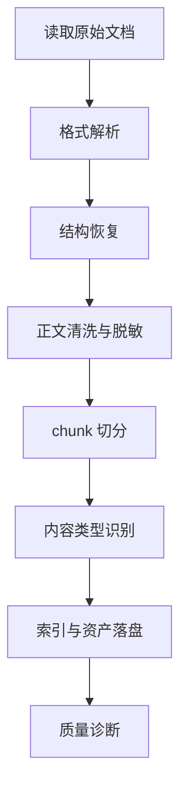

# 模块 2：知识库/PDF/Wiki 到文档规范化

## 1. 模块目标

本模块把 Markdown、PDF、Wiki、飞书/Confluence 导出、README、FAQ、SOP 等非结构化或半结构化资料转换为统一的 `DocumentChunk`、`DocumentAsset` 和 `DocumentIndex`。后续 SkillAtom 抽取模块不直接读取原始文档，而是读取本模块输出的规范化文档证据。

规范化的目标是：

- 保留来源、版本、页码、标题层级、段落位置，支持审计。
- 把长文档拆成可检索、可引用、可评分的 chunk。
- 把表格、代码块、图片说明、附件链接显式结构化。
- 识别 SOP、FAQ、错误码、接口约定、禁止行为、输出模板等可转成 Skill 的内容。
- 对敏感信息、过期内容、冲突内容做标记，而不是直接丢进 Skill。

**可插拔知识源设计**：本模块通过 `KnowledgeSource` 抽象接口解耦"从哪里获取文档原始内容"和"如何规范化为统一格式"。当前支持两种 provider：

| Provider | 说明 | 实现状态 |
|---|---|---|
| `LocalFileKnowledgeSource` | 从本地文件系统读取 Markdown/PDF/DOCX/HTML/TXT | ✅ 已实现 |
| `RemoteKnowledgeSource` | 从第三方 API 拉取（飞书、Confluence、Notion 等） | 🔌 接口预留 |

新增 provider 只需实现 `KnowledgeSource` 接口的 `fetch_raw_content()` 方法，规范化流水线无需修改。本章 §2.4 定义接口规范。

## 2. 输入要求

### 2.1 必填输入

| 输入 | 类型 | 要求 |
|---|---|---|
| `source_uri` | string | 原始文档路径（本地）或资源标识符（远程）。本地为文件路径，远程为 API endpoint 或资源 ID |
| `source_type` | enum | `markdown` / `pdf` / `wiki_export` / `html` / `docx` / `text` |
| `source_provider` | enum | `local_file`（本地文件系统，默认）/ `feishu_api` / `confluence_api` / `notion_api` / `github_wiki` |
| `source_version` | string | 文档版本、导出时间或 hash |
| `source_owner` | string | 来源系统或责任团队 |
| `output_root` | path | 规范化产物目录，通常为 `runs/<run_id>/sources/docs/` |

### 2.2 可选输入

| 输入 | 用途 |
|---|---|
| `authority_level` | 文档权威等级，解决冲突时使用 |
| `valid_from` / `valid_to` | 生效时间范围 |
| `language` | `zh`、`en` 等 |
| `ocr_enabled` | 扫描 PDF 页或图片型文档是否启用 OCR |
| `redaction_policy` | 脱敏规则 |
| `domain_tags` | 领域标签，例如 payment、monitoring |

### 2.3 输入约束

- PDF 必须保留页码；没有页码锚点的抽取结果只能作为低可信参考。
- Wiki 导出必须保留原始页面 ID、URL 或稳定路径。
- 文档中的密钥、账号、个人信息、临时 token 必须脱敏。
- 无法确定版本的文档不得作为高权威来源。

### 2.4 `KnowledgeSource` 可插拔接口

规范化流水线不直接打开文件或调用 API，而是通过 `KnowledgeSource` 接口获取原始内容。新增第三方数据源只需实现该接口。

**接口定义**（Python 示意）：

```python
from abc import ABC, abstractmethod
from dataclasses import dataclass
from typing import Optional

@dataclass
class RawDocument:
    """provider 返回的原始文档内容"""
    content: bytes                # 原始字节内容
    source_uri: str               # 来源标识
    source_type: str              # markdown / pdf / html / docx / text
    source_version: str           # 版本或 hash
    metadata: dict                # 额外元数据（如 API 返回的页面标题、更新时间、附件列表）

class KnowledgeSource(ABC):
    """知识源抽象接口。所有 provider 必须实现此接口。"""

    @abstractmethod
    def fetch_raw_content(self, source_uri: str) -> RawDocument:
        """从指定来源获取原始文档内容。

        Args:
            source_uri: 本地路径或远程资源标识符

        Returns:
            RawDocument: 包含原始内容和元数据

        Raises:
            SourceNotFoundError: 来源不存在
            SourceAccessError: 权限不足或网络错误
        """
        ...

    @abstractmethod
    def list_sources(self) -> list[str]:
        """列出此 provider 下所有可用的 source_uri。"""
        ...

    @abstractmethod
    def healthcheck(self) -> bool:
        """检查 provider 是否可用（网络连通、凭证有效）。"""
        ...
```

**已实现的 Provider**：

```python
class LocalFileKnowledgeSource(KnowledgeSource):
    """从本地文件系统读取文档。

    source_uri 为绝对路径或相对于工作区的路径。
    支持格式：.md / .pdf / .docx / .html / .txt
    """
    def __init__(self, workspace_root: str):
        self.workspace_root = workspace_root

    def fetch_raw_content(self, source_uri: str) -> RawDocument:
        path = os.path.join(self.workspace_root, source_uri)
        if not os.path.exists(path):
            raise SourceNotFoundError(f"File not found: {path}")
        with open(path, 'rb') as f:
            content = f.read()
        return RawDocument(
            content=content,
            source_uri=source_uri,
            source_type=self._infer_type(path),
            source_version=hashlib.sha256(content).hexdigest()[:12],
            metadata={'file_path': path, 'file_size': len(content)}
        )

    def _infer_type(self, path: str) -> str:
        ext = os.path.splitext(path)[1].lower()
        return {'.md': 'markdown', '.pdf': 'pdf', '.docx': 'docx',
                '.html': 'html', '.htm': 'html', '.txt': 'text'}.get(ext, 'text')

    def list_sources(self) -> list[str]:
        # 遍历工作区下的文档目录
        ...

    def healthcheck(self) -> bool:
        return os.path.isdir(self.workspace_root)
```

**预留接口（未实现）**：

```python
class RemoteKnowledgeSource(KnowledgeSource, ABC):
    """远程知识源基类。处理认证、分页、速率限制等通用逻辑。"""

    def __init__(self, auth_config: dict, timeout_seconds: int = 60):
        self.auth_config = auth_config
        self.timeout_seconds = timeout_seconds

    @abstractmethod
    def _build_request(self, source_uri: str) -> dict:
        """构造 API 请求参数。子类实现。"""
        ...

# 示例：飞书 API provider（预留，未实现）
class FeishuKnowledgeSource(RemoteKnowledgeSource):
    def fetch_raw_content(self, source_uri: str) -> RawDocument:
        # source_uri 为飞书文档 token 或 URL
        # 调用飞书 Open API: GET /open-apis/docx/v1/documents/{document_id}/raw_content
        raise NotImplementedError("Feishu API provider not yet implemented")

    def list_sources(self) -> list[str]:
        # 调用飞书 API 列出空间内文档
        raise NotImplementedError("Feishu API provider not yet implemented")

    def healthcheck(self) -> bool:
        # 调用飞书 tenant_access_token 接口验证凭证
        raise NotImplementedError("Feishu API provider not yet implemented")
```

**Provider 注册与选择**：

规范化流水线通过 `source_provider` 字段查找已注册的 provider：

```python
# 注册表
_providers: dict[str, KnowledgeSource] = {
    'local_file': LocalFileKnowledgeSource(workspace_root),
    # 以下预留，未注册
    # 'feishu_api': FeishuKnowledgeSource(auth_config),
    # 'confluence_api': ConfluenceKnowledgeSource(auth_config),
    # 'notion_api': NotionKnowledgeSource(auth_config),
}

def get_provider(name: str) -> KnowledgeSource:
    provider = _providers.get(name)
    if provider is None:
        raise ValueError(f"Unknown source_provider: {name}")
    return provider
```

## 3. 输出与存储内容

推荐目录：

```text
runs/<run_id>/sources/docs/<source_id>/<source_version>/
├── manifest.json
├── document_index.json
├── chunks.jsonl
├── tables.jsonl
├── assets.jsonl
├── extracted_text.md
└── diagnostics/
    ├── redactions.json
    ├── parse_warnings.json
    └── conflicts.json
```

### 3.1 `manifest.json`

```json
{
  "schema_version": "1.0",
  "source_id": "payment-runbook",
  "source_uri": "kb/payment/runbook.md",
  "source_type": "markdown",
  "source_version": "2026-05-28",
  "sha256": "...",
  "authority_level": "team_runbook",
  "language": "zh",
  "normalized_at": "2026-06-03T00:00:00Z"
}
```

### 3.2 `document_index.json`

记录文档结构树。

```json
{
  "schema_version": "1.0",
  "title": "支付系统故障处理手册",
  "sections": [
    {
      "section_id": "sec-timeout",
      "heading": "外部 API 超时处理",
      "level": 2,
      "parent_id": "sec-root",
      "chunk_ids": ["chunk-001", "chunk-002"],
      "page_range": [4, 5]
    }
  ]
}
```

### 3.3 `chunks.jsonl`

每行一个规范化 chunk。

```json
{
  "schema_version": "1.0",
  "chunk_id": "payment-runbook:v2026-05-28:chunk-001",
  "source_id": "payment-runbook",
  "section_id": "sec-timeout",
  "heading_path": ["故障处理", "外部 API 超时处理"],
  "content_type": "procedure",
  "text": "调用支付 API 超时时，先检查幂等键状态...",
  "page": 4,
  "char_start": 1024,
  "char_end": 1320,
  "authority_level": "team_runbook",
  "validity": "active",
  "sensitivity": "none",
  "quality_flags": [],
  "tags": ["payment", "timeout", "retry"]
}
```

### 3.4 `tables.jsonl`

表格单独保存，避免在 chunk 中丢结构。

```json
{
  "schema_version": "1.0",
  "table_id": "payment-runbook:table-error-codes",
  "caption": "错误码处理表",
  "columns": ["错误码", "含义", "处理方式"],
  "rows": [
    ["E100", "外部 API 超时", "检查幂等键后重试"]
  ],
  "source_ref": "page 6 / section sec-error-code"
}
```

### 3.5 `assets.jsonl`

记录图片、截图、附件、图表。

```json
{
  "schema_version": "1.0",
  "asset_id": "payment-runbook:asset-003",
  "asset_type": "image",
  "source_ref": "page 8",
  "alt_text": "退款状态机流程图",
  "ocr_text": "",
  "file_path": "assets/refund-state-machine.png"
}
```

## 4. 执行过程

### 4.1 流程图



### 4.2 步骤 1：通过 Provider 获取原始内容

规范化流水线不直接访问文件系统或 API。第一步通过配置的 `source_provider` 获取原始文档：

```python
provider = get_provider(source_provider)        # 从注册表获取 provider
raw_doc = provider.fetch_raw_content(source_uri) # 获取原始内容
```

然后按 `raw_doc.source_type`（由 provider 推断或配置指定）选择解析器：

| 类型 | 解析方式 |
|---|---|
| Markdown | 解析 heading、列表、表格、代码块 |
| PDF | 使用 PDF 文本抽取；扫描件走 OCR；保留页码 |
| HTML / Wiki | 解析 DOM heading、表格、链接、附件 |
| DOCX | 解析段落样式、表格、图片 |
| Text | 按标题规则和段落分隔降级解析 |

解析器输出统一的中间结构：

```json
{
  "blocks": [
    {"type": "heading", "level": 2, "text": "超时处理", "page": 4},
    {"type": "paragraph", "text": "...", "page": 4},
    {"type": "table", "table_id": "...", "page": 6}
  ]
}
```

`source_provider` 为 `local_file` 时，`source_uri` 为文件路径，`LocalFileKnowledgeSource` 读取文件字节并推断类型。后续步骤（结构恢复、清洗、切分）与 provider 无关，只依赖统一中间 `blocks` 结构。

### 4.2.1 OCR 处理细节

当 PDF 文本抽取结果为空或文本量异常低（< 50 字符/页）时，判定为扫描件，启用 OCR：

| 配置 | 默认值 | 说明 |
|---|---|---|
| `ocr_engine` | `tesseract` | OCR 引擎，可选 `tesseract` / `paddleocr` / `azure_form_recognizer` |
| `ocr_languages` | `chi_sim+eng` | Tesseract 语言包 |
| `ocr_confidence_threshold` | 0.6 | OCR 置信度低于此值的文本标记为 `low_quality` |
| `ocr_dpi` | 300 | OCR 预处理分辨率 |
| `ocr_timeout_seconds` | 300 | 单页 OCR 超时 |

OCR 结果处理：

1. 每页 OCR 后生成 `ocr_confidence` 评分（0-1）。
2. `ocr_confidence < 0.6` 的 chunk 标记 `quality_flags=["ocr_degraded"]`，不改变 `content_type` 的枚举值。
3. 低质量 OCR chunk 不进入高置信 SkillAtom 抽取，仅作为辅助参考。
4. OCR 识别出的表格尝试恢复行列结构；恢复失败时保留原始文本块。
5. 整页扫描图像按页做 OCR；文档内嵌示意图、架构图、截图默认只生成 `asset` 记录，不做 OCR。若启用 `asset_ocr_enabled=true`，才对内嵌图片单独 OCR，并将结果写入 `assets.jsonl` 的 `ocr_text`。

### 4.2.2 多平台 Wiki 适配策略

不同 Wiki 平台的内容获取方式和格式差异大，通过 `RemoteKnowledgeSource` 子类统一处理：

| 平台 | Provider | `source_uri` 示例 | 获取方式 | 格式处理 | 状态 |
|---|---|---|---|---|---|
| **飞书** | `feishu_api` | `doc_token:B4Jkdm1YboR1Rxxx` | Open API 拉取原始内容 | `feishu_parser` 处理 block 结构 | 🔌 预留 |
| **Confluence** | `confluence_api` | `page_id:123456` | REST API 拉取存储格式 | `confluence_parser` 处理宏和附件 | 🔌 预留 |
| **Notion** | `notion_api` | `page_id:abc-def-123` | API 拉取 block 树 | `notion_parser` 展平 block 为 Markdown | 🔌 预留 |
| **本地 Wiki 导出** | `local_file` | `kb/feishu_export.html` | 本地文件读取 | 按 HTML 解析 + 平台特征 class 识别 | ✅ 已实现 |

**本地 Wiki 导出的平台检测**：

当 `source_provider=local_file` 且 `source_type=html` 时，解析器通过 HTML meta 标签或特征 class 名自动检测平台：

```python
def detect_wiki_platform(html_content: str) -> str:
    if '<meta name="feishu:doc_token"' in html_content:
        return 'feishu_export'
    if 'ac:structured-macro' in html_content:
        return 'confluence_export'
    if 'notion-' in html_content:
        return 'notion_export'
    return 'generic_html'
```

检测结果写入 `manifest.json` 的 `source_subtype` 字段，指导后续 format-specific 解析。

**远程 Provider 实现时机**：

- `feishu_api`：当需要直接从飞书空间拉取最新文档而非依赖手动导出时实现。需配置飞书应用凭证（App ID + App Secret）。
- `confluence_api`：当 Confluence 作为团队主知识库时实现。需配置 Personal Access Token。
- `notion_api`：当使用 Notion 管理 SOP 和设计文档时实现。需配置 Internal Integration Token。

所有远程 provider 继承 `RemoteKnowledgeSource` 基类，复用认证刷新、分页、速率限制逻辑。远程获取的内容在 `fetch_raw_content` 中完成拉取和初步格式标准化（如飞书 block 结构 → Markdown），后续规范化流水线无感知。

### 4.3 步骤 2：结构恢复

1. 根据 heading 构建 section tree。
2. 对 PDF 中断行、页眉页脚、脚注、目录页做清理。
3. 将列表项合并为有序步骤或检查项。
4. 将跨页表格合并为单个 table。
5. 保留原始页码、段落偏移和 heading path。

### 4.4 步骤 3：正文清洗与脱敏

清洗：

- 删除重复页眉页脚。
- 统一全角/半角、空白、换行。
- 保留代码块、命令、配置键和错误码原样。
- 将图片引用替换为 `asset_id`。

脱敏：

- API key、token、密码、证书片段。
- 个人手机号、邮箱、身份证号。
- 内部临时登录链接。
- 生产数据库连接串。

脱敏后的文本必须保留可理解占位符，例如 `<REDACTED_API_KEY>`。

### 4.5 步骤 4：chunk 切分

chunk 切分以语义完整为优先级：

1. SOP 步骤不能拆散。
2. FAQ 的问答必须保持同一 chunk。
3. 错误码表可以按行组切分，但表头必须保留。
4. 接口契约按 endpoint 或方法切分。
5. 单 chunk 超预算时，按小节和列表边界拆分。

推荐字段：

| 字段 | 说明 |
|---|---|
| `content_type` | `concept` / `procedure` / `faq` / `error_code` / `api_contract` / `policy` / `template` / `example` |
| `semantic_unit` | `section` / `qa_pair` / `table_rows` / `step_list` |
| `token_estimate` | 估算 token |
| `source_ref` | 页码或 Wiki anchor |
| `quality_flags` | 质量标记，例如 `ocr_degraded`、`layout_uncertain` |

### 4.6 步骤 5：内容类型识别

使用规则优先，LLM 只做补充：

| 类型 | 识别线索 |
|---|---|
| SOP | “步骤”“流程”“先/再/最后”“必须” |
| FAQ | 问答格式、Q/A、常见问题 |
| 错误码 | 错误码列、状态码列、异常名 |
| API 契约 | endpoint、request、response、字段表 |
| 禁止行为 | “不得”“禁止”“不要”“严禁” |
| 输出模板 | 固定标题、JSON schema、报告格式 |
| 故障模式 | “如果失败”“常见原因”“排查” |

### 4.7 步骤 6：冲突与过期检测

本模块只标记**同一知识源体系内部**的矛盾，不检测跨来源（代码 vs 文档）冲突。跨来源一致性是模块 3 的职责。

冲突类型：

- 同一错误码对应不同处理方式。
- Wiki 与 README 对接口字段描述不一致。
- 同一文档内 SOP 步骤前后矛盾。
- 文档已过期但仍被引用（通过 `valid_to` 判断）。

输出到 `diagnostics/conflicts.json`：

```json
{
  "conflict_id": "conflict-error-E100",
  "claim": "E100 超时处理方式",
  "sources": ["runbook:v1", "faq:v3"],
  "status": "needs_resolution",
  "recommended_action": "defer_to_higher_authority_or_code"
}
```

## 5. 质量校验

| 校验项 | 通过标准 |
|---|---|
| 来源完整性 | 每个 chunk 都有 source_id、version、section/page |
| 结构完整性 | heading tree 无孤儿节点 |
| 表格完整性 | 表头、行数、来源位置可追踪 |
| 脱敏完整性 | redaction 记录可审计，文本不含明显 secret |
| chunk 可用性 | 过长 chunk 被拆分；过短噪声 chunk 被合并或标记 |
| 类型准确性 | 抽样人工检查 content_type，准确率目标 >= 90% |

## 6. 失败处理

| 失败 | 处理 |
|---|---|
| PDF 文本为空 | 启用 OCR；若仍失败，记录资产但不进入 SkillAtom |
| Wiki 导出缺页面 ID | 用路径和 hash 生成临时 ID，降低权威度 |
| 表格解析错位 | 保存原始表格文本和 parse warning |
| 脱敏命中过多 | 保留结构，正文替换为脱敏摘要 |
| 文档版本未知 | 标记 `validity=unknown`，禁止自动写入核心 Skill |

## 7. 下游接口

SkillAtom 抽取模块读取：

- `manifest.json`
- `document_index.json`
- `chunks.jsonl`
- `tables.jsonl`
- `assets.jsonl`
- `diagnostics/conflicts.json`

下游不得直接依赖原始 PDF/Wiki 页面内容；需要回溯时通过 `source_ref` 定位。
