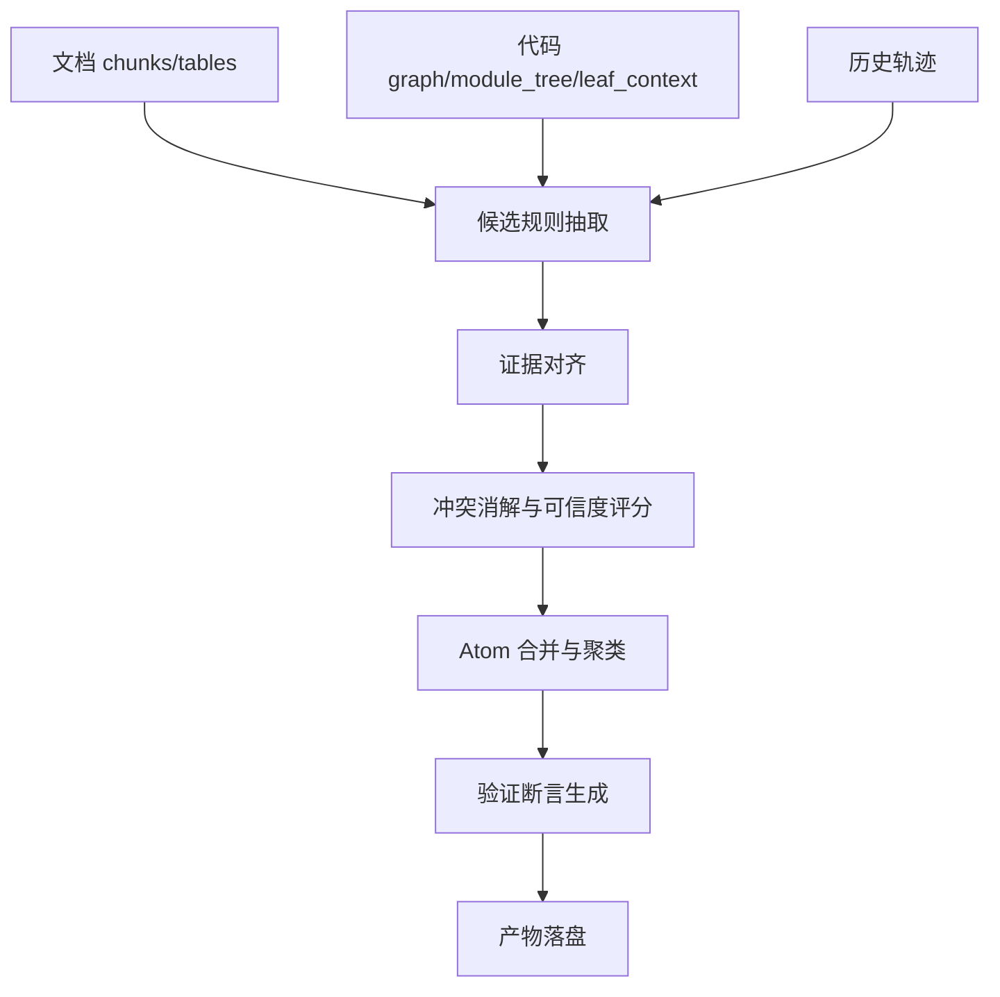

# 模块 3：从代码图谱/模块树与规范化文档到 SkillAtom 抽取

> 状态: **已实现（含 `artifact_quality.json`）**  
> 关联: `00-overall-design.md` §16、`06-cli-human-interaction-orchestrator.md` §12、M1 sidecar、M4 `evidence_index` 消费、`run bootstrap-benchmark`

## 1. 模块目标

本模块将模块 1 的代码证据和模块 2 的文档证据融合，抽取可被 Skill 生成器、Benchmark 生成器和 SkillOpt 优化器消费的 `SkillAtom`。`SkillAtom` 是最小可追踪技能单元，表达一条概念、流程、工具策略、约束、失败模式或输出要求。

本模块不直接生成最终 `SKILL.md`，而是生成带来源、适用条件、可信度和验证断言的结构化候选规则。

2026-06 审计结论：M3 当前已经能产出 atoms、seeds 和 evidence，但在显式 `initial_skill + benchmark` 的主路径中，多数产物只落盘、不进入 M4；同时 seed schema 与 M4 benchmark 不完全兼容，atom 合并过宽会稀释证据相关性。因此本设计以**可被 M4 直接消费**为约束重写产物契约。

## 2. 输入要求

### 2.1 来自模块 1 的代码输入

| 文件 | 要求 |
|---|---|
| `manifest.json` | 仓库快照、工具版本、include/exclude |
| `graph.json` | 节点、边、置信度、来源 |
| `entrypoints.json` | 入口点、协议、handler、下游首跳 |
| `module_tree.json` | 功能模块与叶子模块结构 |
| `leaf_contexts/*.json` | 叶子模块源码片段、调用链、测试、风险 |
| `diagnostics/*.json` | 解析失败、未解析边、超预算情况 |

### 2.2 来自模块 2 的文档输入

| 文件 | 要求 |
|---|---|
| `manifest.json` | 文档版本、权威度、生效状态 |
| `document_index.json` | 标题结构和 section |
| `chunks.jsonl` | 规范化文本块 |
| `tables.jsonl` | 错误码、字段表、规则表 |
| `assets.jsonl` | 图片、流程图、OCR 文本 |
| `diagnostics/conflicts.json` | 已知冲突 |

### 2.3 可选输入

| 输入 | 用途 |
|---|---|
| `historical_traces` | 历史 Agent 失败/成功轨迹 |
| `human_review_notes` | 人工 review 的项目约定 |
| `domain_taxonomy` | 业务领域词表 |
| `atom_policy.yaml` | 纳入、剔除、权重和脱敏策略 |

### 2.4 近期 run 审计发现

以 `test-data/runs/20260607-145023` 为样本：

| 产物 | 观察 | 影响 |
|---|---|---|
| `merged_atoms.jsonl` | 24 条 atoms；最大 atom 合并 1187 个 `source_refs`，另有 643、339、96 这类大 atom | 合并过宽，claim 与证据相关性下降 |
| `benchmark_seeds.jsonl` | 20 条 seeds；20/20 缺 `id`，0/20 带 `context_refs` | 不能作为合格 M4 benchmark 直接消费；`validate_splits()` 会报 missing id |
| `evidence_index.json` | 3959 条 evidence；`atom_ids` 均可回指 atom；2300 个 code refs 中 2271 个是 `graph.db` 精确 node id | 引用闭合度较好，但 evidence 缺少结构化 file/symbol/line/context_ref，M4 难以精确命中 |
| `expected_checks` | 存在 `journal`、`确认`、`check`、`transaction` 等弱检查 | deterministic scorer 容易被泛 token 命中，无法稳定代表 skill 质量 |
| M4 消费 | CLI 仅在无 initial skill 时用 atoms 生成 skill，仅在 train 为空时用 seeds | 有显式 benchmark 时 M3 产物不会自然进入优化闭环 |

设计约束：M3 产物不得只追求数量；每个可消费产物必须有明确消费者、schema 校验和质量指标。

## 3. 输出与存储内容

推荐目录：

```text
runs/<run_id>/atoms/
├── atom_manifest.json
├── raw_atoms.jsonl
├── merged_atoms.jsonl
├── rejected_atoms.jsonl
├── evidence_index.json
├── atom_clusters.json
├── benchmark_seeds.jsonl
└── diagnostics/
    ├── artifact_quality.json
    ├── conflicts.json
    ├── low_confidence.json
    └── sensitive_atoms.json
```

### 3.1 `SkillAtom` schema

```json
{
  "schema_version": "1.0",
  "atom_id": "payment.timeout.retry-idempotency",
  "kind": "procedure",
  "claim": "调用支付 API 超时时，先检查幂等键状态，再按指数退避重试，最多 3 次。",
  "applicability": {
    "domain": "payment",
    "task_types": ["incident_triage", "code_review", "patch_generation"],
    "trigger_terms": ["timeout", "retry", "idempotency"],
    "code_scope": ["src/payment", "src/refund"]
  },
  "action": "Require idempotency validation before recommending retry changes.",
  "negative_rule": "Do not suggest blind duplicate retries for state-changing payment calls.",
  "source_refs": [
    {
      "type": "doc",
      "id": "payment-runbook:v2026-05-28:chunk-001",
      "authority": "team_runbook"
    },
    {
      "type": "code",
      "id": "src/refund/client.py::retry_refund",
      "edge_path": ["retry_refund", "check_key"]
    }
  ],
  "evidence_summary": "Runbook and current retry implementation both require idempotency checks.",
  "checks": [
    "Answer mentions idempotency key state before retry.",
    "Answer limits retries or asks for configured retry budget.",
    "Answer does not recommend duplicate charge/refund execution."
  ],
  "confidence": 0.88,
  "risk": "high",
  "status": "candidate"
}
```

### 3.2 Atom 类型

| `kind` | 用途 | 示例 |
|---|---|---|
| `concept` | 项目特有概念、术语、领域对象 | “settlement batch 是每日清算批次” |
| `procedure` | 多步处理流程 | “发布前先跑迁移 dry-run，再跑回滚脚本检查” |
| `tool_policy` | Agent 工具选择策略 | “改代码前先查 impact，再读具体文件” |
| `constraint` | 必须/禁止规则 | “状态变更接口必须写 audit log” |
| `failure_mode` | 常见失败与恢复方式 | “缓存击穿时先查预热任务状态” |
| `output_format` | 回答或报告格式 | “事故复盘必须包含影响范围、时间线、根因、行动项” |
| `coding_convention` | 项目代码约定 | “数据库写操作必须在 transaction helper 内执行” |
| `validation` | 测试、脚本、人工核验策略 | “触及 refund 逻辑必须跑 refund integration tests” |

### 3.3 Atom 状态

`status` 使用以下枚举，避免 `candidate`、`accepted`、`needs_review` 混用。`merged_atoms.jsonl` 可以包含多个状态，但默认下游只消费 `accepted`；`candidate` 必须显式 opt-in 或进入人工抽检。

| `status` | 存储位置 | 含义 |
|---|---|---|
| `candidate` | `raw_atoms.jsonl` / `merged_atoms.jsonl` | 候选结果，尚未完全满足下游默认消费条件 |
| `accepted` | `merged_atoms.jsonl` | 已通过来源、适用条件、置信度和冲突检查，可用于生成初始 Skill |
| `needs_review` | `diagnostics/conflicts.json` 或 `raw_atoms.jsonl` | 存在冲突、高风险或低置信，需要人工审批 |
| `rejected` | `rejected_atoms.jsonl` | 来源无效、过宽、重复、过期或不适合作为 Skill 规则 |

下游文档中提到的 `accepted atom` 均指 `merged_atoms.jsonl` 中 `status=accepted` 的记录。

### 3.4 `benchmark_seeds.jsonl` schema（M4 兼容）

`benchmark_seeds.jsonl` 必须是 M4 `BenchmarkItem` 的合法子集，可以直接作为 train pool 进入 `BenchmarkSplits`。强制字段：`id`、`question`；推荐 `expected_checks`、`context_refs`。

```json
{
  "schema_version": "1.0",
  "id": "seed-payment-timeout-001",
  "question": "Review the refund timeout handling and explain the required retry policy.",
  "task_type": "code_review",
  "context_refs": [
    "src/refund/client.py#retry_refund"
  ],
  "context_mode": "inline",
  "expected_checks": [
    "mentions idempotency key state before retry",
    "limits retry count or asks for configured retry budget",
    "does not recommend duplicate charge/refund execution"
  ],
  "scorer": "keyword",
  "source_atom_ids": ["payment.timeout.retry-idempotency"],
  "risk": "high"
}
```

生成规则：

- `id` 必须稳定、唯一，默认 `seed-{atom_id}`。
- `question` 必须是可执行任务，不得只截断 `claim`。
- `context_refs` 使用 `path#symbol`，由 atom `source_refs` 生成；无可解析 code ref 时标记 `needs_review`。
- `expected_checks` 至少 2 条，必须是可判定断言；禁止只输出 `journal`、`check`、`确认` 这类泛 token。
- `source_atom_ids` 回指 atom。

### 3.5 `evidence_index.json` schema

`evidence_index` 的目标消费者是 M4 reflect/rollout 的精确证据预取，不是全文搜索库。每条 evidence 必须能被 `context_ref`、symbol 或 atom_id 精确命中。

```json
{
  "evidence_id": "ev-00001",
  "type": "code_node",
  "source_ref": "src/refund/client.py::retry_refund",
  "context_ref": "src/refund/client.py::retry_refund",
  "file_path": "src/refund/client.py",
  "symbol": "retry_refund",
  "line_range": [42, 88],
  "atom_ids": ["payment.timeout.retry-idempotency"],
  "claim_ids": ["payment.timeout.retry-idempotency"],
  "edge_path": ["retry_refund", "check_key", "call_refund_api"],
  "summary": "retry_refund checks idempotency state before retrying a refund call.",
  "confidence_contribution": 0.12
}
```

约束：

- `source_ref` 必须优先使用 M1 `graph.db` node id 或可解析 `context_ref`。
- `trace` 类型必须保留结构化 `edge_path`，不得只写 `"A→B"` 字符串。
- 不做 broad search 注入；M4 只允许按 `context_ref` / `symbol` / `atom_id` 精确命中。
- 若 source_ref 无法在 M1 artifact 中解析，写入 `diagnostics/artifact_quality.json`，并降低 atom 置信度。

### 3.6 `artifact_quality.json`

M3 每次运行必须输出质量摘要，供 `inspect run` 与 Phase -1 artifact contract 使用：

```json
{
  "atoms_total": 24,
  "accepted_total": 0,
  "candidate_total": 20,
  "seeds_total": 20,
  "seed_missing_id": 0,
  "seed_missing_context_refs": 0,
  "generic_expected_checks": 0,
  "max_source_refs_per_atom": 24,
  "source_ref_resolve_rate": 0.98,
  "evidence_entries_total": 3959,
  "evidence_exact_hit_rate": 0.95
}
```

验收红线：

- `seed_missing_id = 0`
- `seed_missing_context_refs = 0`，除非 seed 被标记为 `needs_review`
- `generic_expected_checks = 0`
- 单个 atom 的 `source_refs` 默认不超过 `atom_policy.max_source_refs_per_atom`
- accepted/candidate atom 的 `source_ref_resolve_rate >= 0.90`

## 4. 执行过程

### 4.1 流程图



### 4.2 步骤 1：候选规则抽取

从文档中抽取：

- SOP 步骤 → `procedure`
- “必须/不得/禁止” → `constraint`
- FAQ 问答 → `concept` 或 `failure_mode`
- 错误码表 → `failure_mode`
- API 字段表 → `constraint` 或 `output_format`
- 输出模板 → `output_format`

从代码中抽取：

- 入口到服务/仓储/外部 API 的调用链 → `procedure` 或 `tool_policy`
- 重试、事务、鉴权、日志、审计、缓存、幂等模式 → `coding_convention` 或 `constraint`
- 测试与被测对象关系 → `validation`
- 解析失败或启发式边 → `failure_mode` 或低置信诊断

从轨迹中抽取：

- Agent 反复找错文件 → `tool_policy`
- Agent 回答格式错误 → `output_format`
- Agent 修复漏测 → `validation`
- Agent 误解术语 → `concept`

### 4.2.1 LLM 抽取 Prompt 模板

以下为从代码证据和文档证据中抽取 SkillAtom 的核心 prompt。实际使用时通过模块 5 的结构化输出能力强制 JSON schema。

**从代码调用链抽取 `procedure` / `tool_policy`：**

```markdown
## Task
Analyze the following code leaf context and extract reusable skill atoms.
Focus on patterns that an Agent should know when working with this codebase.

## Code Context
{leaf_context}

## Extraction Rules
1. Identify call chains from entry points to service/data layers.
2. Flag retry patterns, transaction boundaries, auth checks, audit logging, caching, idempotency.
3. For each pattern, create a SkillAtom with:
   - "kind": "procedure" | "tool_policy" | "constraint" | "coding_convention"
   - "claim": one concise sentence describing the required behavior
   - "action": what the Agent MUST do
   - "negative_rule": what the Agent MUST NOT do (if applicable)
   - "source_refs": list of code component IDs
   - "checks": 1-3 verifiable assertions

4. Do NOT invent facts not present in the code.
5. If confidence is low, set "confidence" < 0.5 and "status": "needs_review".

## Output
Return a JSON array of SkillAtom objects.
```

**从文档 chunk 抽取 `procedure` / `constraint` / `failure_mode`：**

```markdown
## Task
Extract skill atoms from the following document chunks.
Focus on domain rules, SOPs, error handling, and constraints.

## Document Chunks
{chunks_with_source_refs}

## Extraction Rules
1. SOP steps with clear order → "kind": "procedure"
2. "MUST"/"MUST NOT"/"禁止"/"不得" statements → "kind": "constraint"
3. Error codes and troubleshooting steps → "kind": "failure_mode"
4. FAQ Q&A pairs → "kind": "concept"
5. Output templates or report formats → "kind": "output_format"

6. Every atom MUST include:
   - "source_refs" pointing to chunk IDs
   - "applicability" describing when this rule applies
   - "checks" with verifiable assertions

7. Do NOT extract:
   - Purely historical narratives without actionable rules
   - Personal opinions
   - Content marked as expired or deprecated

## Output
Return a JSON array of SkillAtom objects.
```

**幻觉防护规则**（注入到 system prompt）：

```text
CRITICAL RULES:
- Every claim must be directly traceable to a source_ref.
- If multiple sources conflict, output separate atoms with "status": "needs_review" and do NOT merge them.
- Do not generalize a single-instance pattern into a global rule.
- Do not fabricate error codes, function names, or API endpoints not present in the source.
- If unsure about a claim, set confidence ≤ 0.5 and add a note to evidence_summary.
```

### 4.3 步骤 2：证据对齐

对候选规则做跨来源对齐：

1. 按领域词、代码路径、入口点、错误码、API 名、术语做候选匹配。
2. 对文档 claim 和代码行为生成 evidence pair。
3. 代码与文档一致时提升 confidence。
4. 代码与文档冲突时保留两边来源，写入 diagnostics，不自动进入核心候选。
5. 只有代码证据、没有文档证据的规则可进入候选，但要标明来源是 observed implementation。
6. 对齐不得仅依赖通用关键词重叠；必须同时满足相同 `kind`、相近 `code_scope` 或同一入口/调用链邻域。
7. 对齐后如果 `source_refs` 超过上限，保留最相关的精确证据，其余写入 evidence_index，不直接挂在 atom 上。

### 4.4 步骤 3：冲突消解

冲突优先级：

1. 高权威文档 + 当前代码一致。
2. 当前代码 + 测试覆盖。
3. 高权威文档但代码不一致。
4. 普通 Wiki/FAQ。
5. 单次历史轨迹。

冲突策略：

| 情况 | 处理 |
|---|---|
| 文档旧、代码新 | 标记 `status=needs_review` |
| 文档新、代码旧 | 生成风险 atom，提示可能存在技术债 |
| 多文档冲突 | 只保留最高权威来源，低权威进入 rejected |
| 代码图谱低置信 | 不生成强制约束，只生成“检查”类规则 |

### 4.5 步骤 4：可信度评分

评分采用**分层资格制**，而非固定权重线性公式。原因是各评分维度（如 `source_authority`、`code_doc_alignment`）缺乏统一的量化标准，机械加权会引入系统性偏差。

**第一层：资格门槛**（任一不满足即拒绝）

- 必须有至少一个有效 `source_ref`（文档、代码或轨迹）。
- `applicability` 不能为空。
- `claim` 不能是空泛陈述。

**第二层：证据质量分层**（自动分类）

| Tier | 条件 | 初始置信度区间 |
|---|---|---|
| Tier 1 | 代码证据 + 高权威文档一致 | 0.80 - 0.95 |
| Tier 2 | 代码证据 + 普通文档一致 | 0.70 - 0.85 |
| Tier 3 | 仅代码证据（observed implementation） | 0.60 - 0.75 |
| Tier 4 | 仅文档证据 | 0.50 - 0.70 |
| Tier 5 | 仅历史轨迹 | 0.40 - 0.55 |

**第三层：LLM 最终判定**

对 Tier 2-4 的候选 atom（以及所有 `risk=high` 的 atom），由 LLM 在以下维度上做二元评估，最终置信度 = 初始区间中值 ± LLM 调整：

- **具体性**：claim 是否包含可操作的领域对象和动作，而非泛泛而谈？
- **时效性**：来源是否在有效期内？代码是否仍是当前版本？
- **无冲突**：是否存在已知矛盾证据？

每个维度得 "pass" 则在初始置信度上 +0.05，"fail" 则 -0.05。最终置信度在 0-1 范围内 clamp。

阈值：

| 分数 | 处理 |
|---:|---|
| `>= 0.80` | 以 `status=accepted` 进入 `merged_atoms.jsonl` |
| `0.60-0.79` | 可进入候选，但需要人工抽检或只放 references |
| `0.40-0.59` | 低可信，仅用于 benchmark seed 或诊断 |
| `< 0.40` | 进入 rejected |

所有评分参数（Tier 区间、LLM 调整幅度）在 `atom_policy.yaml` 中可配置。

### 4.6 步骤 5：Atom 合并与聚类

合并规则：

- 同一 claim、同一适用范围、来源不同：合并 source_refs。
- 同一流程多步分散在多个文档：合并为 procedure atom。
- 代码调用链和文档 SOP 表达同一行为：合并，保留代码路径。
- 互相矛盾的 atom 不合并，进入 conflict。
- 禁止仅因 `journal`、`transaction`、`check` 等通用 token 相同而合并。
- 合并后的 atom 必须保留 `applicability.code_scope`；如果 scope 无法收敛，拆分为多个 atom。
- 合并后的 `source_refs` 默认上限为 24；超过上限时只保留代表性 source_refs，并把完整证据放入 `evidence_index`。

聚类维度：

- 领域：payment、monitoring、export。
- 任务类型：问答、代码审查、代码修改、事故处理。
- Skill 章节：Workflow、Tool Policy、Failure Modes、Validation、Output Format。
- 风险等级：高风险 atom 优先进入 benchmark。

### 4.7 步骤 6：验证断言生成

每个高价值 atom 必须生成至少一个可验证断言：

| Atom 类型 | 检查方式 |
|---|---|
| `procedure` | checklist 覆盖率、步骤顺序检查 |
| `constraint` | 禁止/必须关键词 + LLM judge |
| `tool_policy` | rollout 轨迹中工具调用顺序 |
| `coding_convention` | 静态脚本、单测、lint |
| `failure_mode` | 问答命中 + 不得出现反建议 |
| `output_format` | JSON schema / Markdown section 检查 |

同时生成 `benchmark_seeds.jsonl`，供后续构建 train/selection/test：

```json
{
  "schema_version": "1.0",
  "id": "seed-payment-timeout-001",
  "question": "Review the refund timeout handling and explain the required retry policy.",
  "task_type": "code_review",
  "context_refs": ["src/refund/client.py::retry_refund"],
  "expected_checks": ["mentions idempotency", "limits retry", "no duplicate charge"],
  "source_atom_ids": ["payment.timeout.retry-idempotency"],
  "risk": "high"
}
```

## 5. 质量校验

| 校验项 | 通过标准 |
|---|---|
| 来源可追踪 | 每个 accepted atom 至少有一个 source_ref |
| 适用条件明确 | `applicability` 不为空 |
| 非空泛 | claim 必须包含领域对象、动作或约束 |
| 可验证 | accepted atom 至少一个 check |
| seed 可直接进入 M4 | 每条 seed 必须有 `id`、`question`、`context_refs`、`expected_checks` |
| 检查非泛化 | `expected_checks` 不得只有单词 token 或“确认/check/journal”类弱检查 |
| 证据可解析 | code `source_refs` 能在 M1 `graph.db` 或 sidecar 中解析 |
| 去重 | 相似 atom 聚类后无明显重复 |
| 敏感信息 | claim、action、checks 不包含密钥和个人信息 |
| 冲突可见 | 冲突 atom 不静默丢弃 |
| 合并不过宽 | 单 atom `source_refs` 不超过策略上限，且 `applicability.code_scope` 可解释 |

## 6. 失败处理

| 失败 | 处理 |
|---|---|
| 文档和代码全部缺失来源 | 拒绝 atom |
| LLM 输出非 JSON | 重试；仍失败则保存 raw response 到 diagnostics |
| Atom 过长 | 压缩为一句 claim，细节放 evidence_summary |
| 规则过宽 | 拆成多个带适用条件的 atom |
| 合并后 source_refs 过多 | 拆分 atom；代表性 refs 留在 atom，完整 refs 放入 evidence_index |
| seed 缺 id/question/context_refs | 不进入默认 train，写入 diagnostics 并标记 `needs_review` |
| expected_checks 过泛 | 重新生成检查；仍过泛则拒绝 seed |
| 证据冲突 | 标记 `needs_review`，不进入核心 Skill |
| 高风险低置信 | 只生成人工 review 任务，不生成 Skill 规则 |

## 7. 下游接口

Skill 生成模块读取：

- `merged_atoms.jsonl`
- `atom_clusters.json`
- `evidence_index.json`

Benchmark 生成模块读取：

- `benchmark_seeds.jsonl`
- `merged_atoms.jsonl`
- `rejected_atoms.jsonl` 中的反例

SkillOpt 循环读取：

- 无显式 `initial_skill` 时，可由 accepted atoms 生成初始 Skill。
- 无显式 train benchmark 时，可由 M4 兼容 seeds 生成 train pool。
- 有显式 benchmark 时，M4 不默认合并 seeds；只按 `context_ref` / `symbol` / `atom_id` 精确读取 `evidence_index` 辅助 reflect。
- rollout 失败可回流为新的 trace-derived atoms，但必须经过同一质量门禁。
- rejected edits 可映射回 atom_id，降低相似 atom 权重。

## 8. 与流水线及 M4 的衔接

M3 在流水线 Phase 2 中的落地状态（2026-06，编排见 `00-overall-design.md` §16、`06-cli-human-interaction-orchestrator.md` §12）：

| # | 动作 | 状态 | 代码 / CLI |
|---|------|------|------------|
| 1 | `artifact_quality.json` 与 seed/evidence 质量摘要 | ✅ 已落盘 | `atom_extractor/artifact_quality.py`；M4 contract 内嵌摘要 |
| 2 | `generate_benchmark_seeds()` 输出 M4 兼容 `id`/`question`/`context_refs` | ✅ | `atom_extractor/merger.py` |
| 3 | 收紧 atom 合并，避免污染 `evidence_index` | ✅ | `merger.py` / `scorer.py`（持续迭代） |
| 4 | `evidence_index` 纳入 artifact contract，M4 精确读取 | ✅ | `pipeline_config.py`、`code_evidence.py` |
| 5 | 无 benchmark 或 `--bootstrap-benchmark` 时才并入 train | ✅ | `run all` 默认跳过 M3；`run bootstrap-benchmark` |

### 8.1 Benchmark 引导命令

```bash
# 从已有 run 的 M3 产物写入 benchmark/train/items.json
skill-lab run bootstrap-benchmark --from-run runs/<id> [--merge] [--benchmark DIR]

# 全流程内等效 flag
skill-lab run all --bootstrap-benchmark [--merge-benchmark] [--suggest-skill-rules]
```

高置信阈值：`settings.pipeline.bootstrap_min_confidence`（默认 0.8）。追加规则到 skill：`append_atom_rules_to_skill` → `### Auto-suggested rules` 节。
