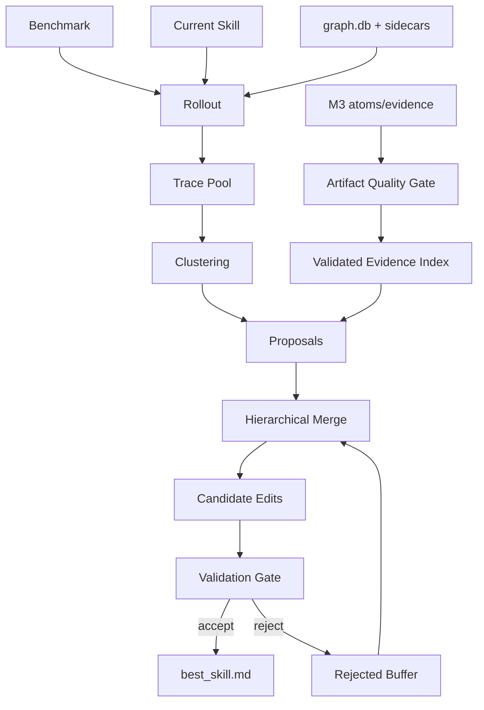

# 模块 4：SkillOpt 优化循环

> 版本: 2.0  
> 状态: **已实现**（2026-06-07 代码对照完成）  
> 实现路径: `src/code_to_skill/skillopt_loop/`  
> 论文参考: [SkillOpt: Executive Strategy for Self-Evolving Agent Skills](https://arxiv.org/abs/2605.23904)（arXiv:2605.23904）  
> 参考实现: [microsoft/SkillOpt](https://github.com/microsoft/SkillOpt)（算法对齐，非运行时依赖）  

## 实现对照总览

| 论文/参考实现阶段 | 本仓库模块 | 状态 |
|---|---|---|
| Rollout（target 冻结 Agent） | `envs/base.py` → `DEFAULTAdapter.rollout()` | ✅ |
| Reflect（failure/success minibatch） | `llm_components.py` → `reflect_llm()` | ✅ |
| Aggregate（分层 merge） | `gradient/aggregate.py` → `merge_patches()` | ✅ |
| Select（edit budget 排序） | `llm_components.py` + `scheduler.py` | ✅ |
| Update（patch apply） | `skill_ops.py` → `apply_edits()` | ✅ |
| Evaluate / Gate | `gate.py` + `cache.py` | ✅ |
| Rejected-edit buffer | `step_buffer.py` | ✅ |
| Slow update + Meta skill | `slow_update.py` + `meta_skill.py` | ✅（默认关闭） |
| Test eval | `test_eval.py` → `evaluate_test_split()` | ✅ |
| 断点续训 | `resume_state.py` | ✅（epoch/batch 级） |
| **本仓库扩展** | | |
| Benchmark 三份 split 接入 | `benchmark_splits.py` | ✅ |
| Edit 质量校验 | `edit_validator.py` | ✅ |
| 场景规则兜底 | `scenario_rules.py` | ✅ |
| 代码图谱证据 | `code_evidence.py` + CodeGraph 工具 | ✅ |
| Token 预算控制 | `token_budgets.py` | ✅ |
| Run 级文件日志 | `run_logging.py` | ✅ |
| Trace pool + proposals（自进化） | `trace_pool.py`、`proposals.py`、`proposal_merge.py` | ✅（默认关闭） |
| Strict gate + rejected buffer | `gate.py`、`rejected_buffer.py`、`step_buffer.py` | ✅（`--self-evolve`） |
| Rule attribution + hygiene | `skill_rules.py`、`hygiene.py` | ✅ |
| Frontier pool | `frontier.py` | ✅（可选） |

---

## 1. 模块目标

本模块用离线训练方式优化 Agent Skill。输入是初始 Skill、Benchmark 数据集、目标 Agent/模型和优化器模型；输出是通过 selection gate 验证的 `best_skill.md`、训练历史、候选编辑、rollout 轨迹和最终评测报告。

算法对齐 SkillOpt 论文与参考实现，主训练循环在 `skillopt_loop/__init__.py` 的 `run_skillopt_loop()`，核心阶段为：

1. **Rollout**：目标 Agent 使用当前 Skill 执行任务。
2. **Reflect**：优化器模型分析成功/失败轨迹，生成 patch。
3. **Aggregate**：分层合并 failure/success patch。
4. **Select**：按 edit budget 选择最重要编辑。
5. **Update**：应用编辑得到候选 Skill。
6. **Evaluate**：在 selection split 上打分，通过 gate 决定接受或拒绝。

epoch 末尾可选执行 slow update 和 meta skill。

与论文的差异：本仓库面向**代码仓库 + 知识库**领域 Skill 提取场景，增加了 CodeGraph 代码证据、EditValidator、场景规则兜底和 train-improved gate 等扩展（详见 §12）。

## 2. 输入要求

### 2.1 必填输入

| 输入 | 类型 | 要求 |
|---|---|---|
| `initial_skill.md` | markdown | 从 SkillAtom 生成的初始 Skill，可为空但不推荐 |
| `benchmark/train` | items | 训练 rollout 使用 |
| `benchmark/selection` | items | validation gate 使用，训练编辑不可见 |
| `benchmark/test` | items | 最终报告使用，训练期间不可见 |
| `adapter` | EnvAdapter | 实现 rollout、evaluate、reflect prompt |
| `target_backend` | model/harness | 被优化的冻结 Agent |
| `optimizer_backend` | model | 负责反思、合并、排序、slow/meta update |
| `out_root` | path | 所有训练产物输出目录，通常为 `runs/<run_id>/optimization/` |

### 2.2 Benchmark Split 加载

仅支持**显式三份 split**（`benchmark_splits.py`）：从 `train/`、`selection/`、`test/` 下的 `items.json` 加载。无 `selection`/`test` 时仅用 train（`source=train_only`），**不做 ratio 自动切分**。

加载时执行 ID 重叠检测（`validate_splits()` / `log_validation()`）。

目录结构：

```text
<project.benchmark>/
├── train/items.json       # 必须
├── selection/items.json   # 可选（推荐）
└── test/items.json        # 可选（推荐）
```

### 2.3 Benchmark item 要求

每条任务至少包含：

```json
{
  "schema_version": "1.0",
  "id": "payment_code_042",
  "question": "这段退款重试逻辑有什么风险？",
  "task_type": "code_review",
  "context_refs": ["code://src/refund/client.py::retry_refund"],
  "context_mode": "inline",
  "expected_checks": ["mentions idempotency", "mentions audit log"],
  "scorer": "rubric_binary"
}
```

`context_mode` 定义了 target Agent 如何获取 `context_refs` 引用的内容：

| 模式 | 行为 | 适用场景 |
|---|---|---|
| `inline` | Adapter 将 context_refs 指向的文件/片段内容直接拼入 user prompt | 代码审查、简单问答（可控、可复现） |
| `agent_read` | target Agent 自行通过工具（如 `read_file`）获取上下文 | Agent 工具链测试、多步探索任务 |
| `none` | 不注入上下文，仅依赖 Skill 中的内置知识 | 纯策略问题、概念问答 |

Adapter 负责在 rollout 前根据 `context_mode` 构造 prompt（**已实现**，见 `DEFAULTAdapter.rollout`）：

- `inline`：`build_rollout_item_context()` 按 `context_refs` 注入源码片段（可复现）。
- `agent_read`：prompt 列出 refs，不注入片段；启用 code tools 由 target 自行读取。
- `none`：仅 skill + 问题；禁用 code tools。

任务必须可评分。代码修改类任务优先使用确定性评分；问答和解释类任务可用 rubric judge。

Rollout 结果除 `hard`/`soft` 外，还包含 `passed_checks`、`missed_checks`，供 Reflect 和场景规则使用。

### 2.4 配置要求

核心配置（`config.template.yaml` → `skillopt` 段）：

| 配置 | 推荐值 | 说明 |
|---|---:|---|
| `num_epochs` | 3-5 | 训练轮数 |
| `batch_size` | 20-40 | 单次 rollout 任务数（小数据集用 20） |
| `accumulation` | 1-2 | 多批 rollout 后合并一次更新 |
| `edit_budget` | 3-4 | 每步最多应用的编辑数 |
| `budget_strategy` | `cosine` 或 `constant` | edit budget 调度 |
| `gate_metric` | `hard` / `soft` / `mixed` | selection gate 比较指标 |
| `patience` | 10 | 连续 reject 早停阈值 |
| `enable_slow_update` | false（MVP）/ true（稳定版） | epoch 级纵向更新 |
| `enable_meta_skill` | false（MVP）/ true（稳定版） | 优化器侧记忆 |
| `enable_code_tools` | true | Reflect/Rollout 启用 CodeGraph 工具 |
| `max_tool_rounds` | 5 | Reflect 阶段工具轮次上限 |
| `rollout_max_tool_rounds` | 2 | Rollout 阶段工具轮次上限 |

Token 预算（`token_budgets`）：

| 阶段 | 默认 token | 说明 |
|---|---:|---|
| `rollout` | 8192 | target Agent 输出上限 |
| `reflect_failure` | 16384 | 失败分析 |
| `reflect_retry` | [32768, 65536] | 失败重试递增 |
| `select_edits` | 4096 | 编辑排序 |
| `slow_update` / `meta_skill` | 4096 / 2048 | epoch 级更新 |

## 3. 输出与存储内容

实际产物目录（以 `demo-project/runs/<run_id>/optimization/` 为例）：

```text
runs/<run_id>/
├── logs/
│   └── run.log                          # Run 级 INFO 日志（run_logging.py）
└── optimization/
    ├── config.json
    ├── runtime_state.json               # schema_version 1.1
    ├── step_checkpoint.json             # 最近 step 内部状态
    ├── history.json
    ├── best_skill.md
    ├── test_report.json                 # 根目录摘要
    ├── cache/
    │   └── selection_scores.json
    ├── skills/
    │   ├── skill_v0001.md
    │   └── skill_v000N.md
    ├── steps/
    │   └── step_0001/
    │       ├── rollout_summary.json     # 含 failures + missed_checks
    │       ├── reflect_patches.json
    │       ├── edit_proposals.json      # 含 related_case_id / missed_checks
    │       ├── edit_apply_report.json
    │       ├── eval_results.json
    │       └── rejected_edits.json      # 可选，validate 拒绝的编辑
    ├── slow_update/                     # enable_slow_update=true 时
    │   └── epoch_02/
    │       ├── slow_update.json
    │       ├── prev_skill.md
    │       └── curr_skill.md
    ├── meta_skill/                      # enable_meta_skill=true 时
    │   └── epoch_02/
    │       └── meta_context.md
    └── final_eval/
        └── test_eval_report.json
```

与参考实现命名差异：

| 参考实现 | 本仓库 | 说明 |
|---|---|---|
| `ranked_edits.json` | `edit_proposals.json` | 含追溯字段（`edit_traceability.py`） |
| `merged_patch.json` | 内联于 `reflect_patches.json` | aggregate 结果不单独落盘 |
| `trajectory_digest.json` | `rollout_summary.json` | 精简摘要 |
| `skill_bundle.json` | 未生成 | 计划由 CLI 导出阶段补充 |

### 3.1 `history.json`

每个 step 一条记录：

```json
{
  "step": 3,
  "epoch": 3,
  "rollout_score": 0.844,
  "selection_score": 0.708,
  "gate_action": "accept_new_best",
  "best_score": 0.708,
  "edit_count": 3
}
```

### 3.2 `runtime_state.json`

断点续训状态（schema 1.1）：

```json
{
  "schema_version": "1.1",
  "last_completed_step": 8,
  "current_score": 0.708,
  "best_score": 0.708,
  "best_step": 3,
  "current_skill_path": "optimization/skills/skill_v0008.md",
  "best_skill_path": "optimization/best_skill.md",
  "epoch": 8,
  "next_batch_start": 0,
  "step_internal": {
    "step": 8,
    "phase": "epoch_end",
    "rollout_completed": 160,
    "rollout_total": 160,
    "last_minibatch_completed": 1
  }
}
```

**恢复粒度**：

| 粒度 | 状态 | 行为 |
|---|---|---|
| epoch / batch | ✅ 已实现 | `resume=True` 时从 `epoch` + `next_batch_start` 继续 |
| step 内部 rollout minibatch | ⚠️ 部分 | `step_checkpoint.json` 记录 phase，但未实现 minibatch 级续跑 |
| selection cache | ✅ 已实现 | resume 时自动 `cache.load()` |

### 3.3 `edit_proposals.json`

每条提案含追溯信息（`edit_traceability.py`）：

```json
{
  "rank": 1,
  "op": "insert_after",
  "content": "- 输出必须以「## 会计凭证」为标题",
  "target": "### 2.3 生成会计凭证",
  "support_count": 2,
  "related_case_ids": ["loan_repay_01", "loan_repay_02"],
  "missed_checks": ["借", "贷"]
}
```

### 3.4 Selection Cache

```json
{
  "schema_version": "1.0",
  "entries": {
    "abc123def456": {
      "skill_semantic_hash": "abc123def456",
      "hard_score": 0.72,
      "soft_score": 0.68,
      "gate_score": 0.68,
      "evaluated_at": "2026-06-06T23:52:53",
      "epoch": 3,
      "step": 3
    }
  }
}
```

语义 hash：空白归一化（trim + collapse whitespace）后 SHA256 取前 12 位。跨 step 复用，跨 run 不复用，满 1000 条 FIFO 淘汰。

## 4. 执行过程

### 4.1 总流程

```mermaid
flowchart TD
  subgraph INIT["① 初始化 / Initialization"]
    direction TB
    I1["加载配置·Backend·Token 预算<br/>Load Config · BackendManager · Token Budgets"]
    I2["初始化 Adapter · CodeGraph 工具<br/>Init Adapter · Code Tools"]
    I3["解析 Benchmark Splits<br/>Resolve Train / Selection / Test"]
    I4{"断点续训?<br/>Resume?"}
    I5["恢复 Skill·History·Cache<br/>Restore Skills · History · Cache"]
    I6["初始评测 Selection 基线<br/>Baseline Eval on Selection"]
    I1 --> I2 --> I3 --> I4
    I4 -->|是 Yes| I5 --> I6
    I4 -->|否 No| I6
  end

  subgraph LOOP["② 训练主循环 / Training Loop"]
    direction TB
    L1["规划 Epoch 训练批次<br/>Plan Epoch Train Batches"]
    L2["① Rollout 当前 Skill<br/>Rollout with Current Skill"]
    L3{"累积就绪?<br/>Accumulation Ready?"}
    L4["② Reflect 轨迹分析<br/>Reflect Trajectories"]
    L5["预取代码证据<br/>Prefetch Code Evidence"]
    L6["③ Aggregate 分层合并<br/>Aggregate Patches"]
    L7["④ Validate 编辑质量<br/>Validate Edits"]
    L8{"有效编辑?<br/>Valid Edits?"}
    L9["场景规则兜底<br/>Scenario Rules Fallback"]
    L10["⑤ Select 排序截断<br/>Select Top Edits by Budget"]
    L11["⑥ Update 应用编辑<br/>Apply Edits → Candidate Skill"]
    L12{"缓存命中?<br/>Cache Hit?"}
    L13["Selection 评测<br/>Eval on Selection Split"]
    L14["⑦ Gate 门禁决策<br/>Gate Decision"]
    L15{"门禁结果<br/>Gate Action"}
    L16["接受·更新 Current/Best<br/>Accept · Update Current/Best"]
    L17["拒绝·记录 Rejected Edits<br/>Reject · Record to Buffer"]
    L18["持久化 History·State·Cache<br/>Persist History · State · Cache"]
    L19{"早停?<br/>Early Stop?"}
    L20{"Epoch 结束?<br/>Epoch Done?"}
    L21["Slow Update + Meta Skill<br/>Epoch-wise Longitudinal Update"]
    L22{"训练结束?<br/>Training Done?"}

    L1 --> L2 --> L3
    L3 -->|否 No · 继续累积| L1
    L3 -->|是 Yes| L4
    L4 --> L5 --> L6 --> L7 --> L8
    L8 -->|否 No| L9 --> L8
    L8 -->|仍无 None| L1
    L8 -->|是 Yes| L10 --> L11 --> L12
    L12 -->|命中 Hit| L14
    L12 -->|未命中 Miss| L13 --> L14
    L14 --> L15
    L15 -->|接受 Accept| L16 --> L18
    L15 -->|拒绝 Reject| L17 --> L18
    L18 --> L19
    L19 -->|是 Yes| F1
    L19 -->|否 No| L20
    L20 -->|否 No| L1
    L20 -->|是 Yes| L21 --> L22
    L22 -->|否 No| L1
    L22 -->|是 Yes| F1
  end

  subgraph FINAL["③ 收尾 / Finalization"]
    direction TB
    F1["Test Split 最终评测<br/>Final Test Evaluation"]
    F2["导出 best_skill.md<br/>Export best_skill.md"]
    F1 --> F2
  end

  INIT --> LOOP
```



**图例 / Legend**

| 符号 | 中文 | English |
|------|------|---------|
| ①–⑦ | SkillOpt 六阶段 + Validate 扩展 | Six core phases + Validate extension |
| 菱形 | 条件分支 | Conditional branch |
| 实线箭头 | 主流程 | Main flow |
| `Accumulation` | 多批 rollout 合并后再 Reflect | Merge multiple rollout batches before reflect |
| `Gate` | accept / accept_new_best / reject / train_improved | Gate actions |
| `Early Stop` | 连续 reject ≥ patience | Consecutive rejects ≥ patience |

### 4.2 初始化

1. 加载配置并拍平结构化 YAML。
2. 初始化 `BackendManager`（optimizer/target 分离）。
3. 初始化 `DEFAULTAdapter`（或自定义 adapter），注入 CodeGraph 工具。
4. 通过 `BenchmarkSplits.resolve()` 解析 train/selection/test。
5. 读取 `initial_skill.md`。
6. 保存 `config.json`；配置 `token_budgets`。
7. 若 `resume=True` 且存在 `runtime_state.json`，恢复 current/best/history/cache。
8. 在 selection split 上评估初始 Skill，得到 baseline current/best score。
9. 按 selection 规模自动降级 `gate_metric`：`< 5` → `soft`，`5–19` 且配置为 `hard` → `mixed`，`≥ 20` 保持配置值（通常为 `hard`）。

### 4.3 阶段 1：Rollout

输入：当前 Skill、train batch、target backend、scorer 配置。

执行：

1. adapter 根据 `context_mode` 构造 prompt（inline 注入代码片段，agent_read 提供工具）。
2. target 使用当前 Skill 执行每个任务；可选启用 CodeGraph 工具（`rollout_max_tool_rounds`）。
3. `score_rollout_result()` 计算 `hard`/`soft`/`passed_checks`/`missed_checks`。
4. 返回 `RolloutResult[]`。

标准输出字段：

```json
{
  "schema_version": "1.0",
  "id": "task-id",
  "hard": 0,
  "soft": 0.25,
  "fail_reason": "missed: 库存, 银行",
  "passed_checks": ["会计凭证"],
  "missed_checks": ["库存", "银行"],
  "task_type": "code_review",
  "predicted_answer": "...",
  "question": "...",
  "expected_checks": ["库存", "银行", "会计凭证"]
}
```

#### Scorer 设计

**1. 关键词 Scorer（`keyword`，默认）**

- `hard`：所有 `expected_checks` 通过为 1，否则为 0。
- `soft`：通过的 check 比例（0-1）。
- 全局别名：`settings.skillopt.check_aliases`；item 级 `check_aliases` 可追加。

**2. LLM Judge Scorer（`llm_judge` / `judge` / `llm`）**

适用于需要语义判断的问答和解释类任务。调用模块 5 的 `routes.judge`，`temperature=0`，trace 写入 `runs/<run_id>/traces/`。

**3. Python 脚本 Scorer（`python_script` / `script`）**

benchmark item 指定 `score_script` 或 `scorer_config.script`，stdin 传入 `predicted` + `item`。

**推荐**：

| task_type | 推荐 scorer |
|---|---|
| `code_review` / `journal_entry` | `keyword` |
| `qa` / `explanation` | `llm_judge` |
| 结构化校验 | `python_script` |

### 4.4 阶段 2：Reflect

输入：rollout results、当前 Skill、rejected edits（step buffer）、meta skill context、CodeGraph 工具。

执行：

1. 将失败/成功样本分组，按 minibatch 切分。
2. **代码证据预取**（`code_evidence.py`）：对失败 case 的 `context_refs` 调用 `explore_symbol`，减少空工具轮次。
3. failure analyst 生成修复型 patch；success analyst 生成保留型 patch。
4. LLM 不可用时降级为规则模式（`_rule_based_patches()`，基于 `missed_checks` 语义映射）。
5. `_sanitize_llm_edits()` 过滤 meta 注释；每条 edit 带 `source_type`。

Reflect prompt 要求（`llm_components.py`）：

- 失败 case 含 question、passed/missed checks、answer excerpt。
- 禁止 meta 编辑（`# Verify`、`need improvement`）。
- 优先 `insert_after` 定位到 skill 章节。
- 不重复 step_buffer 中已拒绝的编辑。

### 4.5 阶段 3：Aggregate

`merge_patches()` 分层合并：

1. failure patches 分层合并。
2. success patches 分层合并。
3. final merge 合并两组，failure 优先。
4. LLM 合并失败时降级为拼接 edits。

### 4.6 阶段 3.5：Validate（本仓库扩展）

`filter_valid_edits()` 在 select 前过滤：

| 规则 | 拒绝原因 |
|---|---|
| 内容 < 20 字符 | `too_short` |
| 含 meta 模式 | `meta_comment` |
| 已存在于 skill | `duplicate` |
| 无可执行标记 | `not_actionable` |

若全部无效，尝试 `scenario_rules.build_scenario_edits()` 按失败 case 生成场景化规则；仍无效则 `skip_validate` 跳过本 step。

### 4.7 阶段 4：Select

1. `EditBudgetScheduler` 计算本步 budget（cosine/constant/linear）。
2. 若 edit 数量 ≤ budget，直接保留。
3. 否则 `select_edits_llm()` 排序；LLM 不可用时按 **missed checks 覆盖度**排序（`_rank_edits_by_coverage()`）。
4. 覆盖度评分：`insert_after`/`replace` 定位到 skill 章节时加 `loc_bonus=0.15`。
5. `StepBufferManager.is_edit_redundant()` 跳过重复编辑。
6. 保存到 `edit_proposals.json`（含 `related_case_ids`、`related_missed_checks`）。

### 4.8 阶段 5：Update

Patch mode（`skill_ops.py`）：

| op | 行为 |
|---|---|
| `append` | 追加到文档末尾；若存在 slow update 区域，则插入到其前面 |
| `insert_after` | 在 target 后插入；找不到 target 时降级 append |
| `replace` | 替换第一个匹配 target |
| `delete` | 删除第一个匹配 target |

保护规则：

- step 级 edit 不能修改 `<!-- SLOW_UPDATE_START -->` 到 `<!-- SLOW_UPDATE_END -->` 之间内容。
- edit content 中出现 slow update marker 时必须剥离。

### 4.9 阶段 6：Evaluate / Gate

1. 计算候选 Skill 语义 hash。
2. 查 `SelectionCache`；未命中则在 selection split 上 rollout 评分。
3. `select_gate_score()` 按 `gate_metric` 投影为单一分数。
4. Gate 决策（`gate.py`）：

| action | 条件 |
|---|---|
| `accept_new_best` | candidate > best + delta |
| `accept` | candidate > current |
| `accept`（train_improved） | selection 持平但 train rollout 提升 ≥ 0.03 |
| `reject` | 以上均不满足 |

5. 连续 reject ≥ `patience` 触发早停。

拒绝时，ranked edits 写入 step buffer，供后续 Reflect 避免重复错误。

### 4.10 Epoch 级 Slow Update

执行条件：`enable_slow_update=true` 且 epoch ≥ 2。

1. 取上一 epoch 最后 Skill 和当前 epoch 最后 Skill。
2. 从 train split 抽样 20 条任务，分别 rollout。
3. 构建 comparison pairs（improved / regressed / persistent_fail / stable_success）。
4. optimizer 输出 `slow_update_content`，写入受保护区域。

论文消融表明 Meta + Slow Update 是关键组件；本仓库默认关闭以控制 MVP 成本，稳定版建议开启。

### 4.11 Optimizer Meta Skill

Meta skill 是优化器侧记忆，不进入部署 Skill。输入为 epoch 对比、accepted/rejected edits；输出写入 `meta_skill/epoch_NN/meta_context.md`，注入后续 Reflect prompt。

## 5. 质量校验

| 校验项 | 通过标准 |
|---|---|
| split 隔离 | train/selection/test 无重复 ID（`validate_splits()`） |
| baseline 存在 | initial Skill selection 分数已记录 |
| gate 强制 | 不允许关闭 selection gate |
| 编辑可审计 | 每步保存 reflect_patches / edit_proposals / edit_apply_report |
| 拒绝可追踪 | rejected edits 进入 step buffer + `rejected_edits.json` |
| best 可复现 | `best_skill.md` 对应 history 中 `accept_new_best` 的 step |
| test 独立 | 只在训练结束运行 test |
| edit 质量 | EditValidator 过滤 meta/duplicate/非可执行内容 |

## 6. 失败处理

| 失败 | 处理 |
|---|---|
| rollout 异常 | 记录任务失败；不中断整个 batch |
| reflect 无 patch | 规则降级；仍无则 skip_validate |
| merge 输出非法 JSON | 重试；失败后拼接 edits |
| ranking 输出非法 JSON | 重试；失败后按原顺序截断到 budget |
| edit target 找不到 | apply report 标记 skipped 或 fallback append |
| validate 全部拒绝 | 尝试 scenario_rules；仍失败则 skip step |
| selection rollout 失败 | 中止当前 step，保留 current/best |
| slow update 失败 | 不影响 fast update 的 best_skill |
| 连续 reject | patience 早停 |

## 7. 对外接口

### 7.1 Python API

```python
from code_to_skill.skillopt_loop import run_skillopt_loop

result = run_skillopt_loop(
    initial_skill=skill_text,
    benchmark_items=train_items,
    selection_items=selection_items,
    test_items=test_items,
    output_dir="runs/<run_id>/optimization",
    num_epochs=3,
    batch_size=20,
    edit_budget=3,
    gate_metric="soft",
    enable_code_tools=True,
    resume=True,
)
# result: {"best_skill", "history", "best_score", "test_report"}
```

### 7.2 CLI

```bash
skill-lab optimize-skill --resume
skill-lab run all   # 端到端流水线
```

### 7.3 输出接口

下游部署模块读取：

- `best_skill.md`
- `final_eval/test_eval_report.json`（或根目录 `test_report.json`）

审计模块读取：

- `history.json`
- `steps/*/rollout_summary.json`
- `steps/*/edit_proposals.json`
- `steps/*/edit_apply_report.json`
- `slow_update/*/slow_update.json`
- `meta_skill/*/meta_context.md`
- `runs/<run_id>/logs/run.log`

## 8. 推荐运行策略

**MVP**（当前 `config.template.yaml` 默认值）：

- `num_epochs=3`，`batch_size=20`，`edit_budget=3`
- `gate_metric=soft`
- `enable_slow_update=false`，`enable_meta_skill=false`
- `enable_code_tools=true`

**稳定版**（对齐论文消融推荐）：

- `num_epochs=4-5`，`batch_size=32-40`，`edit_budget=4`
- `gate_metric=hard`（selection ≥ 20 条时）或 `mixed`
- `enable_slow_update=true`，`enable_meta_skill=true`
- `budget_strategy=cosine`

---

## 9. 实施分期与交付历史

将 `skillopt_loop` 从骨架升级为论文级完整循环的分期计划（均已交付）：

### 9.1 论文对齐分期

| 阶段 | 模块 | 文件 | 状态 |
|:---:|------|------|:---:|
| P0-1 | EnvAdapter 抽象层 | `envs/base.py` | ✅ |
| P0-2 | optimizer/target 分离 + accumulation | `separation.py` | ✅ |
| P1-1 | 分层 merge + buffer→reflect 闭环 | `gradient/aggregate.py` | ✅ |
| P1-2 | SelectionCache + EditBudgetScheduler | `cache.py`, `scheduler.py` | ✅ |
| P2-1 | Slow update + Meta skill | `slow_update.py`, `meta_skill.py` | ✅ |
| P2-2 | Scorer 增强 + Test eval + Checkpoint | `scoring.py`, `test_eval.py` | ✅ |
| P3 | `run_skillopt_loop` 端到端串联 | `__init__.py` | ✅ |

### 9.2 Benchmark / Reflect 分期

| 阶段 | 内容 | 状态 |
|------|------|:---:|
| P0 | BenchmarkSplits + 显式 split + gate_metric | ✅ |
| P1 | scoring missed/passed + rollout 丰富化 | ✅ |
| P2 | 规则降级 + reflect prompt + edit_validator | ✅ |
| P3 | insert_after 定位 + select 覆盖度排序 | ✅ |
| P4 | `evaluate_test_split`（显式 test split）+ CLI `eval` | ✅ |

### 9.3 迭代修复记录

**第二轮（Reflect 可靠性）**

| 问题 | 修复 | 代码 |
|------|------|------|
| Reflect 返回空 content | `_invoke_reflect_with_retry` + content JSON 解析 | `llm_components.py` |
| 规则降级关键词堆砌 | `_CHECK_SEMANTIC_RULES` 语义映射 + 按 task_type 分组 | `llm_components.py` |
| LLM 无效 edit 进入 pipeline | `_sanitize_llm_edits` 预过滤 | `llm_components.py` |
| tool loop 耗尽无 JSON | synthesis pass + `REFLECT_SYNTHESIS_HINT` | `tool_loop.py` |
| token budget 不可配置 | `token_budgets.py` + config | `token_budgets.py` |

**第三轮（E2E 质量）**

| 问题 | 修复 | 代码 |
|------|------|------|
| tool_loop 达 max_rounds 后空 content | 强制无 tools synthesis 回合 | `tool_loop.py` |
| reflect 空 JSON 误判为可用 | `_reflect_response_usable` 仅接受含 edits 的结果 | `llm_components.py` |
| 规则降级重复插入已有 bullet | section 内增量 append | `llm_components.py` |
| duplicate 校验仅整段匹配 | bullet 级重复检测 | `edit_validator.py` |
| rollout LLM 空输出 hard=0 | skill 关键词模板凭证降级 | `envs/base.py` |
| generic 规则全 duplicate 跳过 step | `scenario_rules.build_scenario_edits()` 兜底 | `scenario_rules.py` |

---

## 10. 验收标准

| 标准 | 状态 | 验证方式 |
|------|:---:|----------|
| `selection/items.json` 参与 gate，不与 train 重叠 | ✅ | `validate_splits()` 无 warning |
| `best_skill.md` 含实质性规则，无 `# Verify` 占位行 | ✅ 机制 | `EditValidator` + 语义规则降级 |
| `test_report.json` 训练结束后生成 | ✅ | `__init__.py` → `{output_dir}/test_report.json` |
| CLI `--benchmark` / `--output` 路径正确 | ✅ | `cli/main.py` optimize-skill |
| 独立 `skill-lab eval` 使用 test split | ✅ | `cli/main.py` → `evaluate_test_split()` |
| 每步 edit 可追溯到 task id 与 missed checks | ✅ | `edit_proposals.json` + `rollout_summary.json` |
| 断点续训 epoch/batch 级恢复 | ✅ | `resume_state.py` + `--resume` |
| E2E 优化分数 | ⚠️ 非确定性 | 机制（synthesis / scenario / traceability）已就绪 |

---

## 11. 测试覆盖

| 测试文件 | 覆盖范围 |
|----------|----------|
| `tests/test_benchmark_reflect.py` | split、scoring、edit_validator、rule patches、select coverage、edit traceability |
| `tests/test_scenario_rules.py` | 场景规则兜底 + duplicate 后 validator |
| `tests/test_rollout_helpers.py` | rollout synthesis hint + tool 降级凭证 |
| `tests/test_resume_state.py` | M4 断点续训 runtime_state |
| `tests/test_tool_loop.py` | tool loop synthesis 回合 |
| `tests/test_m3_m4.py` | M4 pipeline 集成 |

---

## 12. 与原始论文的差异对照

论文：[SkillOpt: Executive Strategy for Self-Evolving Agent Skills](https://arxiv.org/abs/2605.23904)（Microsoft, 2026）

### 12.1 对齐部分（核心算法一致）

| 论文概念 | 文本空间类比 | 本仓库实现 |
|---|---|---|
| Skill 文档 = 可训练外部状态 | 冻结 target + 独立 optimizer | `BackendManager` 分离 |
| 梯度 = 轨迹分析编辑方向 | Reflect failure/success | `reflect_llm()` |
| 学习率 = edit budget L | 每步最多 L 条编辑 | `EditBudgetScheduler` |
| Batch = rollout 任务数 B | train batch rollout | `adapter.rollout()` |
| Mini-batch = 分析轨迹数 Bm | reflect minibatch | `reflect_llm()` 内部分组 |
| Validation = held-out selection | selection gate | `GateManager` + `SelectionCache` |
| Momentum = slow/meta update | epoch 级纵向记忆 | `slow_update.py` + `meta_skill.py` |
| 负梯度 = rejected buffer | 防止重复无效编辑 | `StepBufferManager` |

论文五机制全部实现：minibatch reflection、bounded edit budget、held-out gate、rejected-edit buffer、epoch-wise slow/meta update。

### 12.2 本仓库扩展（论文未涉及）

| 扩展 | 动机 | 实现 |
|---|---|---|
| CodeGraph 代码证据 | 代码仓库 Skill 需要真实源码上下文 | `code_evidence.py`、Reflect/Rollout 工具链 |
| `context_mode` 三模式 | 控制上下文注入可复现性 | `envs/base.py` `DEFAULTAdapter.rollout` | ✅ inline 注入 / agent_read 仅工具 / none 纯 skill |
| Pipeline 契约产物 | M4 启动前可观测 | `artifact_contract.json`、`context_ref_report.json`、`steps/step_*/metrics.json` | ✅ |
| Graph sidecar 消费 | entrypoints / role / evidence_index | `graph_sidecars.py` + `code_evidence.py` | ✅ |
| `meta_skill` 与 slow_update 解耦 | 仅开 meta 时仍更新 | `skillopt_loop/__init__.py` | ✅ |
| EditValidator | 防止 LLM 产出 meta 注释/重复规则 | `edit_validator.py` |
| 场景规则兜底 | validate 全拒绝时仍能推进 | `scenario_rules.py` |
| `missed_checks` 追溯 | 编辑可审计到具体失败 case | `edit_traceability.py` |
| Token 预算 | 控制各阶段 LLM 成本 | `token_budgets.py` |
| Run 级日志 | 端到端运行可审计 | `run_logging.py` → `logs/run.log` |
| 显式 benchmark split | 代码仓库场景的数据集管理 | `benchmark_splits.py` |
| LLM 规则降级 | API 不可用时不中断训练 | `llm_components.py` 内 `_rule_based_patches()` |

### 12.3 有意简化的部分

| 论文/参考实现 | 本仓库现状 | 原因 |
|---|---|---|
| 6 benchmarks × 7 models × 3 harnesses | 单领域 benchmark（如 Fineract） | 聚焦代码+知识库提取场景 |
| Codex / Claude Code harness | `DEFAULTAdapter` + 可选 code tools | 统一 adapter 抽象，降低 harness 耦合 |
| `minibatch_size=8` 独立配置 | 内嵌于 reflect 逻辑 | 简化配置面 |
| `skill_bundle.json` 自动导出 | 未生成 | 计划由 CLI 导出阶段补充 |
| slow update selection gate | slow update 直接 apply | MVP 默认关闭 slow update |
| WebUI 监控面板 | CLI + `run.log` + `history.json` | 工程取舍 |
| step 内 minibatch 级断点续训 | 仅 epoch/batch 级 resume | 实现复杂度 vs 收益 |

### 12.4 Gate 行为差异

| 维度 | 论文默认 | 本仓库 |
|---|---|---|
| 比较指标 | `hard`（硬通过率） | 可配置；< 5→soft，5–19→mixed，≥ 20→hard |
| 接受条件 | selection 严格提升 | 增加 `train_improved`：selection 持平但 train rollout 提升 ≥ 0.03 仍 accept |
| 早停 | 未强调 | `patience` 连续 reject 早停 |
| delta 阈值 | 未显式 | `delta=0.01` 防止微小波动误判 |

论文强调「持平即拒绝」；本仓库在 selection 样本极少（代码领域常见）时放宽为 soft gate，并允许 train 信号辅助推进 current_skill，以避免小 validation set 上的噪声阻塞优化。

### 12.5 超参数对照

| 参数 | 论文推荐 | 本仓库 MVP 默认 | 说明 |
|---|---|---|---|
| epochs | 4 | 3 | 小数据集可增至 6-8 |
| batch_size | 40 | 20 | Fineract 仅 7 条 train |
| edit_budget L | 4 | 3 | 稳定版建议 4 |
| gate_metric | hard | soft | 小 selection 集适配 |
| slow + meta | **必须开启**（消融 -22pt） | 默认关闭 | 成本考虑；稳定版应开启 |
| schedule | cosine | constant | 可切换 |

### 12.6 论文核心结论在本场景的适用性

| 论文发现 | 对本仓库的启示 |
|---|---|
| 初始 Skill 不需完美（154 token + 1 编辑 +29.3pt） | `initial_skill.md` 可以是手工草稿，关键是 benchmark 有 scored rollout |
| Rejected buffer 去掉显著降分 | `StepBufferManager` 必须保留 |
| Meta + Slow Update 去掉灾难性降分 | 稳定版必须 `enable_slow_update=true` + `enable_meta_skill=true` |
| Skill 可跨模型迁移 | 优化后的 `best_skill.md` 可直接换 target backend 部署 |
| 部署体积 300-2000 tokens | 通过 edit_budget 控制 Skill 膨胀 |

### 12.7 差异总结

```text
论文 SkillOpt                本仓库 code-to-skill M4
─────────────────────────────────────────────────────
通用 Agent benchmark    →    代码仓库 + 知识库领域 Skill
多 harness 生态         →    统一 EnvAdapter + CodeGraph
严格 hard gate          →    可配置 gate + 小集 soft 降级
完整 minibatch resume   →    epoch/batch 级 resume
论文实验超参            →    小数据集适配默认值
无代码证据管线          →    CodeGraph + context_mode（三模式已落地）
无 pipeline 契约        →    artifact_contract + context_ref_report + step metrics
无 edit 质量过滤        →    EditValidator + scenario_rules
```

核心优化循环（rollout → reflect → aggregate → select → update → gate）与论文一致；差异集中在**领域适配**（代码证据、split 管理、edit 质量控制）和**工程取舍**（默认关闭 slow/meta、gate 放宽、resume 粒度）。

## 13. Skill 自进化（可选扩展）

> 状态: **已实现（Phase 0–4 核心路径，2026-06）**  
> 配置默认: `settings.self_evolution.enabled: false`  
> CLI 详述: [06-cli-human-interaction-orchestrator.md](06-cli-human-interaction-orchestrator.md) §13

### 13.1 动机

仅依赖单条失败 case 或单个 minibatch 直接改 `best_skill.md` 时，容易出现：个例过拟合、Skill 膨胀、验证不硬、M3 产物只写不读、代码证据难归因。自进化在流水线契约（`artifact_contract`、`context_ref_report`、证据 metrics）之上，叠加 **批量轨迹归纳 + 验证选择 + 有界更新** 闭环：

```text
Trace2Skill（轨迹池 / 聚类 / proposal 合并）
+ EvoSkill（严格 gate / frontier / rejected buffer）
+ SkillOpt（有界 edit budget / training_curve / meta_skill）
```

### 13.2 目标与非目标

**目标**：批量归纳而非单点反应；验证优先于生成；有界编辑抑制膨胀；负反馈可复用；规则级 `rule_id` 归因；M3 经质量门禁后才进入 M4。

**非目标**：不做线上实时自进化；不让 LLM 无约束重写整份 Skill；不绕过现有 SkillOpt 主循环。

### 13.3 架构



| 范式 | 本仓库落点 |
|---|---|
| Trace2Skill | `trace_pool.py`、`proposals.py`、`proposal_merge.py` |
| EvoSkill | 严格 `gate.py`、`frontier.py`、`rejected_buffer.py` |
| SkillOpt | `EditBudgetScheduler`、`training_curve`、`meta_skill.py` |

### 13.4 新增产物

| 路径 | 说明 |
|---|---|
| `optimization/trace_pool/traces.jsonl` | 标准化 rollout 轨迹（`trace_id`、`missed_checks`、`context_refs`、`skill_version` 等） |
| `optimization/trace_pool/clusters.json` | 按 `task_type` / `missed_checks` / `context_refs` 聚类 |
| `optimization/proposals/` | 根目录最新副本 + `steps/step_NNNN/*.jsonl` + `steps_index.jsonl` |
| `optimization/rejected_edit_buffer.jsonl` | gate 拒绝的 edit、分数差、原因（注入 reflect） |
| `optimization/rule_attribution.json` | 规则使用次数、关联 checks、退步计数 |
| `optimization/frontier/` | 多候选 Skill 前沿（可选） |

Proposal 质量门禁：`support_count >= 2` 才进入 merge；`evidence_refs` 须可解析；`candidate_rule` 不得只复述单 case 输入。

Skill 规则归因格式（发布可 strip）：

```markdown
<!-- rule_id: rule-journal-003; source: prop-step0003-cluster-journal-balance -->
- When handling journal entries, verify debit and credit totals are balanced.
```

### 13.5 M3 在自进化中的角色

| M3 产物 | 角色 | 消费者 |
|---|---|---|
| `merged_atoms.jsonl` | 初始 Skill 候选 / proposal 参考 | 无 `initial_skill` 时生成起点 |
| `benchmark_seeds.jsonl` | benchmark 扩充候选 | `--bootstrap-benchmark` |
| `evidence_index.json` | 精确证据索引 | `code_evidence.py`、failure proposals |
| `artifact_quality.json` | 质量门禁 | 未通过时 M3 仅诊断，不进入 M4 |

原则：`artifact_quality` 未通过不消费 M3；seed 须满足 M4 schema；evidence 仅精确命中；atom 须经 proposal + gate，不得直接覆盖 Skill。

### 13.6 Gate、Frontier 与 Hygiene

**严格 gate**（`--self-evolve` 或 `self_evolution.gate.strict_improvement`）默认：

- `candidate.selection_score > current_best`
- 平局拒绝（`reject_ties: true`）
- `skill_tokens <= max_skill_tokens`、格式合法

**Frontier**（`frontier_enabled: false` 默认）：产物为 `optimization/frontier/frontier.json` 及快照 skill 文件；保留多个候选 Skill 做对比，依赖稳定 benchmark。

**Hygiene**（`run skill-hygiene <run_id>`）：epoch 末或超 token/规则数时合并、删除、降级冗余规则；仍须过 selection gate。

### 13.7 配置

```yaml
settings:
  self_evolution:
    enabled: false
    trace_pool:
      enabled: true
      min_support_count: 2
      cluster_by: [task_type, missed_checks, context_refs]
    proposals:
      include_success: true
      include_failure: true
      hierarchical_merge: true
      max_merge_fan_in: 8
    gate:
      strict_improvement: true
      reject_ties: true
      allowed_regressions: 0
      frontier_enabled: false
    edits:
      max_edits_per_step: 3
      max_new_rules_per_step: 2
      max_skill_tokens: 2000
    hygiene:
      enabled: true
      run_each_epoch: true
    attribution:
      enabled: true
      inject_rule_ids: true
    knowledge:
      enabled: true
      gate_tolerance: 0.05
      min_support_count: 2
```

### 13.8 实现索引

| 区域 | 路径 |
|---|---|
| 轨迹池 / 聚类 | `skillopt_loop/trace_pool.py` |
| Proposal 生成 / 合并 | `proposals.py`、`proposal_merge.py` |
| Rejected buffer | `rejected_buffer.py`、`step_buffer.py` |
| 规则 ID / 归因 | `skill_rules.py` |
| Hygiene | `hygiene.py` |
| Frontier | `frontier.py` |
| 配置 / 校验 | `self_evolution_config.py`、`self_evolution_validate.py` |
| 主循环接线 | `skillopt_loop/__init__.py` |

### 13.9 参考

- [Trace2Skill](../references/Trace2Skill.pdf) · [EvoSkill](../references/EvoSkill.pdf) · [SkillOpt](../references/skillopt_2605.23904.pdf)
- 微信文章：《如何更科学、方向可控的实现 Skill 的“自进化”?》
