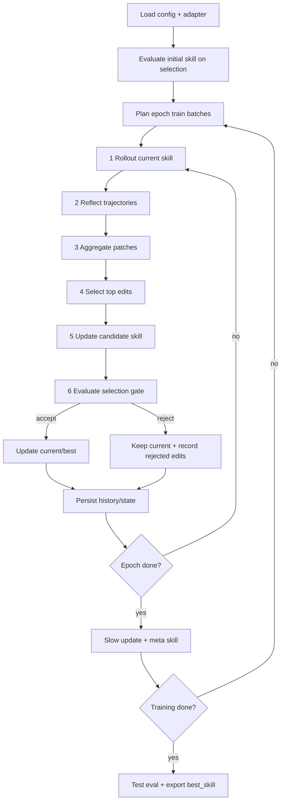

# 模块 4：SkillOpt 优化循环

## 1. 模块目标

本模块用离线训练方式优化 Agent Skill。输入是初始 Skill、Benchmark 数据集、目标 Agent/模型和优化器模型；输出是通过 selection gate 验证的 `best_skill.md`、训练历史、候选编辑、rollout 轨迹和最终评测报告。

本设计对齐 `external/SkillOpt` 的实现：主训练循环在 `skillopt/engine/trainer.py`，核心阶段为：

1. Rollout：目标 Agent 使用当前 Skill 执行任务。
2. Reflect：优化器模型分析成功/失败轨迹，生成 patch。
3. Aggregate：分层合并 failure/success patch。
4. Select：按 edit budget 选择最重要编辑。
5. Update：应用编辑得到候选 Skill。
6. Evaluate：在 selection split 上打分，通过 gate 决定接受或拒绝。

epoch 末尾可选执行 slow update 和 meta skill。

## 2. 输入要求

### 2.1 必填输入

| 输入 | 类型 | 要求 |
|---|---|---|
| `initial_skill.md` | markdown | 从 SkillAtom 生成的初始 Skill，可为空但不推荐 |
| `benchmark/train` | items | 训练 rollout 使用 |
| `benchmark/selection` | items | validation gate 使用，训练编辑不可见 |
| `benchmark/test` | items | 最终报告使用，训练期间不可见 |
| `adapter` | EnvAdapter | 实现 build env、rollout、reflect |
| `target_backend` | model/harness | 被优化的冻结 Agent |
| `optimizer_backend` | model | 负责反思、合并、排序、slow/meta update |
| `out_root` | path | 所有训练产物输出目录，通常为 `runs/<run_id>/optimization/` |

### 2.2 Benchmark item 要求

每条任务至少包含：

```json
{
  "schema_version": "1.0",
  "id": "payment_code_042",
  "question": "这段退款重试逻辑有什么风险？",
  "task_type": "code_review",
  "context_refs": ["code://src/refund/client.py::retry_refund"],
  "context_mode": "inline",
  "expected_checks": ["mentions idempotency", "mentions audit log"],
  "scorer": "rubric_binary"
}
```

`context_mode` 定义了 target Agent 如何获取 `context_refs` 引用的内容：

| 模式 | 行为 | 适用场景 |
|---|---|---|
| `inline` | Adapter 将 context_refs 指向的文件/片段内容直接拼入 user prompt | 代码审查、简单问答（可控、可复现） |
| `agent_read` | target Agent 自行通过工具（如 `read_file`）获取上下文 | Agent 工具链测试、多步探索任务 |
| `none` | 不注入上下文，仅依赖 Skill 中的内置知识 | 纯策略问题、概念问答 |

Adapter 负责在 rollout 前根据 `context_mode` 构造 prompt。当使用 `inline` 时，从模块 1 的 `leaf_contexts` 中按 `context_refs` 取源码片段，确保每次 rollout 使用相同上下文。

任务必须可评分。代码修改类任务优先使用确定性评分；问答和解释类任务可用 rubric judge。

### 2.3 配置要求

核心配置：

| 配置 | 推荐值 | 说明 |
|---|---:|---|
| `num_epochs` | 3-5 | 训练轮数 |
| `batch_size` | 32-40 | 单次 rollout 任务数 |
| `accumulation` | 1-2 | 多批 rollout 后合并一次更新 |
| `minibatch_size` | 6-8 | Reflect 阶段每次分析轨迹数 |
| `edit_budget` | 3-4 | 每步最多应用的编辑数 |
| `min_edit_budget` | 1-2 | scheduler 衰减下限 |
| `lr_scheduler` | `cosine` 或 `constant` | edit budget 调度 |
| `gate_metric` | `hard` / `soft` / `mixed` | selection gate 比较指标 |
| `use_slow_update` | true | epoch 级纵向更新 |
| `use_meta_skill` | true | 优化器侧记忆 |

## 3. 输出与存储内容

推荐目录与 SkillOpt 实现保持一致：

```text
runs/<run_id>/optimization/
├── config.json
├── runtime_state.json
├── history.json
├── best_skill.md
├── skill_bundle.json
├── skills/
│   ├── skill_v0000.md
│   └── skill_v0001.md
├── steps/
│   └── step_0001/
│       ├── rollout/
│       ├── patches/
│       ├── merged_patch.json
│       ├── ranked_edits.json
│       ├── candidate_skill.md
│       ├── edit_apply_report.json
│       ├── selection_eval/
│       ├── trajectory_digest.json
│       └── step_record.json
├── slow_update/
│   └── epoch_02/
│       ├── rollout_prev/
│       ├── rollout_curr/
│       ├── comparison_pairs.json
│       └── slow_result.json
├── meta_skill/
│   └── epoch_02/
│       └── meta_skill_result.json
└── final_eval/
    └── report.json
```

### 3.1 `history.json`

每个 step 一条记录，包含：

- rollout hard/soft 分数。
- patch 数量和 edit 数量。
- edit budget。
- selection hard/soft/gate score。
- action：`accept_new_best` / `accept` / `reject` / `skip_no_patches`。
- 当前分数、最佳分数、最佳 step。
- 各阶段耗时和 token 统计。

### 3.2 `step_record.json`

step 级完整摘要，便于恢复和审计。它应记录 candidate hash、apply summary、gate metric、current/best origin。

### 3.3 `runtime_state.json`

断点续训状态：

```json
{
  "schema_version": "1.0",
  "last_completed_step": 4,
  "current_skill_path": "runs/payment-skill-20260603-001/optimization/skills/skill_v0004.md",
  "current_score": 0.72,
  "current_origin": "step_0004",
  "best_skill_path": "runs/payment-skill-20260603-001/optimization/best_skill.md",
  "best_score": 0.75,
  "best_step": 3,
  "best_origin": "step_0003",
  "step_internal": {
    "step": 5,
    "phase": "rollout",
    "rollout_completed": 18,
    "rollout_total": 40,
    "last_minibatch_completed": 2,
    "current_batch_file": "runs/payment-skill-20260603-001/optimization/steps/step_0005/rollout/batch_003.jsonl"
  }
}
```

**Step 内检查点**：step 内部的 rollout（batch_size=40）可能部分完成。系统在每个 minibatch（默认 8 条）完成后写入 `step_internal` 状态。恢复时：

1. 若 `phase=rollout` 且 `rollout_completed < rollout_total`：从 `last_minibatch_completed + 1` 继续 rollout。
2. 若 `phase=reflect` 且 `last_minibatch_completed < total_minibatches`：跳过已完成的 minibatch reflect。
3. 若 `phase=aggregate` 或之后：视为当前 step 大部分已完成，回退到 step 开头重做或继续——由 `--strict-resume` 参数控制。

Step 内中间文件按 minibatch 编号独立保存，确保恢复时不重复、不遗漏。

### 3.4 `skill_bundle.json`

记录最终可发布 Skill 包的元数据，`best_skill.md` 本身保持为标准 Skill Markdown。

```json
{
  "schema_version": "1.0",
  "skill_id": "payment-agent-skill",
  "version": "0.3.0",
  "entry_file": "best_skill.md",
  "included_atoms": ["payment.timeout.retry-idempotency"],
  "history_file": "history.json",
  "final_eval_report": "final_eval/report.json",
  "created_from_run": "payment-skill-20260603-001"
}
```

## 4. 执行过程

### 4.1 总流程



### 4.2 初始化

1. 加载配置并拍平结构化 YAML。
2. 初始化 adapter，加载 dataloader。
3. 配置 optimizer backend 和 target backend。
4. 读取 `initial_skill.md`。
5. 计算 train size、steps per epoch、total steps。
6. 保存 `config.json`。
7. 如果存在 `runtime_state.json`，从上次 step 恢复。
8. 在 selection split 上评估初始 Skill，得到 baseline current/best score。

### 4.3 阶段 1：Rollout

输入：

- 当前 Skill。
- train batch。
- target Agent/模型。
- scorer 配置。

执行：

1. adapter 构造 train env 或 item batch。
2. target 使用当前 Skill 执行每个任务。
3. 保存对话、工具调用、命令输出、预测答案、评分反馈。
4. 返回 `RolloutResult[]`。

标准输出字段：

```json
{
  "schema_version": "1.0",
  "id": "task-id",
  "hard": 0,
  "soft": 0.25,
  "fail_reason": "missing idempotency check",
  "task_type": "code_review",
  "predicted_answer": "...",
  "target_system_prompt": "...",
  "target_user_prompt": "..."
}
```

### 4.3.1 Scorer 设计

Scorer 是 rollout 阶段对任务结果的评分组件。系统支持两种 scorer 类型：

**1. 确定性 Scorer（`deterministic`）**

适用于可自动检查的任务。通过规则、正则或脚本判断正确性：

```json
{
  "scorer": "deterministic",
  "checks": [
    {"type": "keyword_match", "keywords": ["idempotency", "幂等"], "mode": "all"},
    {"type": "keyword_avoid", "keywords": ["direct charge", "直接扣款"], "mode": "any"},
    {"type": "script", "script_path": "scripts/check_retry_logic.py"},
    {"type": "regex", "pattern": "retry.*\\b[1-3]\\b.*times"}
  ],
  "scoring": {
    "hard": "all_checks_pass",
    "soft": "proportion_passed"
  }
}
```

- `hard` 分：所有 check 通过为 1，否则为 0。
- `soft` 分：通过的 check 比例（0-1）。

**2. LLM Judge Scorer（`llm_judge`）**

适用于需要语义判断的问答和解释类任务。使用模块 5 的 `judge` role 调用 LLM：

```json
{
  "scorer": "llm_judge",
  "rubric": {
    "dimensions": [
      {"name": "mentions_idempotency", "weight": 0.4, "description": "Answer explicitly references idempotency key or mechanism"},
      {"name": "retry_strategy", "weight": 0.3, "description": "Answer describes a bounded retry approach with backoff"},
      {"name": "no_harmful_advice", "weight": 0.3, "description": "Answer does NOT suggest blind duplicate execution or ignoring errors"}
    ]
  },
  "hard_threshold": 0.8,
  "judge_model": "default_judge"
}
```

LLM Judge prompt 模板：

```markdown
## Task
Score the following Agent answer against the rubric.

## Question
{question}

## Agent Answer
{predicted_answer}

## Rubric
{rubric_dimensions}

## Instructions
For each dimension, assign a score 0-1 and a one-sentence justification.
Return JSON: {"scores": [{"dimension": "...", "score": 0.X, "justification": "..."}]}
```

**可复现性保证**：

- LLM Judge 调用时设置 `temperature=0`，固定 `seed`。
- 关键任务可启用双 Judge 投票（`dual_judge=true`）：两个不同模型分别评分，取平均。若分差 > 0.3，标记为 `judge_disagreement` 并记录。
- Judge 调用的 trace 完整保存到模块 5 的 trace 目录。

**降级策略**：若 benchmark item 未显式指定 scorer，按 task_type 自动选择：

| task_type | 默认 scorer |
|---|---|
| `code_review` / `code_patch` | `deterministic` |
| `qa` / `explanation` | `llm_judge` |

### 4.4 阶段 2：Reflect

输入：

- rollout results。
- 当前 Skill。
- 轨迹文件路径。
- step buffer：本 epoch 之前步骤的失败模式和 rejected edits。
- meta skill context：上一 epoch 的优化器侧记忆。

执行：

1. 将失败样本和成功样本分组。
2. 按 minibatch 切分。
3. failure analyst 生成修复型 patch。
4. success analyst 生成保留型 patch。
5. 每个 raw patch 带 `source_type`、`batch_size`、`failure_summary`。

输出：

```json
{
  "schema_version": "1.0",
  "source_type": "failure",
  "batch_size": 8,
  "failure_summary": [
    {"failure_type": "missed_tool_policy", "count": 3}
  ],
  "patch": {
    "reasoning": "...",
    "edits": [
      {
        "op": "append",
        "content": "Before editing refund retry logic, inspect idempotency callers.",
        "target": "",
        "source_type": "failure"
      }
    ]
  }
}
```

### 4.5 阶段 3：Aggregate

输入：

- failure patches。
- success patches。
- 当前 Skill。
- merge batch size。

执行：

1. failure patches 分层合并。
2. success patches 分层合并。
3. final merge 合并两组，failure 优先。
4. 若 LLM 合并失败，降级为拼接 edits。

输出：

- `merged_patch.json`
- 合并后的 `edits` 或 rewrite suggestions。

### 4.6 阶段 4：Select

输入：

- `merged_patch.json`
- 当前 Skill。
- edit budget。
- scheduler 或 autonomous learning-rate decision。

执行：

1. 若 edit 数量不超过 budget，直接保留。
2. 若超过 budget，调用 optimizer 对候选编辑排序。
3. 保存被选中的 top-L edits 到 `ranked_edits.json`。
4. 记录 `support_count` 和 ranking details。

edit budget 是文本空间学习率。它限制每次 Skill 改动幅度，避免无约束重写破坏已有有效规则。

### 4.7 阶段 5：Update

输入：

- 当前 Skill。
- `ranked_edits.json`。
- update mode。

Patch mode 支持：

| op | 行为 |
|---|---|
| `append` | 追加到文档末尾；若存在 slow update 区域，则插入到其前面 |
| `insert_after` | 在 target 后插入；找不到 target 时降级 append |
| `replace` | 替换第一个匹配 target |
| `delete` | 删除第一个匹配 target |

保护规则：

- step 级 edit 不能修改 `<!-- SLOW_UPDATE_START -->` 到 `<!-- SLOW_UPDATE_END -->` 之间内容。
- edit content 中出现 slow update marker 时必须剥离。
- 每个 edit 生成 apply report。

输出：

- `candidate_skill.md`
- `edit_apply_report.json`

### 4.8 阶段 6：Evaluate / Gate

输入：

- candidate Skill。
- selection split。
- current score。
- best score。
- gate metric。

执行：

1. 对 candidate Skill 计算**语义 hash**——先做空白归一化（trim + collapse whitespace），再计算 SHA256。相同语义内容的 Skill 共享同一 hash，避免微小格式差异导致缓存失效。
2. 用语义 hash 查 selection cache（存储在 `runs/<run_id>/optimization/cache/selection_scores.json`）。
3. 未命中则在 selection split 上 rollout 并评分。
4. 计算 hard/soft score。
5. 根据 `gate_metric` 投影为单一 gate score。
6. 若 candidate score > current score，接受为 current。
7. 若 candidate score > best score，更新 `best_skill.md`。
8. 否则拒绝，current/best 不变。

**Selection Cache 结构**：

```json
{
  "schema_version": "1.0",
  "entries": {
    "abc123def": {
      "skill_semantic_hash": "abc123def",
      "hard_score": 0.72,
      "soft_score": 0.68,
      "gate_score": 0.68,
      "evaluated_at": "2026-06-03T10:00:00Z",
      "epoch": 1,
      "step": 3
    }
  }
}
```

Cache 策略：

- 跨 step 可复用（同一 run 内）。
- 跨 run 不复用（不同 run 的 selection split 可能不同）。
- epoch 间可复用（但需校验 selection split 未变化）。
- 缓存满 1000 条时淘汰最旧条目。

gate action：

| action | 含义 |
|---|---|
| `accept_new_best` | 候选超过 current 和 best |
| `accept` | 候选超过 current，但未超过 best |
| `reject` | 候选不超过 current |

拒绝时，ranked edits 和 score drop 写入 step buffer，供后续 Reflect 避免重复错误。

### 4.9 Epoch 级 Slow Update

Slow update 用于总结跨 epoch 的长期规律。

执行条件：

- `use_slow_update=true`
- epoch 1 注入空占位区。
- epoch >= 2 比较相邻 epoch 的最后 Skill。

执行过程：

1. 取上一 epoch 最后 Skill 和当前 epoch 最后 Skill。
2. 从 train split 抽样同一批任务。
3. 分别用两个 Skill rollout。
4. 构建 comparison pairs：
   - `improved`
   - `regressed`
   - `persistent_fail`
   - `stable_success`
5. optimizer 输出 `slow_update_content`。
6. 写入受保护区域：

```markdown
<!-- SLOW_UPDATE_START -->
...
<!-- SLOW_UPDATE_END -->
```

根据配置，slow update 可走 selection gate，也可 force accept。高风险场景建议启用 gate。

### 4.10 Optimizer Meta Skill

Meta skill 是优化器侧记忆，不进入部署 Skill。

输入：

- 上一 epoch Skill。
- 当前 epoch Skill。
- comparison pairs。
- 上一版 meta skill。

输出：

```json
{
  "reasoning": "...",
  "meta_skill_content": "When failures are caused by missing verification, prefer adding validation workflow rules over answer-format rules."
}
```

用途：

- 提醒 optimizer 哪些编辑方向有效。
- 避免重复提出被拒编辑。
- 在证据模糊时指导 merge/ranking。

## 5. 质量校验

| 校验项 | 通过标准 |
|---|---|
| split 隔离 | train/selection/test 无重复和近重复 |
| baseline 存在 | initial Skill selection 分数已记录 |
| gate 强制 | 不允许关闭 selection gate |
| 断点可恢复 | `runtime_state.json` 可恢复 current/best |
| 编辑可审计 | 每步保存 merged/ranked/apply report |
| 拒绝可追踪 | rejected edits 进入 step buffer |
| best 可复现 | `best_skill.md` 对应 history 中 best_step |
| test 独立 | 只在训练结束运行 test |

## 6. 失败处理

| 失败 | 处理 |
|---|---|
| rollout 异常 | 记录任务失败和异常；不中断整个 batch，除非 adapter 不可用 |
| reflect 无 patch | 当前 step 跳过，保存 unchanged skill |
| merge 输出非法 JSON | 重试；失败后拼接 edits |
| ranking 输出非法 JSON | 重试；失败后按原顺序截断到 budget |
| edit target 找不到 | apply report 标记 skipped 或 fallback append |
| candidate 与 current 相同 | 仍可 gate cache，但通常会 reject 或 skip |
| selection rollout 失败 | 中止当前 step，保留 current/best |
| slow update 失败 | 不影响 fast update 的 best_skill |

## 7. 对外接口

### 7.1 输入接口

本模块期望上游提供：

- `initial_skill.md`
- `runs/<run_id>/benchmarks/train/items.json`
- `runs/<run_id>/benchmarks/selection/items.json`
- `runs/<run_id>/benchmarks/test/items.json`
- scorer 配置
- adapter 实现

### 7.2 输出接口

下游部署模块只读取：

- `best_skill.md`
- `skill_bundle.json`
- `final_eval/report.json`
- 可选 `skills/skill_vXXXX.md` 用于回滚

审计模块读取：

- `history.json`
- `steps/*/step_record.json`
- `steps/*/edit_apply_report.json`
- `slow_update/*/comparison_pairs.json`
- `meta_skill/*/meta_skill_result.json`

## 8. 推荐运行策略

MVP：

- `num_epochs=3`
- `batch_size=20`
- `edit_budget=3`
- `gate_metric=soft`，如果 selection 小于 30 条。
- 先只用 patch mode，不启用 full rewrite。

稳定版：

- `num_epochs=4-5`
- `batch_size=32-40`
- `edit_budget=4`
- `gate_metric=mixed`
- 启用 slow update 和 meta skill。
- 对高风险领域开启人工抽检 gate：best_skill 发布前必须 review。
