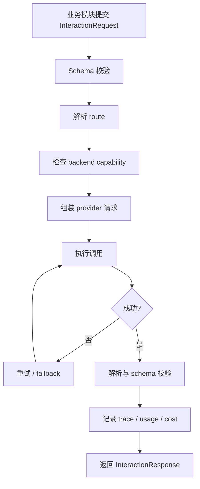

# 模块 5：模型与智能体交互管理

## 1. 模块目标

本模块提供统一、可插拔的模型与智能体交互层，供前 4 个模块调用。它解决两个问题：

1. **替换模型**：同一业务阶段可以从 OpenAI-compatible、Azure OpenAI、Claude、Qwen、MiniMax、本地 vLLM/Ollama 等后端切换，不改业务模块代码。
2. **直接调用其他智能体**：某些阶段不调用裸模型，而是调用 Codex CLI、Claude Code、内部 Agent 服务、MCP Agent、工作流 Agent 等完整智能体，让其在指定工作区内执行任务并返回轨迹和结果。

本模块借鉴 SkillOpt 的 model router、optimizer/target backend 分离、token tracker、Codex/Claude harness 思路，也借鉴 CodeWiki 的多 provider LLM service、trace 文件和 fallback model 机制。

## 2. 适用范围

所有需要模型或智能体能力的阶段都必须经由本模块：

| 调用方 | 典型用途 |
|---|---|
| 模块 1：代码图谱与模块树 | LLM 聚类模块、生成模块摘要、解释启发式解析失败 |
| 模块 2：文档规范化 | 文档类型识别、OCR 后结构恢复、冲突摘要 |
| 模块 3：SkillAtom 抽取 | 抽取候选规则、证据对齐、冲突归因、生成 checks |
| 模块 4：SkillOpt 循环 | target rollout、optimizer reflect/merge/rank、judge 评分、slow/meta update |
| 部署与回流 | 在线 fallback、人工辅助 Agent、观测与成本统计 |

业务模块只能声明“需要什么能力”，不能写死模型名、API SDK 或 CLI 命令。

**分层依赖规则**：本模块是基础设施层。模块 1-4 只能依赖本模块的接口定义（`InteractionBackend` 抽象类、`InteractionRequest`/`InteractionResponse` 等标准类型），不得直接 import 具体 backend 实现类。CLI（模块 6）负责在启动时实例化各个 backend 并通过依赖注入传入各模块。模块 4 的 SkillOpt 循环中，target rollout 和 optimizer reflect 均通过本模块的抽象接口调用，不形成循环引用。

## 3. 输入要求

### 3.1 必填输入

| 输入 | 类型 | 要求 |
|---|---|---|
| `interaction_config.yaml` | YAML | 所有 backend、routing、凭证引用、超时、重试、trace 配置 |
| `request` | object | 标准化模型/Agent 请求 |
| `role` | enum | `extractor` / `clusterer` / `optimizer` / `target` / `judge` / `agent_worker` |
| `stage` | string | 调用阶段，例如 `skillatom_extract`、`rollout`、`merge` |
| `tenant_context` | object | workspace、run_id、trace_id、权限策略 |

### 3.2 可选输入

| 输入 | 用途 |
|---|---|
| `tools` | 给支持 tool calling 的模型使用 |
| `workspace` | 给 Agent/CLI harness 使用 |
| `attachments` | 图片、PDF 页、代码片段、日志文件 |
| `response_schema` | JSON schema 或 Pydantic schema |
| `fallback_policy` | 当前请求覆盖默认 fallback |
| `budget_hint` | 最大 token、最大费用、最大耗时 |
| `safety_policy` | 网络、文件写入、命令执行限制 |

### 3.3 请求标准结构

```json
{
  "request_id": "req-20260603-0001",
  "role": "optimizer",
  "stage": "reflect_failure_minibatch",
  "messages": [
    {"role": "system", "content": "You are a skill optimizer."},
    {"role": "user", "content": "## Current Skill\n..."}
  ],
  "response_format": {
    "type": "json_schema",
    "schema_name": "RawPatch",
    "schema": {}
  },
  "tools": [],
  "attachments": [],
  "workspace": null,
  "timeout_seconds": 120,
  "max_output_tokens": 4096,
  "metadata": {
    "run_id": "skillopt-payment-v1",
    "step": 3
  }
}
```

## 4. 输出与存储内容

推荐目录：

```text
model_interactions/<run_id>/
├── config_resolved.json
├── routing_table.json
├── traces/
│   └── <stage>/<request_id>.json
├── transcripts/
│   └── <stage>/<request_id>.md
├── artifacts/
│   └── <request_id>/
├── token_usage.jsonl
├── cost_usage.jsonl
├── failures.jsonl
└── cache/
```

### 4.1 `ModelResponse`

```json
{
  "request_id": "req-20260603-0001",
  "backend_id": "dashscope-deepseek-v4-pro",
  "backend_type": "llm_api",
  "model": "deepseek-v4-pro",
  "role": "optimizer",
  "stage": "reflect_failure_minibatch",
  "content": "{\"patch\": {\"edits\": []}}",
  "parsed": {
    "patch": {"edits": []}
  },
  "tool_calls": [],
  "artifacts": [],
  "usage": {
    "prompt_tokens": 3200,
    "completion_tokens": 480,
    "total_tokens": 3680
  },
  "latency_ms": 8120,
  "finish_reason": "stop",
  "status": "ok"
}
```

### 4.2 `AgentResponse`

调用其他智能体时，返回同一抽象，但要额外包含执行轨迹。

```json
{
  "request_id": "req-rollout-0042",
  "backend_id": "codex-cli-target",
  "backend_type": "agent_cli",
  "agent": "codex",
  "content": "Final answer...",
  "parsed": null,
  "trajectory": {
    "messages": [],
    "tool_calls": [],
    "file_changes": [],
    "commands": [],
    "exit_code": 0
  },
  "artifacts": [
    {"type": "patch", "path": "artifacts/req-rollout-0042/diff.patch"}
  ],
  "usage": {
    "prompt_tokens": 0,
    "completion_tokens": 0,
    "total_tokens": 0
  },
  "latency_ms": 45230,
  "status": "ok"
}
```

**Agent 成本估算**：Agent CLI 后端无法精确统计 token 用量（`usage` 字段全为 0）。成本估算采用以下降级策略：

1. **CLI 内解析**（优先）：若 Agent CLI 输出中包含 token 统计（如 Codex 的 `--print-usage` flag），解析并回填 `usage` 字段。
2. **API 调用次数估算**：若 Agent 通过 API 调用 LLM（如 Claude Code 通过 Anthropic API），解析其内部日志中的 API 调用次数和模型，估算 token 消耗。
3. **固定单次成本**（兜底）：配置中声明 `cost_per_invocation_usd`，每次 Agent 调用按此固定成本计入。

在 `cost_usage.jsonl` 中，Agent 调用额外记录 `estimation_method` 字段（`parsed` / `api_count` / `fixed`），确保成本数据可审计。

### 4.3 Trace 文件

每次调用必须保存 trace：

```json
{
  "request": {},
  "resolved_route": {
    "role": "optimizer",
    "backend_id": "dashscope-deepseek-v4-pro",
    "fallback_chain": ["dashscope-deepseek-v4-pro", "azure-gpt-4o"]
  },
  "response": {},
  "retries": [],
  "redactions": [],
  "created_at": "2026-06-03T00:00:00Z"
}
```

trace 中不得保存明文 API key、cookie、生产密钥。

## 5. 核心抽象

### 5.1 Backend 类型

| 类型 | 说明 | 示例 |
|---|---|---|
| `llm_api` | 裸模型 API | OpenAI-compatible、Azure OpenAI、Anthropic、DashScope |
| `local_llm` | 本地模型服务 | vLLM、Ollama、llama.cpp server |
| `agent_cli` | 命令行智能体 | Codex CLI、Claude Code |
| `agent_service` | 远程智能体服务 | 内部 Agent API、工作流平台 |
| `mcp_agent` | 通过 MCP 或工具协议编排的智能体 | 带代码图谱、文件工具、浏览器工具的 Agent |
| `mock` | 测试桩 | 单元测试、离线回放 |

### 5.2 Capability 声明

每个 backend 必须声明能力：

```json
{
  "backend_id": "codex-cli-target",
  "type": "agent_cli",
  "capabilities": {
    "chat": true,
    "messages": true,
    "json_schema": false,
    "tool_calling": false,
    "vision": true,
    "workspace_execution": true,
    "file_write": true,
    "shell_command": true,
    "returns_trajectory": true
  },
  "limits": {
    "context_window": 128000,
    "max_output_tokens": 16000,
    "timeout_seconds": 600
  }
}
```

路由时必须检查 capability，不满足则选择 fallback 或报错。

### 5.3 Provider 接口

建议接口：

```python
class InteractionBackend:
    backend_id: str
    backend_type: str

    def capabilities(self) -> dict: ...

    def invoke(self, request: InteractionRequest) -> InteractionResponse: ...

    def healthcheck(self) -> HealthStatus: ...
```

不同后端只实现 adapter，不污染业务模块：

- `OpenAICompatibleBackend`
- `AzureOpenAIBackend`
- `AnthropicBackend`
- `QwenChatBackend`
- `MiniMaxBackend`
- `CodexCliAgentBackend`
- `ClaudeCodeAgentBackend`
- `InternalAgentServiceBackend`
- `MockReplayBackend`

## 6. 配置设计

### 6.1 示例配置

```yaml
backends:
  dashscope-deepseek-v4-pro:
    type: llm_api
    provider: openai_compatible
    base_url: ${DASHSCOPE_BASE_URL}
    api_key_env: DASHSCOPE_API_KEY
    model: deepseek-v4-pro
    context_window: 1000000
    timeout_seconds: 180

  qwen-local-target:
    type: local_llm
    provider: openai_compatible
    base_url: http://127.0.0.1:8000/v1
    api_key_env: LOCAL_LLM_API_KEY
    model: Qwen/Qwen3.5-4B
    timeout_seconds: 120

  codex-cli-target:
    type: agent_cli
    command: codex
    profile: review
    sandbox: workspace-write
    timeout_seconds: 900
    workspace_required: true
    returns_trajectory: true

routes:
  extractor:
    primary: dashscope-deepseek-v4-pro
    fallback: [qwen-local-target]

  optimizer:
    primary: dashscope-deepseek-v4-pro
    fallback: [azure-gpt-4o]

  target:
    primary: codex-cli-target
    fallback: [qwen-local-target]

  judge:
    primary: azure-gpt-4o
    fallback: [dashscope-deepseek-v4-pro]

policies:
  default_retries: 3
  retry_backoff: exponential
  trace_enabled: true
  cache_enabled: true
  redact_secrets: true
  max_cost_per_run_usd: 20
```

### 6.2 路由优先级

一次请求的 backend 选择顺序：

1. 请求级 `backend_id` 显式指定。
2. `role + stage` 精确路由。
3. `role` 默认路由。
4. 全局默认路由。
5. mock/replay，仅测试环境允许。

### 6.3 角色建议

| role | 推荐 backend |
|---|---|
| `extractor` | 长上下文、低温、结构化输出稳定的模型 |
| `clusterer` | 长上下文 + JSON 输出稳定模型 |
| `optimizer` | 强推理模型 |
| `target` | 真实部署 Agent 或待优化模型 |
| `judge` | 稳定、低温、可解释评分模型；高风险任务多模型投票 |
| `agent_worker` | 可执行工具和访问工作区的智能体 |

## 7. 执行过程

### 7.1 流程图



### 7.2 步骤 1：请求校验

校验内容：

- `role`、`stage` 合法。
- messages 非空。
- 附件路径在允许目录内。
- workspace 在允许根目录内。
- response schema 不超过 backend 支持能力。
- 请求没有明文 secret。

### 7.3 步骤 2：路由解析

路由器根据 `role`、`stage`、capability、预算、健康状态选择 backend。

示例：

- SkillOpt reflect：`role=optimizer`，需要 `json_schema` 或可解析 JSON。
- target rollout：`role=target`，若配置为 `agent_cli`，调用 Codex/Claude Code。
- 代码模块树聚类：`role=clusterer`，需要长上下文和稳定结构化输出。

### 7.4 步骤 3：调用裸模型

裸模型后端负责：

1. 将标准 messages 转成 provider SDK 请求。
2. 处理 system/user/messages 差异。
3. 处理 max output、temperature、reasoning effort。
4. 兼容 tool calling 和 structured output。
5. 标准化 usage、finish reason、错误码。

**JSON Schema 结构化输出降级策略**：

不同后端对 structured output 的支持程度差异大。系统采用能力等级模型自动选择策略：

| 等级 | 能力 | 策略 | 典型后端 |
|---|---|---|---|
| L3 | 原生 JSON Schema | 直接使用 provider 的 `response_format` | OpenAI GPT-4o+, 部分 vLLM |
| L2 | Tool Calling 模拟 | 声明一个 dummy function，用其参数 schema 约束输出 | Anthropic, Qwen 部分模型 |
| L1 | Prompt 约束 + 后解析 | 在 prompt 中要求 JSON 格式，返回后提取和修复 | 旧版模型、Ollama |
| L0 | 不支持 | 返回纯文本，由业务模块自行处理 | 极简部署 |

Router 根据 backend 声明的 `capabilities.json_schema` 字段自动选择等级。等级不满足请求要求时降级或报错：

- 请求要求 L3 → backend 只支持 L2 → 自动降级到 L2（若允许降级）或切换 fallback。
- 请求要求 L3 → backend 只支持 L1 → 返回 `capability_mismatch` 错误。

降级记录写入 trace，便于排查因降级导致的输出质量问题。

### 7.5 步骤 4：调用其他智能体

Agent 后端负责：

1. 准备工作区和输入文件。
2. 将 request 转为 Agent 可理解的任务描述。
3. 传入 Skill、上下文、约束、工具权限。
4. 执行 CLI 或服务调用。
5. 收集 stdout/stderr、对话、工具调用、文件 diff、命令执行结果。
6. 把最终答案和轨迹标准化为 `AgentResponse`。

Agent 调用必须显式声明权限：

| 权限 | 默认 |
|---|---|
| 读工作区 | true |
| 写工作区 | 按 stage 配置 |
| 执行命令 | false，除非 rollout 或验证阶段明确需要 |
| 网络访问 | false，除非任务要求 |
| 访问外部密钥 | false |

**安全隔离模式**：

权限声明是契约，但 Agent CLI（如 Codex CLI、Claude Code）本身不受模块 5 控制。为提供实际的隔离保障，系统支持两种安全模式：

| 模式 | 配置 | 隔离机制 |
|---|---|---|
| `declarative` | `safety_mode: declarative` | 仅靠权限声明 + 审批记录。适用于 trusted CLI harness 和本地开发环境。 |
| `sandboxed` | `safety_mode: sandboxed` | 通过 Docker 容器或临时文件系统副本隔离。Agent 的工作区是原始工作区的只读快照 + 临时可写层。执行结束后仅提取批准的产物（如 patch 文件）。 |

推荐策略：

- 模块 1-3（抽取、聚类）：`declarative`，因为这些阶段只读分析，不产生副作用。
- 模块 4 rollout（代码修改类任务）：`sandboxed`，防止 Agent 的代码修改污染原始工作区。
- 模块 4 rollout（纯问答类任务）：`declarative`。

sandbox 实现：Docker 镜像包含目标 Agent CLI 和必要工具链。启动时挂载只读工作区卷 + 临时可写卷。退出时收集 `git diff` 和产物文件。在配置中声明：

```yaml
backends:
  codex-cli-target:
    type: agent_cli
    safety:
      mode: sandboxed
      image: "codex-agent:latest"
      readonly_mounts: ["/workspace"]
      writable_mounts: ["/tmp/agent-output"]
      timeout_seconds: 900
      network: none
```

### 7.6 步骤 5：解析与校验

如果请求声明 `response_schema`：

1. 优先使用 provider 原生 structured output。
2. 不支持时用 prompt 约束 + JSON 提取。
3. 解析失败时允许按策略重试。
4. 多次失败后返回 `status=parse_error`，业务模块决定降级。

### 7.7 步骤 6：观测与追踪

每次调用写入：

- trace JSON。
- human-readable transcript。
- token usage。
- cost usage。
- latency。
- backend health signal。
- fallback/retry 记录。

这些信息是 SkillOpt 训练成本估算、失败定位和模型替换评估的基础。

## 8. 可插拔策略

### 8.1 替换模型

替换模型只改配置，不改模块代码：

```yaml
routes:
  optimizer:
    primary: qwen-local-target
```

替换前必须跑兼容性检查：

- 上下文窗口是否足够。
- JSON 输出是否稳定。
- 是否支持图片/工具/结构化输出。
- 成本和超时是否可接受。
- selection/test 上是否有回归。

### 8.2 替换为智能体

将 target 从裸模型替换为 Codex CLI：

```yaml
routes:
  target:
    primary: codex-cli-target
```

适用场景：

- 代码修改任务需要文件读写和测试。
- 代码理解任务需要多步图谱查询。
- 目标部署形态本身就是 Agent，而不是单次 chat completion。

### 8.3 多后端投票或仲裁

Judge 或高风险抽取可配置多模型：

```yaml
routes:
  judge:
    strategy: quorum
    backends: [azure-gpt-4o, dashscope-deepseek-v4-pro, claude-sonnet]
    quorum: 2
```

输出需保存每个 judge 的原始判定和最终聚合结果。

## 9. 安全与权限

| 风险 | 控制 |
|---|---|
| API key 泄漏 | 只通过 env 或 secret manager 引用；trace 自动脱敏 |
| Agent 误写文件 | workspace sandbox + diff 审计 |
| Agent 执行危险命令 | 命令 allowlist / approval policy |
| 网络越权 | 默认禁网；按 backend 和 stage 单独开启 |
| 训练数据外泄 | 后端按数据分级路由，本地敏感任务优先 local_llm |
| Prompt 注入 | 文档/代码内容作为 data block，不允许覆盖 system policy |

## 10. 质量校验

| 校验项 | 通过标准 |
|---|---|
| 路由稳定 | 同一 role/stage 在同一配置下选择同一 backend |
| 后端健康 | healthcheck 可识别不可用 backend 并 fallback |
| Schema 可靠 | 结构化调用解析成功率达到阶段阈值 |
| Trace 完整 | 每次调用都有 request/route/response/usage |
| 脱敏有效 | trace 中无 API key、token、密码 |
| 成本可控 | run 级成本不超过预算 |
| Agent 可审计 | CLI/服务 Agent 返回轨迹、产物和 exit status |

## 11. 失败处理

| 失败 | 处理 |
|---|---|
| backend 不可用 | healthcheck 标红，走 fallback |
| 速率限制 | 指数退避，必要时切换 fallback |
| 超时 | 中断调用，保存 partial trace |
| JSON 解析失败 | schema retry；仍失败返回 parse_error |
| Agent exit 非 0 | 保存 stderr、工作区 diff 和失败状态 |
| 模型输出过长 | 截断并标记 incomplete，不静默当成功 |
| fallback 全失败 | 返回标准错误对象，业务模块决定跳过或中止 |

## 12. 与其它模块的接口

### 12.1 模块 1 调用示例

```json
{
  "role": "clusterer",
  "stage": "module_tree_cluster",
  "messages": [{"role": "user", "content": "Group these component IDs..."}],
  "response_format": {"type": "json_schema", "schema_name": "ModuleTree"}
}
```

### 12.2 模块 3 调用示例

```json
{
  "role": "extractor",
  "stage": "skillatom_extract",
  "messages": [{"role": "user", "content": "Extract SkillAtom from evidence..."}],
  "response_format": {"type": "json_schema", "schema_name": "SkillAtomList"}
}
```

### 12.3 模块 4 调用示例

```json
{
  "role": "target",
  "stage": "rollout",
  "workspace": "/abs/path/workspace",
  "messages": [{"role": "user", "content": "Use this skill to solve task..."}],
  "metadata": {"skill_hash": "abc123", "task_id": "payment_code_042"}
}
```

## 13. MVP 范围

MVP 先实现 4 类 backend：

1. `OpenAICompatibleBackend`
2. `QwenLocalBackend`，可复用 OpenAI-compatible 协议
3. `CodexCliAgentBackend`
4. `MockReplayBackend`

MVP 必须支持：

- 按 role 路由。
- fallback。
- retries。
- trace。
- token usage。
- JSON schema 解析。
- workspace 权限校验。

暂不要求：

- 多模型 quorum。
- 完整成本计费。
- 所有 provider 原生 tool calling 兼容。
- 复杂 Agent 编排图。
