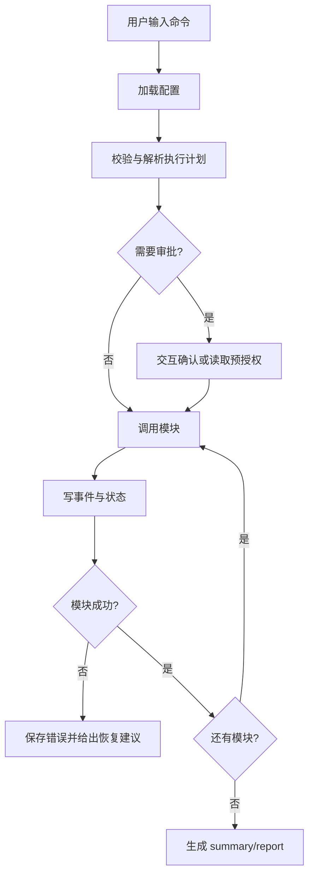

# 模块 6：CLI 人机交互与模块编排

## 1. 模块目标

本模块提供统一 CLI，用于让人以交互式或脚本化方式调用前 5 个模块，完成从数据准备、抽取、优化到发布审计的完整流程。

CLI 的目标不是替代各模块内部逻辑，而是作为人机协作入口：

- 引导用户选择知识库、PDF、Wiki、代码仓库、目标领域和输出目录。
- 调用模块 1 到模块 5，并传递标准配置和产物路径。
- 展示运行进度、诊断、成本、失败原因和下一步建议。
- 对高风险动作做人类确认，例如联网调用模型、写工作区、运行智能体、发布 Skill。
- 支持自动化脚本调用，便于 CI 或定时任务接入。

## 2. 输入要求

### 2.1 必填输入

| 输入 | 类型 | 要求 |
|---|---|---|
| `workspace` | path | 本次运行的工作目录 |
| `project_config` | YAML/JSON | 项目级配置，包含数据源、模块参数、模型路由和输出目录 |
| `command` | CLI command | 用户要执行的命令，例如 `init`、`run`、`status` |
| `mode` | enum | `interactive` 或 `batch` |

### 2.2 可选输入

| 输入 | 用途 |
|---|---|
| `--domain` | 指定领域，例如 payment、monitoring |
| `--repo` | 指定代码仓库路径 |
| `--docs` | 指定文档路径或目录 |
| `--config` | 指定配置文件 |
| `--from-step` | 从指定模块恢复运行 |
| `--to-step` | 运行到指定模块停止 |
| `--approve` | 非交互模式下允许的审批项 |
| `--dry-run` | 只校验配置和计划，不执行。支持 `--dry-run-level` 指定深度 |
| `--json` | 输出机器可读 JSON |
| `--verbose` | 输出详细日志 |

### 2.3 输入约束

- CLI 不直接绕过模块接口读写内部产物，必须通过各模块定义的输入/输出契约调用。
- 批处理模式下不得默认执行高风险动作；必须通过显式参数或配置授权。
- 涉及模型调用、联网、Agent 写工作区、执行 shell 命令时必须展示或记录审批信息。
- CLI 必须支持断点恢复，不应因为单个模块失败而破坏已完成产物。

### 2.4 `project.yaml` 完整 schema

```yaml
# === 项目基础 ===
project:
  name: fineract-finance-skill
  domain: fintech
  description: "Apache Fineract 金融核心系统 Agent Skill 优化项目"

# === 数据源 ===
sources:
  repos:
    - id: fineract
      path: /abs/path/fineract
      ref: develop  # 锁定开发分支 commit
      include:
        - "fineract-provider/src/main/java/org/apache/fineract/accounting/**"
        - "fineract-provider/src/main/java/org/apache/fineract/portfolio/**"
        - "fineract-core/src/main/java/org/apache/fineract/accounting/**"
        - "fineract-core/src/main/java/org/apache/fineract/portfolio/**"
      exclude:
        - "**/test/**"
        - "**/integration-tests/**"
        - "**/target/**"

  docs:
    - id: fineract-user-manual
      path: kb/fineract/user-manual.md
      provider: local_file
      type: markdown
      version: "1.10.0"
      authority: official_doc
      domain_tags: [loan, savings, accounting, interest]
    - id: fineract-accounting-guide
      path: kb/fineract/accounting-guide.pdf
      provider: local_file
      type: pdf
      ocr_enabled: false
      authority: team_runbook
      domain_tags: [accounting, journal-entry, accrual]
    # 远程知识源示例（预留，provider 未实现时 config validate 给出警告）
    # - id: feishu-sop
    #   path: doc_token:B4Jkdm1YboR1Rxxx
    #   provider: feishu_api
    #   type: wiki_export
    #   version: "latest"
    #   authority: team_runbook

# === 模块 1：代码图谱与模块树 ===
code_graph:
  max_leaf_tokens: 8000
  max_module_depth: 3
  tokenizer: cl100k_base
  split_strategy: file_then_function
  max_components_per_group: 200
  max_components_per_llm_call: 50
  llm_clustering_enabled: true
  entrypoint_rules: []

# === 模块 2：文档规范化 ===
document_normalizer:
  ocr_engine: tesseract
  ocr_languages: chi_sim+eng
  ocr_confidence_threshold: 0.6
  chunk_max_tokens: 2000
  redaction_policy: standard
  # 远程 provider 凭证（仅当使用 feishu_api / confluence_api 等远程 source 时需要）
  # knowledge_sources:
  #   feishu_api:
  #     app_id: ${FEISHU_APP_ID}
  #     app_secret: ${FEISHU_APP_SECRET}
  #   confluence_api:
  #     base_url: https://your-domain.atlassian.net/wiki
  #     personal_access_token: ${CONFLUENCE_PAT}

# === 模块 3：SkillAtom 抽取 ===
atom_extractor:
  atom_policy: atom_policy.yaml
  confidence_tier_1_max: 0.95
  llm_adjustment: 0.05

# === 模块 4：SkillOpt 优化 ===
skillopt:
  num_epochs: 3
  batch_size: 20
  minibatch_size: 8
  edit_budget: 3
  gate_metric: soft
  use_slow_update: false
  use_meta_skill: false
  safety_mode: sandboxed  # rollout 阶段隔离模式

# === 流水线编排（M1–M4 契约，见 07 文档）===
pipeline:
  write_artifact_contract: true
  validate_context_refs: true
  run_atoms_when_benchmark_present: false
  run_docs_when_atoms_skipped: false
  merge_atom_seeds_into_benchmark: false
  append_atom_rules_to_skill: false
  bootstrap_min_confidence: 0.8
  use_evidence_index: true
  use_entrypoints: true
  use_role_index: true
  auto_plot_training_curve: true

# === 模块 5：模型交互 ===
model_layer:
  interaction_config: interaction_config.yaml

# === 输出与发布 ===
output:
  root: runs/
  publish_target: ~/.codex/skills/fineract-agent

# === 审批策略 ===
approvals:
  require_for:
    - invoke_agent_cli_with_workspace_write
    - publish_skill
    - overwrite_existing_output
    - execute_shell_command
  auto_approve_in_batch: false
```

## 3. 输出与存储内容

推荐目录：

```text
runs/<run_id>/
├── run_config.resolved.yaml
├── run_manifest.json
├── run_state.json
├── events.jsonl
├── approvals.jsonl
├── module_outputs.json
├── sources/
│   ├── code/
│   └── docs/
├── atoms/
├── benchmarks/
├── optimization/
├── model_interactions/
├── reports/
│   ├── summary.md
│   ├── diagnostics.md
│   └── publish_checklist.md
└── logs/
    ├── cli.log
    └── module_errors.log
```

### 3.1 `run_manifest.json`（✅ Phase 4）

由 `PipelineRunRecorder` 写入，记录 M1–M4 各阶段 `status` / `skip_reason` / `duration_sec` / `artifacts` / `metrics`。M4 失败时仍写入 `status: failed`。`inspect run` 直接消费。

```json
{
  "schema_version": "1.0",
  "run_id": "fineract-finance-20260603-001",
  "domain": "fintech",
  "created_at": "2026-06-03T00:00:00Z",
  "status": "completed",
  "duration_sec": 842.5,
  "effective_settings": {},
  "phases": [
    {"phase": "m1_code_graph", "status": "skipped", "skip_reason": "..."},
    {"phase": "m4_skillopt", "status": "completed", "metrics": {"best_score": 0.72}}
  ],
  "summary": {"best_score": 0.72, "train_items": 7},
  "modules_legacy": [
    "code_graph_module_tree",
    "document_normalization",
    "skillatom_extraction",
    "skillopt_loop"
  ],
  "operator": "local-user"
}
```

### 3.2 `run_state.json`

用于断点恢复。

```json
{
  "schema_version": "1.0",
  "run_id": "fineract-finance-20260603-001",
  "status": "running",
  "current_module": "skillatom_extraction",
  "completed_modules": [
    "code_graph_module_tree",
    "document_normalization"
  ],
  "failed_modules": [],
  "artifacts": {
    "code_graph": "runs/fineract-finance-20260603-001/sources/code/fineract/develop/graph.json",
    "doc_chunks": "runs/fineract-finance-20260603-001/sources/docs/fineract-user-manual/v1.10.0/chunks.jsonl"
  }
}
```

### 3.3 `events.jsonl`

记录面向用户和自动化系统的事件流。

```json
{
  "schema_version": "1.0",
  "ts": "2026-06-03T00:00:00Z",
  "level": "info",
  "module": "document_normalization",
  "event": "chunks_written",
  "message": "Wrote 128 document chunks.",
  "artifact": "runs/fineract-finance-20260603-001/sources/docs/fineract-user-manual/v1.10.0/chunks.jsonl"
}
```

### 3.4 `approvals.jsonl`

记录用户确认。

```json
{
  "schema_version": "1.0",
  "approval_id": "appr-001",
  "requested_action": "invoke_agent_cli_with_workspace_write",
  "module": "skillopt_loop",
  "decision": "approved",
  "scope": "run_id=fineract-finance-20260603-001",
  "ts": "2026-06-03T00:00:00Z"
}
```

## 4. CLI 命令设计

### 4.1 总览

```text
skill-lab init
skill-lab config validate
skill-lab run <pipeline|module>
skill-lab status [run_id]
skill-lab inspect <artifact>
skill-lab approve <approval_id>
skill-lab eval <skill>
skill-lab publish <run_id>
skill-lab resume <run_id>
```

### 4.2 `init`

初始化项目目录和配置模板。

```bash
skill-lab init --workspace ./agent-skill-lab --domain fintech
```

生成：

- `project.yaml`
- `runs/`
- `skills/`
- `configs/`
- `fixtures/`

### 4.3 `config validate`

校验配置，不执行模块。

检查内容（L1 `config-only`）：

- 数据源路径存在。
- 模型路由与 **生效配置表**（`build_effective_settings_report`：M1/M2/M3/M4 已接线项）。
- 必需密钥通过环境变量存在，但不打印明文。

L2 `static-analysis`：在 L1 基础上对每个 repo 做文件扫描 + 符号解析（无 LLM 聚类），对 `local_file` 文档做格式解析（无 OCR）。实现：`cli/static_analysis.py`。

L3 `full-simulate`：L2 + M1–M4 全流程，全部 LLM 走 `MockReplayBackend` + 内置 fixture（`cli/full_simulate.py`）。

**`--dry-run` 三级模式**：

`--dry-run` 不是简单的布尔开关，而是支持三级深度控制：

```bash
skill-lab run all --dry-run                # 默认 Level 1
skill-lab run all --dry-run-level config-only    # Level 1
skill-lab run all --dry-run-level static-analysis # Level 2
skill-lab run all --dry-run-level full-simulate   # Level 3
```

| Level | 名称 | 执行内容 | 不执行的内容 |
|---|---|---|---|
| L1 `config-only` | 配置校验 | 校验 YAML schema、路径存在性、环境变量、模块间输入/输出路径一致性、审批策略完整性 | 任何模块代码、任何 LLM 调用 |
| L2 `static-analysis` | 静态分析 | L1 + 运行模块 1 的文件清单和符号抽取（不调用 LLM 聚类）、模块 2 的格式解析（不调用 OCR） | LLM 聚类、OCR、模块 3-4 全部内容 |
| L3 `full-simulate` | 完整模拟 | L2 + 按正常流程走完所有模块，但所有模型调用使用 `MockReplayBackend`（返回固定 mock 响应） | 真实 LLM/Agent 调用 |

默认 dry-run 为 L1。L3 使用内置 fixture：`cli/fixtures/full_simulate/mock-backend/responses.json`（✅ 已实现 `cli/full_simulate.py`）。

```bash
skill-lab config --dry-run-level full-simulate
skill-lab run all --dry-run --dry-run-level full-simulate
```

### 4.4 `run`

运行单个模块或全流程。

```bash
skill-lab run all --config-path config.yaml
skill-lab run all --dry-run --dry-run-level full-simulate
skill-lab run code-graph --repo fineract
skill-lab run normalize-docs --docs ./kb/fineract/user-manual.md
skill-lab run extract-atoms --from runs/<run_id>
skill-lab run bootstrap-benchmark --from-run runs/<run_id> [--merge]
skill-lab run optimize-skill --benchmark benchmarks/fineract -o runs/<id>/optimization
skill-lab run training-curve plot <run_id>
```

支持范围：

| 名称 | 调用模块 | 说明 |
|---|---|---|
| `code-graph` | M1 | 构建 `graph.db` |
| `normalize-docs` | M2 | 文档规范化 |
| `extract-atoms` | M3 | 必须 `--from <run_dir>`（含 M1/M2 产物） |
| `bootstrap-benchmark` | M3→benchmark | 高置信种子写入 `train/items.json` |
| `optimize-skill` | M4 | SkillOpt；`--resume` 续训 |
| `training-curve` | M4 可观测 | 子命令 `plot` / `backfill` |
| `all` | M1→M4 | 见下方编排 flag |
| `model-check` | M5 | 模型连通性（预留） |

**`run all` 编排 flag**（`settings.pipeline` 可设默认值）：

| Flag | 作用 |
|------|------|
| `--with-atoms` | 有 benchmark 时仍跑 M3 |
| `--with-docs` | 跳过 M3 时仍跑 M2 |
| `--bootstrap-benchmark` | M3 高置信种子填充/合并 train |
| `--merge-benchmark` | 与 bootstrap 同用：追加而非覆盖 train |
| `--suggest-skill-rules` | 高置信 atom 追加 `### Auto-suggested rules` |
| `--resume-run-id` | 复用 run 目录，跳过 M1–M3（有 graph.db） |
| `--dry-run` + `--dry-run-level` | L1 配置 / L2 静态分析 / L3 mock 全流程 |

### 4.5 `status`

查看运行状态。

```bash
skill-lab status fineract-finance-20260603-001
```

输出：

- 当前模块。
- 已完成模块。
- 失败模块。
- 最近事件。
- 等待审批项。
- 关键产物路径。

### 4.6 `inspect`

查看产物摘要。

```bash
# Run 级汇总（推荐）
skill-lab inspect run <run_id>

# 单文件（向后兼容）
skill-lab inspect runs/<run_id>/optimization/best_skill.md
skill-lab inspect runs/<run_id>/atoms/merged_atoms.jsonl
```

**`inspect run`** 输出：`run_manifest.json` 各阶段 skip/耗时、`history.json` gate 历史（近 5 步）、`test_report`、`context_ref_report` 解析率、`artifact_contract` sidecar、`training_curve` 路径、最近 step `metrics.json`（证据命中 / custom reflect / scenario_rules）。

### 4.7 `approve`

审批等待中的高风险动作。

```bash
skill-lab approve appr-001
skill-lab approve appr-001 --deny
```

常见审批项：

- 调用联网模型。
- 调用 Agent CLI 并允许写工作区。
- 执行测试命令。
- 覆盖已有输出目录。
- 发布 Skill。

### 4.8 `eval`

对指定 Skill 运行评测。

```bash
skill-lab eval runs/fineract-finance-20260603-001/optimization/best_skill.md --split test
```

调用模块 4 的 eval-only 能力，并通过模块 5 调用 target/judge。

### 4.9 `publish`

发布通过门禁的 Skill。

```bash
skill-lab publish fineract-finance-20260603-001 --target ~/.codex/skills/fineract-agent
```

发布前必须检查：

- test 分数已生成。
- best_skill 有来源和版本。
- 敏感信息扫描通过。
- 高风险规则人工 review 通过。
- 发布目标目录不会覆盖未备份内容。

### 4.10 `resume`

从 `run_state.json` 恢复。

```bash
skill-lab resume fineract-finance-20260603-001
```

恢复策略：

- 已完成模块默认跳过。
- 失败模块可重试。
- 允许 `--from-step` 强制从指定模块重跑。
- 重跑时不删除旧产物，写入新 run 或新版本目录。

## 5. 执行过程

### 5.1 流程图



### 5.2 步骤 1：加载配置

CLI 合并配置优先级：

1. 命令行参数。
2. `project.yaml`。
3. 环境变量。
4. 默认配置。

合并后写入 `run_config.resolved.yaml`。

### 5.3 步骤 2：构建执行计划

执行计划包含：

- 模块顺序。
- 输入产物路径。
- 输出产物路径。
- 需要的模型/Agent route。
- 需要审批的动作。
- 可恢复检查点。

示例：

```json
{
  "steps": [
    {"module": "code_graph_module_tree", "action": "run"},
    {"module": "document_normalization", "action": "run"},
    {"module": "skillatom_extraction", "action": "run"},
    {"module": "skillopt_loop", "action": "run"}
  ]
}
```

### 5.4 步骤 3：审批处理

交互模式：

- CLI 展示动作、影响范围、权限和成本估算。
- 用户输入确认或拒绝。
- 决策写入 `approvals.jsonl`。

批处理模式：

- 只允许执行 `project.yaml` 或命令行中预授权的动作。
- 未授权动作返回 `approval_required`，不中断已完成产物。

### 5.5 步骤 4：模块调用

CLI 调用模块时传递标准上下文：

```json
{
  "schema_version": "1.0",
  "run_id": "fineract-finance-20260603-001",
  "workspace": "/abs/path/agent-skill-lab",
  "input_paths": {},
  "output_root": "runs/fineract-finance-20260603-001",
  "interaction_config": "project.yaml#model_layer",
  "mode": "interactive"
}
```

模块返回：

```json
{
  "schema_version": "1.0",
  "status": "ok",
  "artifacts": {},
  "metrics": {},
  "warnings": [],
  "next_actions": []
}
```

### 5.6 步骤 5：事件与状态更新

每个模块开始、结束、警告、失败、审批、产物写入都记录事件。

CLI 必须保证：

- 事件追加写入，不覆盖。
- 状态文件原子写入。
- 崩溃后可以从最后一个完成模块恢复。

### 5.7 步骤 6：报告生成

全流程完成后生成：

- `reports/summary.md`：人读摘要。
- `reports/diagnostics.md`：警告、失败、低置信产物。
- `reports/publish_checklist.md`：发布前检查项。

## 6. 人机交互设计

### 6.1 交互原则

- 默认展示用户需要决策的信息，不刷屏展示内部日志。
- 高风险动作必须清楚说明会读什么、写什么、调用什么外部服务。
- 每个失败都给出“重试、跳过、查看日志、修改配置”的下一步。
- 所有交互都可被 `--json` 或 batch 模式替代，避免阻塞自动化。

### 6.2 典型交互

```text
? Select pipeline:
  > Full: code graph -> docs -> atoms -> optimize
    Only normalize documents
    Only optimize existing skill

? This run will call external model route `optimizer.deepseek`.
  Estimated max cost: $3.20.
  Approve? [y/N]

? SkillOpt target is `codex-cli-target` with workspace write enabled.
  Workspace: /abs/path/fineract
  Approve? [y/N]
```

## 7. 与其它模块的接口

| CLI 命令 | 调用模块 | 输入 | 输出 |
|---|---|---|---|
| `run code-graph` | 模块 1 | repo config | graph/module tree |
| `run normalize-docs` | 模块 2 | docs config | chunks/tables/assets |
| `run extract-atoms` | 模块 3 | graph + docs | SkillAtom |
| `run optimize-skill` | 模块 4 | initial skill + benchmark | best_skill |
| `run model-check` | 模块 5 | interaction config | backend health report |
| `eval` | 模块 4 + 5 | skill + benchmark | eval report |
| `publish` | 发布模块/文件系统 | best_skill + checklist | deployed Skill |

## 8. 安全与权限

| 风险 | 控制 |
|---|---|
| 覆盖用户文件 | 发布和重跑前检查目标路径，默认备份 |
| 执行危险命令 | CLI 不直接执行任意命令，只请求模块 5 的受控 Agent 后端 |
| 泄漏密钥 | 配置中只引用 env var；日志和事件脱敏 |
| 批处理误执行高风险动作 | batch 模式必须显式 `--approve` |
| 长任务中断 | run_state 支持恢复 |
| 错误产物被发布 | publish 前强制读取门禁报告 |

## 9. 质量校验

| 校验项 | 通过标准 |
|---|---|
| 命令可发现 | `--help` 覆盖所有命令和关键参数 |
| 配置可验证 | `config validate` 不执行副作用 |
| 状态可恢复 | 中断后 `resume` 能继续或明确失败原因 |
| 事件完整 | 每个模块 start/end/fail 均有事件 |
| 审批可审计 | 高风险动作都有 approval 记录 |
| JSON 输出稳定 | `--json` 输出 schema 稳定 |
| 跨平台 | 路径处理支持 macOS/Linux，避免 shell 特有假设 |

## 10. 失败处理

| 失败 | 处理 |
|---|---|
| 配置缺失 | 提示缺失字段和示例 |
| 数据源不存在 | 中止当前模块，保留 run_state |
| 模块返回失败 | 写入 module_errors.log，展示恢复命令 |
| 审批被拒 | 标记 skipped_by_user，不执行后续依赖模块 |
| 运行中断 | 下次 `resume` 从最后完成模块继续 |
| 报告生成失败 | 保留模块产物，允许单独重跑 report |

## 11. MVP 范围

MVP 必须实现：

- `init`
- `config validate`
- `run all`
- `run <single-module>`
- `status`
- `resume`
- `eval`
- `--json`
- approvals 记录
- run_state 和 events

MVP 可以暂缓：

- TUI 仪表盘。
- Web UI。
- 多用户权限系统。
- 远程任务队列。
- 复杂插件市场。
