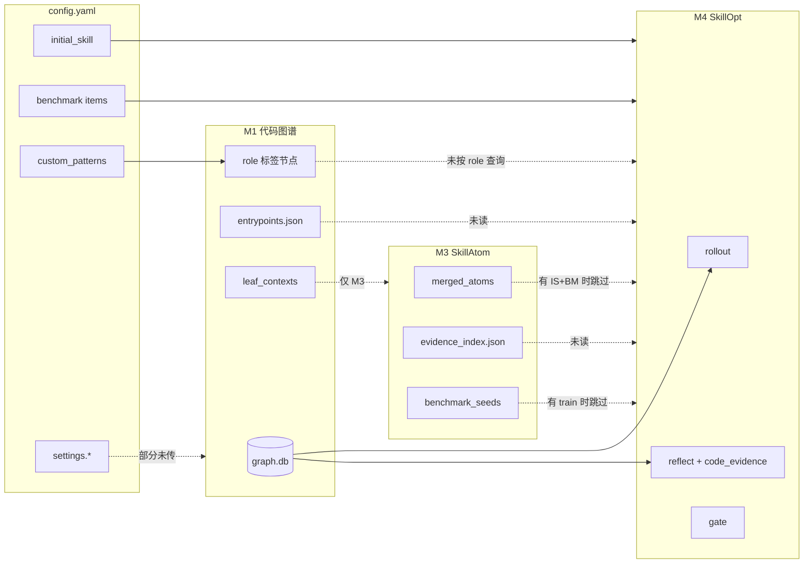

# 流水线整合与代码利用率优化方案

> 版本: 1.1  
> 状态: **方案（审计后修订，待实施）**  
> 关联: `00-overall-design.md`、`01`–`06` 模块设计、`config.yaml`  
> 背景: 2026-06 审计发现 M1–M5 各子系统已实现，但 Fineract 典型路径（`initial_skill` + 显式 benchmark + `graph.db`）下大量产物**只写不读**，框架代码与配置项存在**悬空接口**。
> 修订: 2026-06-08 结合最近 run 记录，补充 artifact contract、`context_refs` 解析、role/evidence 落地顺序。

## 1. 问题陈述

当前仓库具备较完整的模块能力：

- **M1** 代码图谱：`graph.db`、Spring/MyBatis、`custom_patterns` 角色节点、`entrypoints.json`、`leaf_contexts`
- **M2** 文档规范化：`DocumentChunk`
- **M3** SkillAtom：规则/LLM 抽取、`evidence_index.json`、`benchmark_seeds`
- **M4** SkillOpt：LLM rollout、reflect、gate、slow/meta、训练曲线、`code_evidence` 预取
- **M5** 模型路由：target/optimizer 分离、trace
- **MCP/CLI** 图谱查询与 SkillOpt 内嵌 CodeTools 共用 `GraphRegistry`

但在 **`skill-lab run all --config-path config.yaml`** 主路径上，实际数据流被压缩为：

```text
config.project.initial_skill  ──┐
config.project.benchmark      ──┼──► M4 SkillOpt（rollout / reflect / gate）
M1 graph.db ──► CodeToolsHandler ─┘
M2 / M3 产物（多数情况下）──────► 写入 run 目录，M4 不读取
```

结果是：**算力花在 M2/M3，但优化入口仍主要依赖人工编写的 skill 与 benchmark**；代码利用主要停留在 `context_refs` 临时查图，图谱侧积累的架构标签、入口点、atom 证据链未成为 M4 的一等输入；`config.yaml` 中大量 `settings.*` 键未传入对应模块。这不是单点 bug，而是**模块间契约与编排层缺失**。

## 2. 现状数据流（审计）



### 2.1 已贯通（保持）

| 链路 | 说明 |
|------|------|
| `graph.db` → `CodeToolsHandler` → rollout/reflect | `explore_symbol`、`get_code_context`、`trace_symbol` 等 |
| benchmark `context_refs` → `build_reflect_code_evidence` / rollout 预取 | 通用解析，无领域硬编码 |
| `settings.skillopt` + `model_provider.routes` → M4 | rollout/optimizer 分离、token 预算、gate |
| `training_curve` 记录 | step/gate/epoch/test 事件落盘 |
| `custom_patterns` → M1 建图 | 产生 `metadata.framework` / `metadata.role` 节点 |

### 2.2 未贯通或弱利用（优化目标）

| 能力 | 实现位置 | 现状 |
|------|----------|------|
| M1 `entrypoints.json` | `code_graph/entrypoints.py` | M4 `trace_symbol` 仅用路径含 `api` 的启发式 `from_entry=rest` |
| M1 `custom_patterns` 角色 | `code_graph/framework.py` | 节点入库；M4 不做 role 过滤检索 |
| M3 `evidence_index` / atom `edge_path` | `code_graph/evidence.py` | 仅写入 `atoms/`；reflect 重复 live 查图 |
| M3 → benchmark 种子 | `atom_extractor/merger.py` | schema 用 `seed_id`/`task_template`，缺 `id`/`question`/`context_refs` |
| M3 在有 benchmark 时仍全量运行 | `cli/main.py` `run all` | 耗时与 LLM 成本浪费 |
| `settings.document_normalizer.*` | `config.yaml` | `normalize_document()` 未读配置 |
| `settings.atom_extractor.*` | `config.yaml` | `scorer.py` 阈值硬编码 |
| `settings.code_graph.*`（聚类等） | `config.yaml` | 未传入 `run_code_graph_pipeline` |
| `score_with_llm_judge` | `skillopt_loop/scoring.py` | 无调用方；benchmark `scorer` 字段未用 |
| `EnvAdapter` 自定义 reflect prompt | `envs/base.py` | `llm_components` 固定用 `reflect_helpers` |
| `meta_skill.update()` | `skillopt_loop/__init__.py` | 嵌套在 `enable_slow_update` 分支内 |
| `step_buffer` 成功/失败模式 | `step_buffer.py` | reflect 主要只用 rejected edits |
| `training_curve` plot/backfill | `training_curve.py` | 无 CLI；仅库函数与测试 |
| `publish_target` / gate 审批 | `cli/main.py` | publish 硬编码 `skills/agent`；`gate_ok=True` |
| `context_mode` inline/agent_read/none | `types.py` / `envs/base.py` | 文档有、rollout 未分支 |
| `run extract-atoms` | `cli/main.py` | 传空 `leaf_contexts`，独立命令几乎无意义 |

### 2.3 最近 runs 证据（2026-06-08 审计）

| Run | 观察 | 结论 |
|-----|------|------|
| `test-data/runs/20260607-183325` | optimize-only；M4 日志显示 `graph=yes`；188 次 rollout、6 次 reflect；run 目录无 M1/M2/M3 产物，仅复用共享 `test-data/runs/sources/code/fineract/develop/graph.db` | M4 能用 graph/code tools，但缺少同 run 的 `entrypoints.json` / `evidence_index.json` 等 sidecar，结构化产物无法消费 |
| `test-data/runs/20260607-145023` | full run；M1 产出 416 files / 5453 nodes / 16414 edges / 673 entrypoints；M3 产出 24 atoms / 20 seeds / 3959 evidence entries；M4 918 次 rollout、12 次 reflect | M1/M3 产物已写入 run 目录，但 M4 只消费 `graph.db` 与 benchmark split；M3 seeds/evidence 未进入优化闭环 |
| `145023` rollout/reflect trace | 853/918 个 rollout prompt 含项目代码参考；12/12 个 reflect prompt 含 `Code Evidence` | 不是“完全没有读代码”，而是**靠 benchmark `context_refs` 临时查图**，缺少 artifact contract、命中率指标和 sidecar 复用 |
| `reflect` 证据样例 | 部分失败 case 的 fallback graph query 命中不相关类（如 `DefineOpeningBalanceCommandHandler`） | 必须先做 `context_refs` 解析与证据命中统计，避免把“有代码块”误认为“代码证据相关” |
| role 元数据 | `graph.json` 有 `metadata.role`，但 `graph.db` 的 `nodes` 表没有 metadata 字段 | M4 主要读 `graph.db`，因此 role 感知检索不能直接依赖当前 DB；短期需 sidecar `role_index.json`，长期再迁移 schema |

### 2.4 当前关键瓶颈

1. **artifact contract 缺失**：M4 只知道 `graph_db_path` / `repo_root` / `graph_sources`，不知道同 run 是否存在 `entrypoints.json`、`role_index.json`、`evidence_index.json`。
2. **`context_refs` 未预检**：benchmark refs 是否能解析到真实文件、符号、调用链，目前只能从 trace 事后翻看。
3. **代码证据相关性不可观测**：没有 `resolved_refs`、`evidence_hits`、`fallback_queries`、`tool_rounds` 等指标，难以判断“读了代码”是否真的帮助 reflect。
4. **role 元数据未入 DB**：`custom_patterns` 产物能在 `graph.json` 看见，但 `GraphRegistry` / `CodeToolsHandler` 查询路径不能按 role 过滤。
5. **rollout 证据预算不稳定**：rollout 先拼接 task/checks/code context，再整体截断 user message；代码证据可能被尾部截断或被大段源码挤掉。

## 3. 优化原则

1. **单源真相（Single Source of Truth）**  
   - 任务与验证：`benchmark/items.json`（含 `context_refs`、`expected_checks`）  
   - 领域规则：`initial_skill.md`（或发布版 `best_skill.md`）  
   - 代码定位：`graph.db` + 可选 `evidence_index` / `entrypoints`  
   - 目标项目架构词汇：`project.code_graph.custom_patterns`（仅 M1 标注，M4 按 role 消费）

2. **写前读（Write implies Read）**  
   每个 run 目录下的 JSON/JSONL 产物，必须在设计里标明**唯一消费者**；无消费者的产物标记为 deprecated 或改为按需生成。

3. **配置即契约**  
   `config.yaml` 中出现的键必须：传入模块 **或** 从 template 删除并写入「预留」说明。禁止「YAML 有、代码无」。

4. **渐进启用**  
   通过 `settings.pipeline` 或 `project.pipeline` 开关控制新链路，默认行为与当前 Fineract 路径兼容。

5. **框架无领域硬编码**  
   Fineract 知识只出现在 `config.yaml`、`benchmark/`、`initial_skill.md`，不在 `skillopt_loop` / `atom_extractor` 源码中恢复词表。

6. **先解析再优化（Resolve before Optimize）**  
   在 M4 训练前解析 benchmark `context_refs`、graph sidecars 与 project hints，产出可观测的 `artifact_contract.json` / `context_ref_report.json`；reflect 不再靠字符串猜测入口与角色。

7. **精确证据优先（Precise Evidence First）**  
   证据来源优先级为：benchmark `context_refs` 精确命中 → role/entrypoint 限定查图 → `evidence_index` 精确命中 → 通用 `get_code_context` fallback。fallback 必须计数。

## 4. 分阶段方案

### Phase -1 — 契约与可解析性（P0，1 天）

**目标**：先把“哪些产物存在、哪些 ref 可解析、哪些证据命中”变成显式契约，避免后续 Phase 只是在现有猜测链路上叠功能。

| 项 | 动作 | 主要文件 |
|----|------|----------|
| P-1-1 | 新增 `PipelineArtifacts` / `GraphArtifacts`：统一发现 `graph.db`、`entrypoints.json`、`graph.json`、`role_index.json`、`atoms/evidence_index.json`，支持 run 目录和共享 `settings.output.root/sources` | `cli/pipeline_config.py`（新）、`cli/main.py` |
| P-1-2 | M4 启动前解析 benchmark `context_refs`：输出 `optimization/context_ref_report.json`，记录 file/symbol/trace 是否命中 | `skillopt_loop/code_evidence.py`、`cli/main.py` |
| P-1-3 | `build_reflect_code_evidence` 返回正文 + metrics：`resolved_refs`、`evidence_hits`、`fallback_queries`、`irrelevant_or_empty_hits` | `skillopt_loop/code_evidence.py` |
| P-1-4 | step 级写 `steps/step_*/metrics.json`，至少记录 Code Evidence 命中率与工具轮次 | `skillopt_loop/__init__.py` |

**验收**：不改变模型输出也能从单次 run 看出：多少 benchmark refs 解析成功、多少 reflect 证据来自精确命中、多少来自 fallback。

---

### Phase 0 — 编排与成本（P0，1–2 天）

**目标**：不增加新算法，只减少无效计算、修复明显断线。

| 项 | 动作 | 主要文件 |
|----|------|----------|
| P0-1 | `run all`：当 `initial_skill` 与 `benchmark.train` 均非空时，**默认跳过 M3**；`--with-atoms` 强制跑 M3 | `cli/main.py` |
| P0-2 | 若 P0-1 跳过 M3 且 M2 只服务 M3，则默认跳过 M2；`--with-docs` 或 `--with-atoms` 强制跑 | `cli/main.py` |
| P0-3 | `meta_skill.update()` 与 `slow_update` **解耦**：`enable_meta_skill` 时在每 epoch 末独立调用；comparison 为空时仍可基于 accepted/rejected edits 更新 | `skillopt_loop/__init__.py` |
| P0-4 | `publish` 读取 `settings.output.publish_target`；gate 未 accept 时警告或 `--force` | `cli/main.py` |
| P0-5 | `run extract-atoms` 从 run 目录加载 `leaf_contexts` + doc chunks，或文档标明「仅调试」并 require `--from` | `cli/main.py` |
| P0-6 | CLI：`skill-lab run training-curve plot|backfill <run_id>` 暴露已有库函数 | `cli/main.py`、`training_curve.py` |

**验收**：Fineract `run all` 在无 `--with-atoms` 时不再写 `atoms/`；meta_skill 日志在仅开 meta 时仍更新；`publish` 尊重 config。

---

### Phase 1 — M1 产物进 M4（P1，3–5 天）

**目标**：图谱建图阶段的结构化信息进入 reflect/rollout，减少空工具轮次与泛化 patch。

| 项 | 动作 | 主要文件 |
|----|------|----------|
| P1-1 | **Entrypoint 驱动 trace**：优先使用 `graph.db` 中已有 `route`/`entry_to` 节点；`entrypoints.json` 作为 sidecar 加速和解释。禁止仅靠路径含 `api` 推断 `from_entry=rest` | `code_evidence.py`、`code_graph/registry.py`、`cli/pipeline_config.py` |
| P1-2 | **Role sidecar 先行**：从 `graph.json` 生成 `role_index.json`，记录 `(framework, role, file_path, symbols)`；M4 按 `graph_role` / `project.graph_role_hints` 限定候选，再 fallback 通用查图 | `code_graph/framework.py`、`code_evidence.py` |
| P1-3 | **Role 入库后续**：为 `GraphDB.nodes` 增加 `metadata_json` 或独立 `node_metadata` 表，使 `GraphRegistry` 可直接按 role 查询 | `code_graph/db.py`、`graph_queries.py` |
| P1-4 | **复用 evidence_index**：reflect 预取时若存在 `atoms/evidence_index.json`，只按 `context_ref` / symbol / atom_id 精确命中注入 compact `edge_path`；未命中再 fallback live 查图 | `code_evidence.py`、`code_graph/evidence.py` |
| P1-5 | benchmark item 可选字段 `graph_role` / `entrypoint_id`，与 P1-2 对齐（手工维护，非框架硬编码） | `benchmark` schema、`types.py` |
| P1-6 | rollout 证据预算分段：task/checks/code evidence 分别限额，避免整体 `user_msg[:3000]` 截断掉代码证据 | `envs/base.py`、`rollout_helpers.py` |

**验收**：对含 `context_refs` 的 failure，reflect 日志中 Code Evidence 块在首轮即含调用链比例上升；role 配置后相关 Java 文件检索命中率可测；`context_ref_report.json` 中 fallback 比例下降。

---

### Phase 2 — M3 与 benchmark 协同（P1，3–5 天）

**目标**：M3 成为 benchmark/skill 的**辅助生产线**，而非与显式 benchmark 并行重复。

| 项 | 动作 | 主要文件 |
|----|------|----------|
| P2-1 | `generate_benchmark_seeds` 输出对齐 `items.json`：`id`、`question`、`expected_checks`、`context_refs`（由 atom `source_refs` + `edge_path` 生成） | `atom_extractor/merger.py` |
| P2-2 | 新命令或 `run all --bootstrap-benchmark`：高置信 atom → **追加** train items（需 `--merge-benchmark` 防覆盖） | `cli/main.py` |
| P2-3 | 高置信 atom claims → 可选合并进 `initial_skill` 附录节（`### Auto-suggested rules`），gate 前人工可删 | `cli/main.py`、模板 skill |
| P2-4 | `settings.atom_extractor` 传入 scorer tier / `llm_adjustment` | `config_loader.py`、`scorer.py` |

**验收**：无手工 benchmark 时，`run all` 仍可从 M3 种子启动 M4；种子项通过 `validate_splits` 无 missing `id`。

---

### Phase 3 — 配置贯通与适配器（P2，2–4 天）

| 项 | 动作 | 主要文件 |
|----|------|----------|
| P3-1 | 统一 `PipelineSettings`：从 `settings` 解析 M1/M2/M3 参数，CLI 单点传入 | `cli/config_loader.py`、`cli/pipeline_config.py`（新） |
| P3-2 | M2：`normalize_document(..., **settings.document_normalizer)` | `document_normalizer/`、`cli/main.py` |
| P3-3 | M1：传递 `split_strategy`、`llm_clustering_enabled` 等至 `cluster.py` / pipeline | `code_graph/__init__.py` |
| P3-4 | `EnvAdapter.get_error_reflect_prompt`：子类或 YAML `project.reflect_prompts` 覆盖默认 | `envs/base.py`、`llm_components.py` |
| P3-5 | benchmark `scorer: llm_judge` 可选启用 `score_with_llm_judge`（路由 `routes.judge`） | `envs/base.py`、`scoring.py` |

**验收**：修改 `config.yaml` 中 OCR/chunk 参数后 M2 产物 chunk 大小变化可观测；adapter 覆盖 prompt 在 reflect trace 中可见。

---

### Phase 4 — 可观测性与闭环（P2，2–3 天）

| 项 | 动作 | 主要文件 |
|----|------|----------|
| P4-1 | `run_manifest.json` 记录各阶段 skip 原因、耗时、产物路径 | `cli/main.py`、`cli/types.py` |
| P4-2 | 训练结束自动生成 `training_curve.svg`（已有纯 SVG 实现） | `skillopt_loop/__init__.py` |
| P4-3 | `inspect` 子命令增强：`inspect run <id>` 汇总 history、test_report、curve | `cli/main.py` |
| P4-4 | reflect 指标：Code Evidence 命中率、工具轮次、scenario_rules 触发率写入 `steps/step_*/metrics.json` | `skillopt_loop/__init__.py` |

**验收**：单次 run 可从 CLI 查看曲线与证据命中率，无需手翻 JSON。

---

### Phase 5 — 工具层统一（P3，可选）

| 项 | 动作 |
|----|------|
| P5-1 | MCP 可选暴露 `read_code_file` / `search_code`（与 SkillOpt 对齐），或文档明确「IDE 用 MCP 查图、训练用 Handler 查图+读文件」 |
| P5-2 | `CodeToolsHandler` 工厂：daemon / M4 / 测试共用同一构造逻辑 |
| P5-3 | 实现 `context_mode: agent_read`（rollout 不注入，仅靠工具）与 `none`（纯 skill） |

## 5. 建议的配置扩展（`config.yaml`）

在 `settings` 下新增可选段 `pipeline`（实施 Phase -1 / Phase 0 时引入）：

```yaml
settings:
  pipeline:
    # 前置契约：训练前解析 artifact 与 benchmark refs
    write_artifact_contract: true
    validate_context_refs: true
    # M3：有 initial_skill + benchmark 时是否仍跑 atom 抽取
    run_atoms_when_benchmark_present: false
    # M2：仅服务 M3 时是否仍规范化文档
    run_docs_when_atoms_skipped: false
    # 是否将 M3 种子合并进 train（需显式 true）
    merge_atom_seeds_into_benchmark: false
    # M4：是否加载 atoms/evidence_index 辅助 reflect
    use_evidence_index: true
    # M4：是否加载 entrypoints.json 辅助 trace
    use_entrypoints: true
    # M4：是否加载 role_index.json 辅助检索
    use_role_index: true
    # 训练结束自动写 training_curve.svg
    auto_plot_training_curve: true

project:
  # 可选：按任务类型映射到 custom_patterns 的 role（项目专用）
  graph_role_hints:
    journal_entry:
      framework: fineract
      roles: [accounting_processor, api_resource]
```

`project.graph_role_hints` 为**项目配置**，非框架默认值；Fineract 示例可放在 `config.yaml` 注释或 `config.template.yaml`。

## 6. 模块职责重划（目标态）

| 模块 | 核心产出 | 必须被谁读取 |
|------|----------|--------------|
| M1 | `graph.db`, `entrypoints.json`, `leaf_contexts`, `role_index.json` | M3（可选）, **M4 CodeTools**, **M4 GraphArtifacts** |
| M2 | `DocumentChunk` | M3（可选） |
| M3 | `merged_atoms`, `evidence_index`, seeds | CLI 引导 benchmark/skill；**M4（可选 evidence_index）** |
| M4 | `best_skill.md`, `history`, `training_curve.*` | CLI eval/publish/inspect |
| M5 | traces | 人工调试、成本分析 |

新增契约产物：

| 产物 | 写入时机 | 消费者 |
|------|----------|--------|
| `optimization/artifact_contract.json` | M4 启动前 | M4 / `inspect run` |
| `optimization/context_ref_report.json` | benchmark split 加载后、rollout 前 | M4 / `inspect run` |
| `steps/step_*/metrics.json` | 每个 reflect/gate step | `training_curve` / `inspect run` |

## 7. 风险与边界

| 风险 | 应对 |
|------|------|
| atom 自动并入 benchmark 污染 train | 默认关闭；仅 `confidence >= tier_1` 且 `--merge-benchmark` |
| role 检索误收窄 | fallback 到现有通用 `get_code_context` |
| `role_index.json` 与 `graph.db` 不一致 | `artifact_contract.json` 记录 graph hash / generated_at；不一致时禁用 role sidecar 并告警 |
| `evidence_index` 过大或低相关 | 只允许 context_ref / symbol / atom_id 精确命中；禁止按全文泛搜 evidence_index |
| 代码证据被大段源码挤掉 | rollout/reflect 分段 token budget；超限时优先保留 file path、symbol、call chain 摘要 |
| 跳过 M3 后无 benchmark 的新项目断裂 | 检测 train 为空时自动跑 M3 并走种子路径（保持当前行为） |
| 配置面扩大 | Phase 3 集中 `PipelineSettings` + `config validate` 打印生效表 |

## 8. 成功指标（实施后）

1. **成本**：Fineract 标准 `run all`  wall time 降 ≥30%（跳过 M3 + 证据预取减少工具轮次）。
2. **质量**：同 benchmark、同 epoch，reflect 产生的 patch 中**含文件路径/符号名**比例升 ≥20%。
3. **可解释**：`inspect run <id>` 可展示曲线、gate 历史、test hard/soft，无需读 5+ JSON 文件。
4. **配置诚实**：`skill-lab config` 输出「已生效 / 未接线」配置项清单。
5. **零领域回归**：`skillopt_loop` 与 `atom_extractor` 无 Fineract 专用源码；CI 含「框架无领域词表」静态检查（可选）。
6. **证据命中**：`context_refs` 解析成功率、reflect 精确证据命中率、fallback 查询比例可从 run 产物直接读取。

## 9. 实施顺序建议

```text
P-1（契约/可解析性）→ P0（编排修复）→ P1（M1→M4）→ P2（M3↔benchmark）→ P3（配置贯通）→ P4（可观测）→ P5（工具统一，按需）
```

优先 **P-1 + P0 + P1-1/P1-2/P1-4**：先让证据链可解释，再减少无效 M2/M3 成本，最后把 entrypoint / role / evidence_index 接入 M4。

## 10. 文档与代码同步

实施各 Phase 时需更新：

| 文档 | 更新内容 |
|------|----------|
| `04-skillopt-loop.md` | §12 扩展项状态；meta_skill 解耦；evidence_index 消费 |
| `01-code-repo-to-code-graph-module-tree.md` | entrypoints/custom_patterns 的 M4 消费契约 |
| `03-skillatom-extraction.md` | 种子 schema、与 benchmark 关系、skip 策略 |
| `06-cli-human-interaction-orchestrator.md` | 新子命令、`pipeline` 配置、`inspect run` |
| `config.template.yaml` | `settings.pipeline` 与 `graph_role_hints` 示例 |

---

*本文档描述「应如何整合已有代码」；具体 issue/PR 可按 Phase 拆分为独立交付项。*
