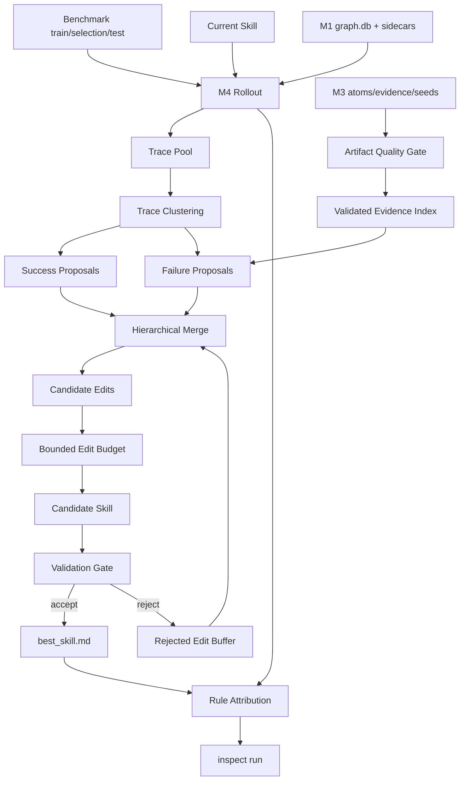

# Skill 自进化优化设计

> 版本: 0.1  
> 状态: **方案（待实施）**  
> 日期: 2026-06-09  
> 关联: `03-skillatom-extraction.md`、`04-skillopt-loop.md`、`07-pipeline-integration-optimization.md`  
> 背景: 结合文章《如何更科学、方向可控的实现 Skill 的“自进化”?》中对 Trace2Skill、EvoSkill、SkillOpt 三类范式的分析，补充本项目在 Skill 自动沉淀、批量归纳、验证门控和可控更新上的设计。

## 1. 核心判断

本项目当前已经具备 SkillOpt 主干：rollout、reflect、edit、gate、training curve、target/optimizer 模型分离，以及 M1 代码图谱与 M3 SkillAtom 产物。但如果仅依赖单个失败 case 或单个 minibatch 直接改 `best_skill.md`，仍会出现以下问题：

- **个例带偏**：某条失败轨迹的特殊情况被写成通用规则。
- **Skill 膨胀**：每轮只追加规则，缺少删除、合并和归因，文档越来越长。
- **验证不硬**：没有稳定的 holdout gate 时，无法判断新 Skill 是否真实提升。
- **产物断层**：M3 atoms/seeds/evidence 可能只落盘，不一定进入 M4 的优化闭环。
- **代码证据弱归因**：知道 rollout/reflect 读了代码，但难判断哪段代码证据促成了哪条 skill 更新。

因此 08 的目标不是替换 07，而是在 07 已打通 artifact contract 和 evidence metrics 的基础上，引入一个更完整的 **离线 Skill 自进化闭环**：

```text
批量轨迹归纳（Trace2Skill）+
验证选择（EvoSkill）+
有界训练式更新（SkillOpt）
= 可控、可观测、可回滚的 Skill 自进化
```

## 2. 设计目标

1. **从单点反应改为批量归纳**  
   不让单条 trace 直接决定 Skill 更新；先聚类、汇总、找共性，再生成候选 patch。

2. **验证优先于生成**  
   任何自动更新必须通过 selection/test gate；平局或下降默认拒绝。

3. **有界编辑，抑制膨胀**  
   每步限制新增/替换/删除数量和总 token；鼓励合并、替换、删除冗余规则。

4. **负反馈可复用**  
   被拒绝的 edit 不丢弃，进入 rejected buffer，作为后续 optimizer 的反例。

5. **规则级归因**  
   每条 Skill 规则有 `rule_id`，记录它在 rollout 中是否被引用、影响哪些 checks、是否关联退步。

6. **M3 作为候选源，而不是默认真理源**  
   M3 atoms/seeds/evidence 必须通过质量门禁后，才可参与 Skill 生成、benchmark 扩充或 reflect 证据注入。

## 3. 非目标

- 不做线上实时自进化；默认仍是离线 run、验证后发布。
- 不让 LLM 无约束重写整个 Skill；rewrite 只作为显式模式。
- 不把所有 trace 都永久塞进 Skill；trace 是训练数据，Skill 只保留泛化规则。
- 不绕过现有 M4 SkillOpt；本方案扩展 M4，而不是重建一套独立优化器。

## 4. 目标架构



### 三类范式在本项目中的落点

| 范式 | 本项目落点 | 解决的问题 |
|---|---|---|
| Trace2Skill | `Trace Pool`、`Trace Clustering`、`Hierarchical Merge` | 避免单条轨迹过拟合，保留高频共性 |
| EvoSkill | `Validation Gate`、`Frontier`、`Rejected Buffer` | 只接受能提升验证集的更新 |
| SkillOpt | `Bounded Edit Budget`、`training_curve`、`meta_skill` | 小步可控更新，类似学习率和动量 |

## 5. 新增产物

### 5.1 Trace Pool

路径：

```text
runs/<run_id>/optimization/trace_pool/
├── traces.jsonl
├── clusters.json
├── cluster_summary.json
└── diagnostics.json
```

`traces.jsonl` 每条记录最少包含：

```json
{
  "trace_id": "step_0003:item_jv_purchase_001",
  "item_id": "jv_purchase_001",
  "task_type": "journal_entry",
  "hard": 0,
  "soft": 0.4,
  "question": "...",
  "expected_checks": ["..."],
  "passed_checks": ["..."],
  "missed_checks": ["..."],
  "context_refs": ["..."],
  "code_evidence_ids": ["ev-00001"],
  "tool_calls": [],
  "predicted_answer": "...",
  "skill_version": "v0003"
}
```

聚类维度：

- `task_type`
- `missed_checks`
- `context_refs` resolved symbol / role
- failure reason
- code evidence hit pattern

### 5.2 Patch Proposal

路径：

```text
runs/<run_id>/optimization/proposals/
├── success_proposals.jsonl
├── failure_proposals.jsonl
├── merged_proposals.jsonl
└── proposal_quality.json
```

schema：

```json
{
  "proposal_id": "prop-step0003-cluster-journal-balance",
  "source": "failure_cluster",
  "cluster_id": "cluster-journal-balance",
  "support_trace_ids": ["..."],
  "support_count": 8,
  "missed_checks": ["..."],
  "evidence_refs": ["ev-00001"],
  "root_cause": "Skill lacks balanced journal entry validation rule.",
  "edit_intent": "add_rule",
  "candidate_rule": "When handling journal entries, verify debit and credit totals are balanced before finalizing.",
  "risk": "medium",
  "confidence": 0.82
}
```

质量门禁：

- `support_count >= 2` 才能直接进入 merge；单例 proposal 默认 `needs_review`。
- `evidence_refs` 必须可解析，除非 proposal 明确是输出格式类规则。
- `candidate_rule` 不得只复述某个具体 case 的输入。

### 5.3 Rejected Edit Buffer

路径：

```text
runs/<run_id>/optimization/rejected_edit_buffer.jsonl
```

用途：

- 记录被 gate 拒绝的 edit、拒绝原因、分数变化。
- 进入后续 reflect / merge prompt，提示 optimizer 不要重复生成同类修改。
- 用于 `meta_skill` 更新，形成“调优 Skill 的经验”。

schema：

```json
{
  "edit_id": "edit-v0004-002",
  "proposal_id": "prop-step0003-cluster-journal-balance",
  "op": "append",
  "content_hash": "sha256:...",
  "reason": "selection_score_not_improved",
  "before_score": 0.72,
  "after_score": 0.70,
  "affected_rule_ids": ["rule-journal-003"],
  "missed_checks_after": ["..."],
  "created_at_step": 4
}
```

### 5.4 Rule Attribution

为 `best_skill.md` 增加轻量规则标识。推荐格式：

```markdown
<!-- rule_id: rule-journal-003; source: prop-step0003-cluster-journal-balance -->
- When handling journal entries, verify debit and credit totals are balanced before finalizing.
```

归因产物：

```text
runs/<run_id>/optimization/rule_attribution.json
```

指标：

- `rule_used_count`
- `rule_helped_checks`
- `rule_associated_failures`
- `rule_regression_count`
- `last_touched_step`
- `source_proposal_ids`

用途：

- 清理长期未被使用或关联退步的规则。
- 解释某次 Skill 更新为什么被接受。
- 支持 `inspect run` 展示“哪些规则真正有用”。

## 6. M3 与自进化闭环的关系

M3 不再只是“前置抽取模块”，而是三个角色：

| M3 产物 | 新角色 | 消费者 |
|---|---|---|
| `merged_atoms.jsonl` | Skill 初始候选规则 | 无 `initial_skill` 时生成初始 Skill；有显式 Skill 时仅供 proposal 参考 |
| `benchmark_seeds.jsonl` | benchmark 扩充候选 | 无 train 或显式 `--bootstrap-benchmark` 时合入 |
| `evidence_index.json` | reflect/rollout 精确证据索引 | failure proposal、code evidence builder |
| `artifact_quality.json` | M3 质量门禁 | pipeline contract、inspect run、CI |

接入原则：

1. `artifact_quality.json` 未通过时，M3 只能作为诊断产物，不进入 M4。
2. M3 seed 必须满足 M4 benchmark schema：`id/question/context_refs/expected_checks`。
3. M3 evidence 只能按 `context_ref` / symbol / atom_id 精确命中，不能 broad search 注入。
4. M3 atom 不能直接覆盖现有 Skill；必须转成 proposal，经 gate 验证。

## 7. Gate 与 Frontier

### 7.1 严格 Gate

默认接受条件：

```text
candidate.selection_score > current_best.selection_score
and candidate.regression_count <= allowed_regressions
and candidate.skill_tokens <= max_skill_tokens
and candidate.format_valid == true
```

默认策略：

- 平局拒绝。
- selection 提升但 test 明显下降时标记 `needs_review`。
- 格式失败、rule_id 重复、证据引用失效直接拒绝。
- gate 结果必须写入 `history.json` 与 `training_curve.jsonl`。

### 7.2 Frontier Pool（可选）

为避免单一路径早停，可维护固定容量前沿集合：

```text
runs/<run_id>/optimization/frontier/
├── frontier.json
├── skill_v0003.md
├── skill_v0005.md
└── skill_v0008.md
```

适用条件：

- benchmark 稳定，selection/test 充足。
- 任务存在多个可行策略。
- 希望保留多个候选 Skill 做后续对比。

初期默认不启用，先采用单 best skill gate。

## 8. Skill Hygiene

为避免 Skill 自动迭代后变得冗长，新增 hygiene pass。

触发时机：

- 每个 epoch 结束。
- `best_skill.md` 超过 `max_skill_tokens`。
- 规则数量超过 `max_rules`。
- rule attribution 显示长期未使用规则。

动作：

| 动作 | 条件 |
|---|---|
| 合并规则 | 多条规则命中同一 task_type / checks，且内容重复 |
| 删除规则 | 长期未使用，或与 regression 强相关 |
| 替换规则 | 新规则覆盖旧规则且验证通过 |
| 降级到 reference | 信息有用但不应进入核心 Skill |

Hygiene 仍需走 gate，不允许直接改 `best_skill.md`。

## 9. CLI 与配置

### 9.1 CLI

新增或扩展：

```bash
skill-lab run optimize-skill --self-evolve
skill-lab run optimize-skill --trace-merge
skill-lab inspect run <run_id> --trace-pool
skill-lab inspect run <run_id> --rule-attribution
skill-lab run skill-hygiene <run_id>
```

### 9.2 配置

```yaml
settings:
  self_evolution:
    enabled: false
    trace_pool:
      enabled: true
      min_support_count: 2
      cluster_by: ["task_type", "missed_checks", "context_refs"]
    proposals:
      include_success: true
      include_failure: true
      hierarchical_merge: true
      max_merge_fan_in: 8
    gate:
      strict_improvement: true
      reject_ties: true
      allowed_regressions: 0
      frontier_enabled: false
      frontier_size: 3
    edits:
      max_edits_per_step: 3
      max_new_rules_per_step: 2
      max_skill_tokens: 2000
    hygiene:
      enabled: true
      run_each_epoch: true
      min_rule_use_count: 1
    attribution:
      enabled: true
      inject_rule_ids: true
```

## 10. 实施阶段

### Phase 0：可观测基础

| 项 | 动作 | 主要文件 |
|---|---|---|
| 0-1 | rollout 结果标准化写入 `trace_pool/traces.jsonl` | `skillopt_loop/__init__.py`, `envs/base.py` |
| 0-2 | M3 `artifact_quality.json` 落盘并纳入 run manifest | `atom_extractor/`, `cli/main.py` |
| 0-3 | gate 记录拒绝原因、分数差、candidate hash | `skillopt_loop/gate` 或 `__init__.py` |

### Phase 1：批量轨迹归纳

| 项 | 动作 | 主要文件 |
|---|---|---|
| 1-1 | trace clustering：按 task/check/context_refs 聚类 | `skillopt_loop/trace_pool.py` |
| 1-2 | success/failure proposal 生成 | `skillopt_loop/proposals.py` |
| 1-3 | hierarchical merge：去重、冲突检测、support_count 排序 | `skillopt_loop/proposal_merge.py` |

### Phase 2：严格验证与负反馈

| 项 | 动作 | 主要文件 |
|---|---|---|
| 2-1 | gate 默认严格提升，平局拒绝 | `skillopt_loop/__init__.py` |
| 2-2 | rejected edit buffer 落盘并注入 reflect prompt | `step_buffer.py`, `reflect_helpers.py` |
| 2-3 | meta_skill 从 rejected buffer 学习无效编辑模式 | `meta_skill` 相关模块 |

### Phase 3：规则级归因与 Skill Hygiene

| 项 | 动作 | 主要文件 |
|---|---|---|
| 3-1 | 为 skill rules 注入 `rule_id` | `skill_io.py` 或新增 `skill_rules.py` |
| 3-2 | rollout/reflect 记录 rule usage 与 check attribution | `envs/base.py`, `scoring.py` |
| 3-3 | hygiene pass：合并、删除、降级冗余规则 | `skillopt_loop/hygiene.py` |

### Phase 4：Frontier Pool（可选）

| 项 | 动作 | 主要文件 |
|---|---|---|
| 4-1 | 多候选 Skill 前沿集合 | `skillopt_loop/frontier.py` |
| 4-2 | 父代选择和替换策略 | `skillopt_loop/__init__.py` |
| 4-3 | inspect 展示 frontier 演化 | `cli/main.py` |

## 11. 成功指标

| 指标 | 目标 |
|---|---|
| selection gate 可信度 | accepted candidate 在 test 上不下降 |
| Skill 膨胀控制 | `best_skill.md` token 数稳定在阈值内 |
| 规则有效性 | 80% 以上 retained rules 有 attribution |
| proposal 质量 | accepted proposal 的平均 `support_count >= 2` |
| 负反馈复用 | 重复 rejected edit 比例逐步下降 |
| 代码证据利用 | accepted edits 中带 `evidence_refs` 的比例上升 |

## 12. 风险与边界

| 风险 | 应对 |
|---|---|
| benchmark 质量差导致 gate 误导 | 先做 benchmark split 审计；低质量 benchmark 不启用自进化 |
| trace cluster 过粗 | cluster diagnostics 展示样本；低纯度 cluster 不生成 proposal |
| optimizer 过度迎合 selection | 保留 test holdout；selection/test 分离；周期性人工抽检 |
| rule_id 污染 Skill 可读性 | 使用 HTML 注释隐藏元数据；发布时可选择 strip |
| 成本增加 | 默认关闭 self_evolution；按 phase 启用；缓存 trace 与 score |
| M3 噪声进入闭环 | `artifact_quality.json` 未通过时只诊断不消费 |

## 13. 推荐落地顺序

```text
M3 artifact_quality
→ trace_pool 标准化
→ proposal 聚类/归纳
→ 严格 gate + rejected buffer
→ rule attribution
→ hygiene
→ frontier pool
```

短期优先做前三项：它们能最快解决“产物是否有效、轨迹是否可复用、自动更新是否被个例带偏”的问题。Frontier Pool 放到后期，因为它依赖稳定 benchmark 和更高运行成本。

## 14. 参考

- 微信文章：《如何更科学、方向可控的实现 Skill 的“自进化”?》
- Trace2Skill: [`docs/references/Trace2Skill.pdf`](../references/Trace2Skill.pdf) — https://arxiv.org/pdf/2603.25158
- Trace2Skill GitHub: `https://github.com/Qwen-Applications/Trace2Skill`（`external/Trace2Skill/`）
- EvoSkill: [`docs/references/EvoSkill.pdf`](../references/EvoSkill.pdf) — https://arxiv.org/pdf/2603.02766
- EvoSkill tech report: [`docs/references/EvoSkill_tech_report.pdf`](../references/EvoSkill_tech_report.pdf)
- EvoSkill GitHub: `https://github.com/sentient-agi/EvoSkill`（`external/EvoSkill/`）
- SkillOpt: [`docs/references/skillopt_2605.23904.pdf`](../references/skillopt_2605.23904.pdf) — https://arxiv.org/pdf/2605.23904
- SkillOpt: `https://microsoft.github.io/SkillOpt/`
